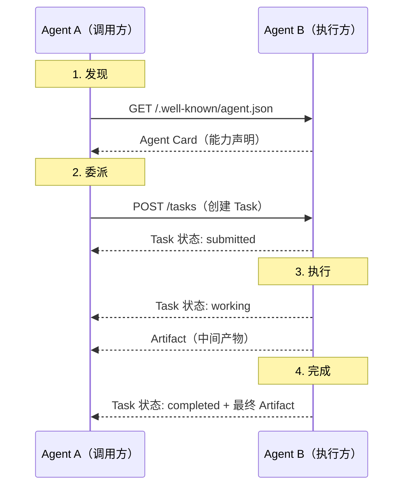

# Agent 间通信协议

??? note "背景知识"
    - **Agent**：LLM 驱动的自主执行循环，能使用工具完成任务 → [详见](ai-agents.md)
    - **MCP (Model Context Protocol)**：Agent 与工具之间的标准连接协议 → [详见](agent-tools.md#2-mcpmodel-context-protocol)
    - **Agent Card / Skill 声明**：描述 Agent 能力的元数据，供其他 Agent 发现和调用

> 当一个 Agent 的能力不够时，它需要找到另一个 Agent 并委派任务——这需要标准化的发现和通信协议。

与[工具协议](agent-tools.md)的区别：工具是"被调用的函数"，没有自主性；另一个 Agent 是"有自主决策能力的合作者"，能自行规划执行步骤。这一本质差异决定了 Agent 间协议需要处理**任务生命周期、进度通知、结果协商**等工具协议不需要的问题。

---

## 1. A2A（Agent-to-Agent Protocol）

Google 提出的 Agent 间通信协议[^a2a-spec]。

### 核心概念

| 概念 | 说明 |
|------|------|
| **Agent Card** | 能力声明（JSON），托管在 `/.well-known/agent.json`，包含名称、能力范围、输入输出格式、认证方式 |
| **Task** | 协作的基本单位，有完整生命周期 |
| **Artifact** | 任务的输出物（文本、文件、结构化数据），执行中可发送中间 Artifact |

### 交互流程

**关键设计**：

- **Task 生命周期**：`submitted → working → completed / failed`，调用方可随时查询状态
- **流式通信**：支持 SSE（Server-Sent Events），执行方可以实时推送进度和中间结果
- **不透明执行**：调用方不需要知道 Agent B 内部用了什么模型、什么工具——只关心输入和输出
- **Push Notification**：长时间任务可通过 webhook 回调通知调用方，避免轮询

---

## 2. ACP（Agent **Client** Protocol）

Zed Industries 提出的 Client → Agent 通信协议（2025.8），JetBrains 于 2026.2 加入共同维护[^acp-spec]。注意此 ACP 的 C 是 **Client**——另一个同名的 Agent **Communication** Protocol（BeeAI / IBM / Linux Foundation）已废弃并合并进 A2A。

与上面 A2A 的根本区别：A2A 是 Agent ↔ Agent **对等协作**，ACP 是 Client → Agent **单向控制**——编辑器/编排器信任并驱动一个 coding agent，类似 LSP 解决编辑器与语言工具的 M×N 集成问题。

### 核心设计

- **JSON-RPC 2 over stdio**（HTTP 传输开发中），复用 MCP 的类型定义
- **Session 模型**：多轮对话以 Session 为单位，支持 `initialize → session/message → session/cancel / session/close`
- **结构化事件流**：Agent 返回的不是终端文本，而是 tool call、文件 diff、推理链等结构化事件——解决 PTY scraping 丢失元数据的问题
- **与 MCP 正交**：MCP 连接 Agent → 工具，ACP 连接 Client → Agent，ACP agent 内部可使用 MCP server

### 协议栈分层

| 层 | 说明 |
|---|---|
| **ACP 协议** | JSON-RPC 规范，定义 session 生命周期和事件类型 |
| **ACP SDK** | 官方多语言库（TypeScript / Python / Kotlin / Java / Rust） |
| **`acpx`** | OpenClaw 开发的无头 CLI 客户端，封装 session 管理、prompt 队列、崩溃恢复 |

---

## 3. 协议对比

| 维度 | MCP（[工具协议](agent-tools.md)） | A2A | ACP |
|------|-----|-----|-----|
| 交互对象 | Agent → 工具（被动执行） | Agent ↔ Agent（对等协作） | Client → Agent（单向委派） |
| 执行方 | MCP Server 按指令执行 | Agent 自行规划执行步骤 | Agent 自主执行，Client 信任 |
| 核心抽象 | 工具调用（无状态） | **Task**（任务生命周期） | **Session**（多轮对话） |
| 发现机制 | 配置文件静态指定 | Agent Card 动态发现 | ACP Registry + 本地注册表 |
| 传输层 | stdio / Streamable HTTP | REST + SSE | JSON-RPC over stdio / HTTP |

---

## 参考资料

[^a2a-spec]: Google. *Agent-to-Agent Protocol*. https://google.github.io/A2A/
[^acp-spec]: Zed Industries & JetBrains. *Agent Client Protocol*. https://agentclientprotocol.com/
