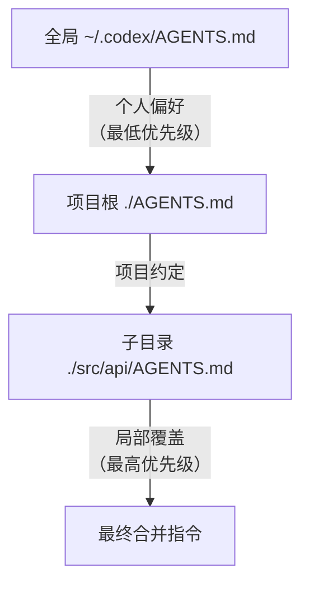

# AGENTS.md —— 项目级 Agent 指令标准

??? note "背景知识"
    - **Coding Agent**：集成在 IDE 或 CLI 中、能自主读写代码并执行命令的 AI Agent → [详见](../agent/ai-agents.md)
    - **上下文窗口**：LLM 单次推理能处理的 token 总预算，所有指令和代码都要挤进这个预算
    - **MCP (Model Context Protocol)**：Agent 与工具之间的标准连接协议 → [详见](../agent/agent-tools.md#2-mcpmodel-context-protocol)

> 没有项目上下文的 coding agent 会猜你的命名风格、用错测试框架、忽略分支策略——产出的代码看着能跑，但融入不了项目。AGENTS.md 用一个 Markdown 文件解决这个"新人入职"问题。

---

## 1. 解决什么问题

### 1.1 指令碎片化

每个 coding agent 各读各的配置文件：

| 工具 | 指令文件 |
|------|---------|
| OpenAI Codex | `AGENTS.md` |
| Claude Code | `CLAUDE.md` |
| Cursor | `.cursor/rules/*.mdc` |
| Gemini CLI | `GEMINI.md` |
| GitHub Copilot | `.github/copilot-instructions.md` |
| Windsurf | `.windsurfrules` |

对于同时使用多个工具的团队，这意味着在 N 个文件里维护**重复的**项目约定——改了构建命令要同步改 N 处，总有人忘。

### 1.2 统一标准

AGENTS.md 由 OpenAI 于 2025 年 8 月提出，随后与 Anthropic MCP 一起移交 Linux Foundation 的 Agentic AI Foundation (AAIF)[^aaif-2025]。截至 2026 年中，AAIF 有 170+ 成员组织，AGENTS.md 被 60,000+ 开源仓库采用[^codex-blog-2026]。

关键设计决策：**纯 Markdown，无 schema，无 YAML frontmatter 要求，无专有语法**——任何文本编辑器都能写，任何 agent 都能解析。

---

## 2. 发现与合并算法

AGENTS.md 的技术核心不在文件格式（就是普通 Markdown），而在**发现和合并机制**——决定了 agent 在哪找指令、冲突时谁赢。

### 2.1 三层作用域



| 作用域 | 位置 | 典型内容 |
|--------|------|---------|
| **全局** | `~/.codex/AGENTS.md` | 个人编码偏好（缩进风格、语言选择） |
| **项目根** | `./AGENTS.md` | 构建命令、测试规范、代码风格、Git 约定 |
| **子目录** | `./packages/api/AGENTS.md` | 该模块特有的约定和约束 |

### 2.2 发现流程

Codex 的实现（`agents_md.rs`[^codex-rs]）：

1. 从项目根（通常是 Git 根）向下遍历到当前工作目录
2. 每个目录检查：`AGENTS.override.md` → `AGENTS.md` → fallback 列表（可配置）
3. 每个目录最多取一个文件（override 优先）
4. 按目录从根到 cwd 顺序拼接，用分隔符连接
5. 总大小不超过 `project_doc_max_bytes`（默认 32 KiB），超出截断

**关键设计**：

- **Closest wins**：子目录指令出现在拼接结果的末尾，模型更容易"记住"近处的指令——这利用了 LLM 对尾部内容注意力更高的特性
- **Override 机制**：`AGENTS.override.md` 用于临时覆盖（如 hotfix 期间放宽某些约束），删除即恢复原有规则
- **上下文预算管理**：32 KiB 硬限制迫使指令精简，避免上下文膨胀

### 2.3 跨工具兼容

Claude Code 在找不到 `CLAUDE.md` 时会 fallback 读取 `AGENTS.md`[^claude-fallback]。实践中的统一策略：

```
# 方案 A：symlink（推荐）
ln -s AGENTS.md CLAUDE.md

# 方案 B：单行引用（Claude Code 的 @import 语法）
echo "@AGENTS.md" > CLAUDE.md
```

维护一份 `AGENTS.md` 作为 single source of truth，工具专属文件只放该工具独有的配置。

---

## 3. 有效写法

### 3.1 高价值章节

按 agent 使用频率排序，**Commands 是最高价值章节**——agent 能自我验证工作的前提：

| 优先级 | 章节 | 作用 |
|--------|------|------|
| 1 | **Commands** | 构建、测试、Lint 的可执行命令 |
| 2 | **Testing** | 框架、目录结构、命名约定 |
| 3 | **Code Style** | 具体规则（非"写干净的代码"） |
| 4 | **Project Structure** | 目录地图 |
| 5 | **Boundaries** | 不要碰的文件/目录 |
| 6 | **Git Workflow** | 分支策略、commit 格式 |

### 3.2 写约束，不写手册

AGENTS.md 应该是**护栏（guardrails）**，不是架构文档：

- ❌ "本项目使用 React 18.2.0 + Next.js App Router。路由系统的工作原理是……（500 字解释）"
- ✅ "添加依赖前先确认；修改行为时更新文档；优先小改动"

详细文档通过引用链接到外部：

```markdown
## 扩展文档
- 架构设计 → @docs/architecture.md
- API 规范 → @docs/api-guidelines.md
```

### 3.3 具体 > 模糊

Agent 对具体指令的遵从率远高于模糊指令[^vercel-evals]：

| ❌ 模糊 | ✅ 具体 |
|---------|---------|
| "遵循代码规范" | "Python 用 Black 格式化，import 用 isort" |
| "写测试" | "`pytest`，测试文件镜像 `src/` 结构" |
| "保持代码干净" | "TypeScript 启用 strict mode，导出函数必须有显式返回类型" |

### 3.4 非显而易见的规则附 "why"

```markdown
- 不要直接使用 `datetime.now()`，用 `src/core/clock.py`。
  原因：测试需要控制时间，避免 monkeypatching。
```

一句 "why" 让 agent 在边缘情况下也能正确决策。

### 3.5 长度控制

- **最佳范围**：50–150 行（有效文件的中位数在 6–10 条规则 + 3–5 个命令）
- **超过 200 行**：agent 开始忽略靠后的指令（模型对中间内容注意力下降）
- **单一根文件 + 子目录差异化**：根文件放全局规则，子目录只写不同的部分

---

## 4. 迭代方法

最有效的 AGENTS.md 不是一次写成的，而是从 agent 的错误中生长出来：


**Day 1**：只写命令和一两条关键约束
**Day 3**：agent 未经确认添加依赖 → 加 "添加依赖前先确认"
**Day 7**：agent 在子目录用错测试命令 → 子目录加 `AGENTS.md`

**关键纪律**：当作代码维护。改了构建流程 → 同 PR 更新 AGENTS.md。过时指令比没有指令更有害——agent 会执行错误的命令。

---

## 5. 局限

AGENTS.md 设定约定，不处理：

| 需求 | 应使用 |
|------|--------|
| 复杂多步编排 | Skills（Codex）/ Subagent |
| 外部服务集成 | MCP Server |
| 确定性自动化 | 传统脚本 / CI |
| 运行时安全约束 | 沙箱策略（非 Markdown 能表达） |

---

## 参考资料

[^aaif-2025]: Linux Foundation. *Agentic AI Foundation*. 2025. https://www.linuxfoundation.org/press/linux-foundation-launches-agentic-ai-foundation
[^codex-blog-2026]: Vaughan, D. *Agent Instruction Files: AGENTS.md, CLAUDE.md, and Cross-Tool Portability*. 2026. https://codex.danielvaughan.com/2026/05/27/agent-instruction-files-agents-md-claude-md-cross-tool-portability-codex-cli/
[^codex-rs]: OpenAI. *codex-rs/core/src/agents_md.rs*. https://github.com/openai/codex/blob/main/codex-rs/core/src/agents_md.rs
[^claude-fallback]: Anthropic. *Claude Code — AGENTS.md support discussion*. https://github.com/anthropics/claude-code/issues/6235
[^vercel-evals]: aihackers.net. *AGENTS.md: What Actually Works (And What Doesn't)*. 2025. https://aihackers.net/posts/agents-md-practical-guide/
