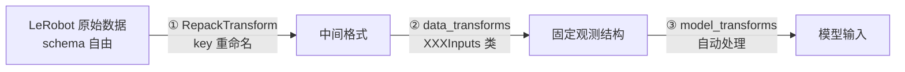

# OpenPI：具身基础模型的开源微调框架

??? note "背景知识"
    - **具身智能数据类型**：机器人学习的通用四元组（图像、本体感知、动作、语言指令） → [详见](../embodied-infrastructure/embodied-data-types.md)
    - **Flow Matching**：条件流匹配，通过学习从噪声到目标分布的连续向量场来生成样本 → [详见](../foundations/diffusion-models.md)
    - **PaliGemma**：Google 的视觉-语言模型，OpenPI 用作视觉和语言编码的骨干网络
    - **LeRobot Dataset v3**：Hugging Face 的机器人数据格式，OpenPI 用作训练数据输入 → [详见](../embodied-infrastructure/lerobot-dataset-v3.md)
    - **FSDP**：Fully Sharded Data Parallelism，将模型参数分片到多卡以降低单卡显存 → [详见](../infrastructure/distributed-training.md)

---

| 属性 | 值 |
|------|-----|
| **开发者** | Physical Intelligence |
| **GitHub** | [Physical-Intelligence/openpi](https://github.com/Physical-Intelligence/openpi) |
| **论文** | [arXiv:2410.24164](https://arxiv.org/abs/2410.24164)（π₀） |
| **预训练数据量** | 10k+ 小时机器人数据 |
| **训练后端** | JAX（官方）+ PyTorch（社区） |

**一句话定位**：Physical Intelligence 开源的具身基础模型框架，提供预训练 VLA checkpoint 和配套微调管线，核心设计是 Mixture of Experts 双专家架构 + 三层 Transform 数据管线，将任意机器人数据映射到固定观测结构[^github-2025-openpi]。

---

## 模型架构：双专家 + 双动作头

### Mixture of Experts 设计

π₀ 不是单一 Transformer，而是两个专家的混合[^pi-2024-pi0]：

| 专家 | 参数量 | 处理内容 |
|------|--------|---------|
| PaliGemma | 2B | 图像 + 语言 token |
| Action Expert | 300M | 机器人状态 + 动作 token |

两个专家共享 attention 但各自拥有独立的 FFN 权重。动作预测有专属参数容量，不被视觉/语言任务稀释——消融实验显示这比共享全部权重的标准 Transformer 效果更好。

### 三种模型变体

| 模型 | 动作建模方式 | 核心权衡 |
|------|------------|---------|
| **π₀** | Conditional Flow Matching | 连续分布建模，表达力强，推理需多步去噪 |
| **π₀-FAST** | FAST action tokenizer → 自回归 | 训练快 5x，推理单次前向，但动作空间离散化[^pi-2025-fast] |
| **π₀.₅** | Flow Matching + Knowledge Insulation | 开放世界泛化更强，防止微调遗忘预训练知识[^pi-2025-pi05] |

π₀ 和 π₀.₅ 通过 Flow Matching 从噪声逐步去噪出动作序列（action chunk，默认 50 步未来动作）；π₀-FAST 将连续动作离散化为 token 后自回归生成，省去多步采样。

---

## 数据管线：三层 Transform 架构

核心设计问题：不同机器人平台的数据 schema 千差万别，但模型需要固定格式的输入。解决方案是三层 Transform 管线，逐步将任意 LeRobot 数据映射到模型的固定观测结构：

### ① RepackTransform — key 重命名

纯粹的 key 映射，将 LeRobot 返回的 feature name 重命名为下游 Inputs 类期望的格式。不同数据集的 LeRobot schema 不同，这一层吸收差异：

| 数据集 | LeRobot 原始 key | repack 后 key |
|--------|-----------------|--------------|
| LIBERO | `image` | `observation/image` |
| DROID | `exterior_image_1_left` | `observation/image` |
| ALOHA | `observation.images.top` | `images/cam_high` |

中间 key 的命名没有标准，各数据集配置各写各的——只要和下一层的 Inputs 类内部一致即可。

### ② data_transforms — 结构组装

每种机器人平台实现一个 `XXXInputs` 类，将重命名后的数据组装成模型的固定观测结构：

- 将多个图像字段嵌套到 `image` dict 的固定槽位
- 生成 `image_mask`（标记哪些摄像头有真实数据，缺失的用零数组 + `False` mask 填充）
- 图像格式转换（LeRobot 的 `float32 CHW` → 模型的 `uint8 HWC`）
- 拼接 state 向量（如将 `joint_position` + `gripper_position` 合并）

即使 LeRobot feature key 完全与模型一致，这一层仍不可省略——平铺 → 嵌套的结构转换和 image_mask 生成无法跳过。

### ③ model_transforms — 自动处理

框架自动执行，无需用户编写：

| 操作 | 说明 |
|------|------|
| `ResizeImages(224, 224)` | 所有图像统一缩放到 224×224（原始分辨率任意） |
| `TokenizePrompt` | 语言指令字符串 → PaliGemma token 序列 |
| `PadStatesAndActions` | state 和 actions 零填充到 `action_dim`（默认 32） |
| `Normalize` | 按预计算的 norm_stats 归一化 state/actions |

---

## 固定观测结构：位置即语义

OpenPI 将[通用的四元组数据类型](../embodied-infrastructure/embodied-data-types.md)（图像、本体感知、动作、语言指令）映射到一组硬编码的固定槽位：

### OpenPI 固定槽位

| Key | 类型 | Shape | 通用角色 |
|-----|------|-------|---------|
| `image/base_0_rgb` | float32 / uint8 | `[B, 224, 224, 3]` | 第三人称视角 |
| `image/left_wrist_0_rgb` | float32 / uint8 | `[B, 224, 224, 3]` | 左腕摄像头 |
| `image/right_wrist_0_rgb` | float32 / uint8 | `[B, 224, 224, 3]` | 右腕摄像头（缺失则零填充 + `image_mask=False`） |
| `state` | float32 | `[B, action_dim]` | 本体感知，不足 `action_dim` 自动零填充 |
| `actions` | float32 | `[B, H, action_dim]` | 未来 H 步动作序列，仅训练时提供 |
| `prompt` | string | 标量 | 语言指令，由 model_transforms 自动 tokenize |

π₀-FAST 在 model_transforms 阶段额外生成 `token_ar_mask`（标记自回归 token）和 `token_loss_mask`（标记计入 loss 的 token），对原始数据无额外要求——三种模型接收完全相同的原始数据。

### 位置-语义绑定

模型不读 key 名字符串，而是按固定位置处理输入。10k+ 小时预训练中每个位置始终对应同一语义，模型权重中编码了这种绑定。微调时必须保持一致的数据路由——全局视角图像必须进入 `base_0_rgb` 槽位，腕部摄像头必须进入对应的 wrist 槽位，颠倒放置会导致预训练 prior 完全失效。

### action_dim 与维度约定

`action_dim`（默认 32）是模型内部工作的向量维度。实际维度不足时自动零填充，推理时截取前 N 维。预训练中各维度的含义：

| 维度 | 预训练语义 |
|------|-----------|
| dim 0–5 | 左臂 6 关节角度（rad） |
| dim 6 | 左臂夹爪 \[0=全开, 1=全闭\] |
| dim 7–12 | 右臂 6 关节角度（双臂） |
| dim 13 | 右臂夹爪（双臂） |
| dim 14–15 | 底盘 x-y 速度（移动机器人） |

维度顺序和物理量类型（弧度 vs 米、关节空间 vs 笛卡尔空间、绝对 vs delta → [数据类型详解](../embodied-infrastructure/embodied-data-types.md)）需要与预训练保持一致。偏离越远，预训练 prior 帮助越有限。

---

## 归一化策略

训练前必须对 state/actions 做[归一化](../embodied-infrastructure/embodied-normalization.md)。OpenPI 特有的设计：

- **模型间差异**：π₀ 用 z-score，π₀.₅ / π₀-FAST 用分位数归一化（硬编码，由 `model_type` 决定）
- **复用预训练统计量**：预训练提供了 9 种平台（ALOHA、DROID-Franka、UR5e 等）的 `norm_stats.json`，匹配的平台直接从 checkpoint assets 加载；新平台用 `compute_norm_stats.py` 重新计算
- **小数据集注意**：分位数归一化在小数据集上可能裁切有效数据导致性能下降，此时可切换为 z-score

---

## 硬件需求

| 场景 | 显存 | 参考 GPU | 备注 |
|------|------|---------|------|
| 推理 | > 8 GB | RTX 4090 | — |
| LoRA 微调 | > 22.5 GB | RTX 4090 | 仅 JAX 支持 |
| 全量微调 | > 70 GB | A100-80G / H100 | 可用 FSDP 多卡分摊 |
| DROID 全量 | 8×H100 | ~2 天收敛 | 100k steps, bs256 |

仅测试 Ubuntu 22.04。JAX 后端不支持多机训练；PyTorch 后端通过 `torchrun` 支持多机 DDP 但功能不完整（不支持 LoRA、FSDP、混合精度、EMA）。

---

## 参考资料

[^pi-2024-pi0]: Physical Intelligence. *π₀: A Vision-Language-Action Flow Model for General Robot Control*. 2024. https://arxiv.org/abs/2410.24164
[^pi-2025-fast]: Physical Intelligence. *FAST: Efficient Action Tokenization for Vision-Language-Action Models*. 2025. https://www.physicalintelligence.company/research/fast
[^pi-2025-pi05]: Physical Intelligence. *π₀.₅: a Vision-Language-Action Model with Open-World Generalization*. 2025. https://www.physicalintelligence.company/blog/pi05
[^github-2025-openpi]: Physical Intelligence. *openpi — Open-source models and packages for robotics*. GitHub. 2025. https://github.com/Physical-Intelligence/openpi
