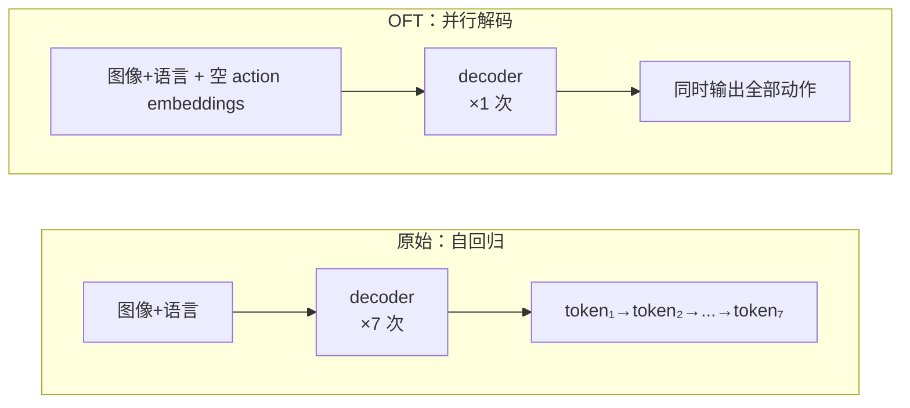

# OpenVLA-OFT：VLA 微调方法论——从自回归到并行 MLP 回归

??? note "背景知识"
    - **VLA（Vision-Language-Action Model）**：在预训练视觉-语言模型上微调，直接输出机器人低级控制动作的端到端策略 → [详见](../embodied-infrastructure/embodied-data-types.md)
    - **具身智能数据归一化**：state/action 的归一化方案，OpenVLA 原始方案使用 256-bin 离散化 → [详见](../embodied-infrastructure/embodied-normalization.md)
    - **Flow Matching / Diffusion**：通过迭代去噪生成动作序列的生成式方法 → [详见](../foundations/diffusion-models.md)
    - **Action Chunking**：一次预测并执行未来 K 步动作，减少重规划频率 → [详见](../embodied-infrastructure/embodied-data-types.md)

---

| 属性 | 值 |
|------|-----|
| **开发者** | Stanford（Moo Jin Kim, Chelsea Finn, Percy Liang） |
| **GitHub** | [moojink/openvla-oft](https://github.com/moojink/openvla-oft) |
| **论文** | [arXiv:2502.19645](https://arxiv.org/abs/2502.19645) |
| **基座模型** | OpenVLA 7.5B（Prismatic VLM = SigLIP + DINOv2 + Llama-2 7B） |

**一句话定位**：不是一个新模型，而是一套 VLA **微调方法论**（Optimized Fine-Tuning recipe）——通过三个设计决策（并行解码、连续 MLP 动作头、L1 回归目标）将 OpenVLA 的推理速度提升 26–43x、成功率从 76.5% 提升至 97.1%，并系统性证明微调策略比预训练数据覆盖更重要[^kim-2025-oft]。后被 [StarVLA](starvla.md) 作为四种 Action Head 范式之一纳入统一对比。

---

## 核心问题：自回归 VLA 为什么不够用

原始 OpenVLA 沿用语言模型的自回归范式预测动作——将 7 维动作（3 位置 + 3 姿态 + 1 夹爪）各离散化为 256 个 bin，然后逐 token 串行生成：

```
token₁ → token₂ → token₃ → ... → token₇
  Δx       Δy       Δz      roll  pitch  yaw  gripper
```

每生成一个 token 需要一次完整的 decoder forward pass。这带来两个瓶颈：

1. **速度**：单步动作需要 7 次串行前向传播，在 A100 上仅 4.2 Hz（0.24s 延迟），而双臂机器人需要 25–50 Hz
2. **动作精度**：连续动作值被强制量化到 256 个离散 bin（约 0.008 精度），精细操作信息被丢弃

如果要做 action chunking（一次预测 K 步），串行次数变为 $K \times D$——K=8 时需要 56 次前向传播，完全不可用。

---

## OFT 方法论：三个设计决策

### 决策一：并行解码替代自回归

**核心改动**：将因果注意力掩码换成双向注意力，用空的 action embeddings（仅靠位置编码区分）替代 teacher forcing 输入。



这样一次前向传播就能输出所有动作维度。加上 action chunking，预测 K 步只需在输入中多插几组空 embedding，总计仍然只需**一次前向传播**——K=8 时吞吐从 4.2 Hz 跳到 109.7 Hz（26x）。

关键的是，并行解码不仅提升速度，还提升了成功率（+14%）。论文推测 action chunking 帮助捕获时序依赖并减少累积误差，在长序列任务上尤为明显（LIBERO-Long 从 53.7% 升到 86.5%）。

### 决策二：MLP action head 直接回归连续动作

这是 OFT 方法论中最核心的架构改动，也是后来被 StarVLA 等框架广泛采用的设计。

**原始方案**：decoder 最后一层的 hidden states 经过线性投影 → softmax → 256-way 分类，选出离散 bin ID，再反量化回连续值。本质上是把回归问题硬转成了分类问题。

**OFT 方案**：将这个分类层替换为一个 MLP（多层感知机），直接输出连续浮点数：

```
decoder hidden states [B, K×D, 2048]
          ↓
    ┌─────────────┐
    │ Linear 2048→1024 │
    │     ReLU         │  ← 第 1 层
    ├─────────────┤
    │ Linear 1024→512  │
    │     ReLU         │  ← 第 2 层
    ├─────────────┤
    │ Linear 512→256   │
    │     ReLU         │  ← 第 3 层
    ├─────────────┤
    │ Linear 256→1     │  ← 第 4 层
    └─────────────┘
          ↓
  连续动作值 [B, K×D]  （每个位置输出 1 个浮点数）
```

每个 action token 位置的 hidden state 独立通过同一个 MLP，输出对应维度和时间步的动作值。MLP 总参数约 151M，相对于 7.5B 的 backbone 仅占 2%。

**为什么 MLP 就够了**：VLM backbone 的 hidden states 已经编码了"该怎么做"的高级语义——空间关系、物体属性、任务目标都已经压缩在 2048 维向量中。MLP 的角色只是一个"翻译器"，将抽象表征映射到具体的物理量。这个映射本质上接近线性，不需要复杂的非线性建模能力，堆 4 层带激活函数的线性变换就足够了。StarVLA-α 后来的消融实验证实了这一点——在 Qwen3-VL-4B backbone 上，MLP head 与更复杂的 Flow Matching DiT head 表现几乎相同[^starvla-2026-alpha]。

### 决策三：L1 回归目标

训练目标选择 L1 loss（平均绝对误差），而非 diffusion/flow matching 的迭代去噪：

$$\mathcal{L} = \frac{1}{K \cdot D} \sum_{k=1}^{K} \sum_{d=1}^{D} |a_{k,d} - \hat{a}_{k,d}|$$

对比三种学习目标：

| 目标 | 推理方式 | 吞吐（K=8） | LIBERO-Long SR |
|------|---------|------------|----------------|
| Next-token prediction（原始） | 自回归 K×D 步 | 4.2 Hz | 53.7% |
| Diffusion（50 步去噪） | 并行，但迭代 50 次 | 4.2 Hz | 91.1% |
| **L1 regression** | **并行，单次前向** | **109.7 Hz** | **90.7%** |

L1 和 diffusion 成功率相当，但 L1 快 26 倍。更值得注意的是 L1 在不完美数据上的鲁棒性优势：diffusion 会忠实复现训练数据中的次优行为（比如演示者偶尔将勺子插得太深），而 L1 天然倾向于学习动作分布的中位数模式，等效于对噪声和次优轨迹做了隐式正则化。

---

## OFT+ 变体：FiLM 语言调制

在真实 ALOHA 双臂机器人上部署时，多视角摄像头引入视觉虚假相关——policy 学会根据物体在画面中的位置预测动作，而忽略语言指令。去掉 FiLM 后语言跟随率降至随机水平（33%）。

解决方案：在视觉编码器（SigLIP + DINOv2）的每个 Transformer 块中插入 FiLM（Feature-wise Linear Modulation）层：

$$\hat{\mathbf{F}} = (1 + \gamma) \odot \mathbf{F} + \beta$$

其中 $\gamma, \beta$ 由语言 embedding 均值经线性投影得到，$\mathbf{F}$ 是视觉 patch embeddings。关键实现细节：$\gamma, \beta$ 的每个元素对应 hidden dimension 的一个维度（而非一个 patch），实现空间无关的全局调制——与 CNN 中 FiLM 对整个 feature map 做缩放/偏移的语义一致。

---

## 核心发现：微调策略 > 预训练数据覆盖

| 方法 | 预训练含双臂数据 | ALOHA 平均成功率 |
|------|:---:|---|
| ACT（从头训练） | — | 最低 |
| Diffusion Policy（从头训练） | — | 中等 |
| RDT-1B（微调） | 6K 集双臂 | 中等偏上 |
| $\pi_0$（微调） | 8K 小时双臂 | 高 |
| **OpenVLA-OFT+（微调）** | **完全没有** | **最高（+15%）** |

OpenVLA 预训练数据全部是单臂机器人，但通过 OFT 微调后在双臂灵巧任务上超越了专门预训练过双臂数据的 $\pi_0$ 和 RDT-1B。这说明对于下游任务而言，**怎么微调**比**预训练时见过什么**更关键。

---

## 参考资料

[^kim-2025-oft]: Kim, Finn, Liang. *Fine-Tuning Vision-Language-Action Models: Optimizing Speed and Success*. 2025. https://arxiv.org/abs/2502.19645
[^starvla-2026-alpha]: Ye et al. *StarVLA-α: Reducing Complexity in Vision-Language-Action Systems*. 2026. https://arxiv.org/abs/2604.11757
