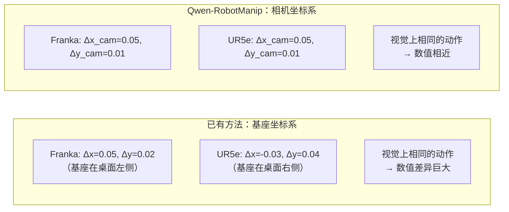

# Qwen-RobotManip：三维度跨形态对齐让数据规模化从冲突变为互补

??? note "背景知识"
    - **VLA（Vision-Language-Action Model）**：在预训练视觉-语言模型上微调，直接输出机器人低级控制动作的端到端策略 → [详见](../embodied-infrastructure/embodied-data-types.md)
    - **Flow Matching / Diffusion**：通过迭代去噪生成动作序列的生成式方法 → [详见](../foundations/diffusion-models.md)
    - **跨形态训练的归一化挑战**：不同机器人的 state/action 维度、值域、物理含义完全不同 → [详见](../embodied-infrastructure/embodied-normalization.md)
    - **StarVLA-α 的发现**：OXE 跨域预训练反而有害，强 VLM + 极简 MLP 即可 → [详见](starvla.md)

---

| 属性 | 值 |
|------|-----|
| **开发者** | Qwen Team (Alibaba) |
| **GitHub** | [QwenLM/Qwen-VLA](https://github.com/QwenLM/Qwen-VLA) |
| **论文** | [arXiv:2606.17846](https://arxiv.org/abs/2606.17846) |
| **基座模型** | Qwen3.5-4B VL + 1.15B DiT action head |
| **预训练数据** | ~38,100 h（全部开源数据） |

**一句话定位**：不是单点算法突破，而是一个**系统工程创新**——用三维度对齐框架（表示 / 运动 / 行为）让跨 15 种形态的 38K h 异构数据产生正向 log-linear scaling，解决了「跨形态数据越多反而越差」的领域痛点[^qwen-2026-robotmanip]。

---

## 核心问题：为什么跨形态数据「越多越差」

已有 VLA（OpenPI、StarVLA）通过 zero-pad 到统一维度解决了**维度不同**的问题，但没解决更本质的冲突——**相同视觉场景下，不同机器人的监督信号在数值上完全不同**：

- Franka 做「向左推 5cm」：7 维关节角增量，数值取决于当前构型和运动学
- ALOHA 做同一任务：14 维关节角，数值完全不同
- UR5e 做同一任务：6 维，又一套数值

把这些数据混在一起训练，模型看到的是「同样的图像和指令 → 互相矛盾的目标向量」。StarVLA-α 观察到 OXE 跨域预训练反而损害性能（RoboCasa-GR1 从 53.8% 降到 27.8%），正是这个冲突的直接体现。

Qwen-RobotManip 的实验进一步量化了这个现象：**去掉对齐框架后，数据量增加时 scaling curve 变平甚至下降**；只有在完整对齐框架下才展现 log-linear scaling 行为。

---

## 三维度跨形态对齐框架

### 维度一：表示对齐——80 维 Canonical State-Action Space

所有机器人的 state/action 映射到一个**固定语义槽位**的 80 维向量：

```
[ 左臂关节×7 | 左夹爪×1 | 右臂关节×7 | 右夹爪×1 | 灵巧手关键点×N | 移动底盘×2 | ... ]
```

与 OpenPI 的 32 维 zero-pad 和 StarVLA 的 simple padding 相比，关键差异在于：

- **语义槽位固定**：每个维度有确定的物理含义（第 0–6 维永远是左臂关节角，第 7 维永远是左夹爪），而非按数据集随意排布
- **Per-dimension 二进制掩码**：单臂机器人只激活前 8 个槽位，双臂激活前 16 个，灵巧手激活手部关键点槽位——梯度只在有效维度上流动，空槽位不产生干扰

数据质量保障同样是对齐的一部分。五阶段清洗管线通过 Pinocchio 正运动学校验符号约定和 TCP 定义错误、交叉相关检测 state-action 时序偏移、极值过滤等手段排除损坏数据。例如 RoboMIND 的 UR 数据中 81% 的 episode 因方向一致性校验失败被排除——这意味着如果不做清洗，近五分之四的该数据源都是噪声。

### 维度二：运动对齐——相机坐标系 Delta Pose

这是对齐框架中最关键的工程洞察。

已有方法的末端执行器动作通常表达在**机器人基座坐标系**下（或直接用关节角增量）。问题在于，不同机器人的基座坐标系原点、朝向、比例完全不同，即使执行视觉上完全相同的动作，数值也天差地别。

Qwen-RobotManip 将动作转换到**相机坐标系**下的 delta pose：



相机坐标系的优势：它是**跨形态共享且直接可观测的**——不管什么机器人，「在画面中向左移 5cm」对应的相机系 delta 都是接近的值。这把跨形态对齐从运动学问题转化为视觉几何问题。

配套的两个机制确保相机信息被正确注入模型：

- **Camera Positional Encoding (CaPE)**：相机外参（位姿）通过位置编码注入 cross-attention 层，使模型知道每个视角的空间关系
- **内参编码**：焦距 / 视场角编码进 visual tokens，使模型区分广角和窄焦镜头下相同像素位移对应的不同物理距离

DiT action head 还额外接收 **EEF type embeddings**（夹爪 / 灵巧手 / 吸盘），实现形态感知的动作去噪。

### 维度三：行为对齐——In-Context Policy Adaptation

同一个动作在不同控制频率下含义不同（50 步 @50Hz = 1 秒，50 步 @5Hz = 10 秒），同一机器人在不同初始状态下最优动作也不同。行为对齐通过两个机制解决：

**结构化 Embodiment Prompt**：文本形式注入机器人平台标识、执行速度、控制频率等元信息，让模型在 prompt 层面区分形态。

**历史 Observation-Action Chunk**：将上一步的观测和动作作为上下文输入。这不仅提供时序连续性，更重要的是充当**隐式形态标识**——模型从历史动作的数值模式中推断当前的机器人类型和动力学特性，实现 on-the-fly 适应。

训练时的关键细节：**随机上下文采样**——以一定概率丢弃历史上下文，防止模型学到「直接复制上一步动作」的捷径，迫使其真正学习策略。消融实验显示 in-context 机制在 RoboTwin-C2R Easy 上带来 +11.5 点提升，Hard 上带来 +6.8 点。

---

## 数据规模化：Human-to-Robot 合成管线

对齐框架让大规模异构数据变得可用，但数据本身从哪来？开源机器人数据仅 ~11K h，远不够支撑基础模型训练。Qwen-RobotManip 采用 [H2R 合成管线](../embodied-infrastructure/embodied-synthetic-data.md)（MANO 手部估计 → 运动重定向 → SAM3 去手修复 → MuJoCo IK 基座搜索 → 深度引导渲染），将 ~2K h 人类视频转化为 ~25K h × 15 种形态的机器人演示，占预训练语料的 65%。

该管线的整体架构是 2025 年起领域内逐渐成型的通用技术路线。Qwen-RobotManip 的差异在于规模（15 种形态、25K h）和与对齐框架的耦合——合成数据直接生成相机系 delta pose 标注，与运动对齐无缝集成。

---

## 与已有方案的对齐策略对比

| 维度 | OpenPI | StarVLA | Qwen-RobotManip |
|------|--------|---------|-----------------|
| **动作空间统一** | 32 维 zero-pad | 32 维 simple padding | 80 维固定语义槽 + 二进制掩码 |
| **动作坐标系** | 按数据集原始格式 | 按数据集原始格式 | 相机坐标系 delta pose |
| **形态条件注入** | 位置-语义绑定（固定槽位） | Embodiment prompt | Prompt + 历史 chunk + EEF type embedding |
| **跨形态 scaling** | 未验证 | 反向结果（OXE 有害） | log-linear scaling（实验验证） |
| **数据量** | 10K+ h（含私有） | 不强调预训练 | 38K h（全开源） |

---

## 关键数字

| OOD 指标 | Qwen-RobotManip | 前最佳（π₀.₅） | 提升 |
|----------|-----------------|---------------|------|
| LIBERO-Plus | 91.4% | 84.4% | +7.0 |
| RoboTwin-C2R Hard | 69.4% | 47.9% | +21.5 |
| RoboCasa365 Composite-Unseen | 14.9% | ~5% | 3× |
| RoboTwin-XE（零样本跨形态） | — | — | 3× next best |
| RoboChallenge 第 1 名 | 45% SR | — | +20% relative |

标准 IID benchmark（LIBERO、RoboTwin clean）无法区分预训练模型和从头训练模型——强 IID 分数可通过 pattern matching 达成。Qwen-RobotManip 因此主张以 OOD 设置作为评估 VLA 基础模型的核心指标。

---

## 参考资料

[^qwen-2026-robotmanip]: Qwen Team. *Qwen-RobotManip Technical Report: Alignment Unlocks Scale for Robotic Manipulation Foundation Models*. 2026. https://arxiv.org/abs/2606.17846
