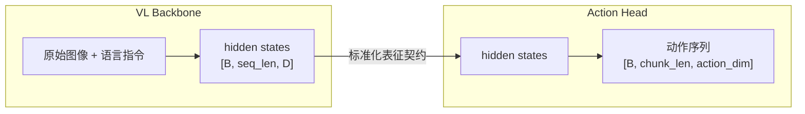

# StarVLA：模块化 VLA 研究平台与极简基线

??? note "背景知识"
    - **具身智能数据类型**：机器人学习的通用四元组（图像、本体感知、动作、语言指令） → [详见](../embodied-infrastructure/embodied-data-types.md)
    - **Flow Matching**：条件流匹配，通过学习从噪声到目标分布的连续向量场来生成样本 → [详见](../foundations/diffusion-models.md)
    - **OpenPI**：Physical Intelligence 的 VLA 框架，StarVLA 对标复现的核心方法之一 → [详见](openpi.md)
    - **具身智能数据归一化**：state/action 的 z-score / min-max / 分位数方案 → [详见](../embodied-infrastructure/embodied-normalization.md)

---

| 属性 | 值 |
|------|-----|
| **开发者** | StarVLA Community / Von Neumann Institute, HKUST |
| **GitHub** | [starVLA/starVLA](https://github.com/starVLA/starVLA)（2K+ stars） |
| **论文** | [arXiv:2604.05014](https://arxiv.org/abs/2604.05014)（平台）、[arXiv:2604.11757](https://arxiv.org/abs/2604.11757)（StarVLA-α） |
| **支持骨干** | Qwen2.5-VL / Qwen3-VL（VLM）、Cosmos-Predict2 / Wan（World Model） |
| **许可** | CC BY 4.0 |

**一句话定位**：VLA 领域的「统一实验台」——将所有 VLA 方法分解为可独立替换的 Backbone + Action Head，四种动作解码范式共享同一数据接口和训练基础设施；StarVLA-α 在此平台上系统性验证「强 VLM + 极简 MLP head 即可匹敌复杂架构」[^starvla-2026-platform][^starvla-2026-alpha]。

**与预训练框架的区别**：StarVLA 本身是**研究代码框架**，不是像 OpenPI / GR00T 那样提供重度预训练的 checkpoint。用户的典型工作流是：选一个现成 VLM（如 Qwen3-VL-4B）做 Backbone → 选一种 Action Head → 在目标任务数据上训练。StarVLA-α 的核心发现正是支撑这一定位的：强 VLM 本身已是足够好的初始化，不需要额外的大规模机器人预训练。不同机器人硬件原则上需要分别训练，但 Generalist 模式（动作向量 zero-pad 到统一维度联合训练）也能达到接近 Specialist 的效果。

---

## 核心设计：Backbone–Action Head 解耦

### 为什么需要解耦

VLA 领域存在严重碎片化：各方法架构不兼容、代码库紧耦合、评测协议不统一。StarVLA 提出一个统一抽象——将所有 VLA 方法分解为两个标准化组件，通过表征契约连接：

关键设计决策：

- **统一 I/O 接口**：training 和 inference 都消费与部署时完全一致的原始传感器数据（raw RGB + 语言字符串），避免 train/test 分布不匹配
- **双向模块化**：Backbone 和 Action Head 各自可独立替换——换 Backbone 不影响 Action Head，反之亦然
- **统一训练目标**：$\mathcal{L} = \mathcal{L}_{\text{action}} + \mathcal{L}_{\text{aux}}$，不同范式只是 $\mathcal{L}_{\text{aux}}$ 的形式不同（VLM-based 加语言辅助目标，World-Model-based 加视频预测目标，Direct VLA 令 $\mathcal{L}_{\text{aux}} = 0$）

这个形式化引出 **Generalized VLA** 视角：VLM-based 和 World-Model-based 方法并非根本不同的范式，而是同一策略框架下不同归纳偏置的变体。

### 四种 Action Head 范式

所有变体共享相同的数据接口和基础设施，仅 Action Head 不同：

| 变体 | 解码方式 | 读取 VLM 层数 | 推理方式 | 对标 |
|------|---------|-------------|---------|------|
| **StarVLA-OFT** | MLP 并行连续回归（L1 loss） | 仅最后层 | 单次前向，最快 | OpenVLA-OFT |
| **StarVLA-FAST** | 自回归离散 token 预测 | 复用 VLM 自身 | K 步自回归 | π₀-FAST |
| **StarVLA-π** | 逐层 Cross-DiT Flow Matching | 所有层 | T 步去噪，最慢 | π₀ |
| **StarVLA-GR00T** | 单层 DiT Flow Matching（双系统） | 仅最后层 | T 步去噪 | GR00T N1.5 |

技术要点：

- **OFT**：VLM 序列中插入可学习 action query tokens，前向传播后提取其 hidden states，经 MLPResNet（24 blocks）直接回归连续动作向量
- **FAST**：扩展 VLM 词表加入 FAST action tokens（如 Qwen3-VL-4B-Action），复用 LM head 自回归生成离散 token ID，再由 FAST tokenizer 解码回连续动作
- **GR00T**：VLM hidden states 通过 cross-attention 条件注入独立的 DiT，DiT 对拼接的 state embedding + learnable future tokens + action embedding 做 flow matching 去噪。噪声用 Beta 分布采样，训练目标为 velocity field MSE
- **PI**：与 GR00T 类似但更重——DiT 的每一层 block 分别与 VLM 对应层的 hidden states 做 cross-attention，浅层获得低级视觉特征，深层获得高级语义

### World Model 骨干支持

同一 Action Head 抽象也适用于 World Model 骨干（Cosmos-Predict2、Wan 2.2）。此时 VL Backbone 替换为视频扩散 DiT，Action Head 读取 DiT 的中间表示而非 VLM hidden states，形成 7 种组合（3 种 head × 2 种 WM backbone + 1 种通用 WM-OFT）。

---

## StarVLA-α：极简基线的反直觉发现

StarVLA-α 刻意最小化架构复杂度——Qwen3-VL-4B + MLP action head + z-score 归一化 + 无额外预训练——然后沿三个轴做系统性消融[^starvla-2026-alpha]。

### 发现一：Action Head 复杂度收益有限

| 方法 | LIBERO avg | SimplerEnv WidowX | RoboTwin clean | RoboCasa-GR1 |
|------|-----------|------------------|---------------|-------------|
| **StarVLA-α (MLP)** | **98.8** | 64.6 | **88.2** | **53.8** |
| StarVLA-α-FAST | 97.8 | 35.6 | 72.5 | 45.0 |
| StarVLA-α-GR00T | 98.7 | 65.3 | 88.0 | 52.8 |
| StarVLA-α-π | 98.1 | 65.9 | 88.1 | 48.9 |

**结论**：连续动作预测一致优于离散 token（FAST 落后明显）。但三种连续 head（MLP / GR00T / PI）表现相近——**VLM backbone 足够强时，轻量 MLP 就是高效且有竞争力的默认选择**，额外的 Flow Matching 迭代去噪没有"雕刻"出更多有用信号。

### 发现二：Robot-Specific 预训练是双刃剑

| 预训练数据 | RoboTwin Clean | RoboCasa-GR1 |
|-----------|---------------|-------------|
| **无预训练（直接微调 Qwen3-VL）** | 88.2 | **53.8** |
| + OXE（大规模跨域异构） | 83.6 | 27.8 |
| + InternData-A1（部分同域） | 88.6 | 35.4 |
| + RoboTwin-Rand（完全同域） | 88.8 | 33.3 |

**结论**：OXE 跨域预训练反而损害性能。同域预训练在低数据场景有帮助，但会损害跨 embodiment 泛化（RoboCasa 大幅下降）。**强 VLM 本身已是足够好的初始化**，额外的 action-specific 预训练需审慎权衡。

### 发现三：数据工程在充足数据下收益消失

| 技术 | LIBERO avg | RoboTwin (+500 Random) | RoboCasa (24×1000) |
|------|-----------|----------------------|-------------------|
| **基线（无工程）** | **98.8** | **88.2** | 53.8 |
| + 本体感觉输入 | 98.5 | 88.0 | 54.2 |
| + 历史帧堆叠 | 97.8 | 87.4 | 52.6 |
| + Delta action | 98.1 | 85.6 | 54.8 |
| + Relative action | 98.7 | 87.3 | 55.5 |

**结论**：Proprioception、history frames、delta/relative action 在低数据时有小幅提升，但数据充足时几乎无额外收益。

### 跨 Embodiment 泛化：极简方案胜出

StarVLA-α 不使用 RDT Action space 或 Multi-Action Head，而是**将所有 embodiment 的动作向量 zero-pad 到统一 32 维**。这个极简策略在 RoboCasa-GR1 和 Google VM 上分别比复杂方案高 4.8% 和 2.9%：

| 方法 | LIBERO avg | Google VM | RoboCasa-GR1 |
|------|-----------|-----------|-------------|
| RDT Action | 97.2 | 71.4 | 52.3 |
| Multi Action Head | 97.2 | 67.8 | 53.5 |
| **Simple Padding** | **97.8** | **74.3** | **57.3** |

### 其他发现

- **模型规模**：4B 参数即足够，8B 相比 4B 提升 < 1%
- **Batch size 关键**：512+ 的大 batch 防止局部最优，是泛化的关键因素
- **真实世界**：单一 generalist 模型在 RoboChallenge（ARX5 机器人，11 个任务）上达到 33.6% SR / 54.5 progress score，大幅超越 π₀.₅（12.7% / 27.6）

---

## Model Zoo 与命名规则

### 命名格式

Checkpoint 命名遵循 `{Backbone}-{ActionHead}-{训练数据}` 格式，所有模型托管在 [HuggingFace StarVLA](https://huggingface.co/StarVLA) 组织下（27 个模型）。其中训练数据名称来自 VLA 领域的标准数据集：

- **Bridge**：BridgeData V2（UC Berkeley），53,896 条轨迹，WidowX 250 桌面机械臂，24 种环境
- **RT-1**（又名 Fractal）：Google DeepMind 的 RT-1 数据集（内部代号 `fractal20220817_data`），~130k 条轨迹，Google Robot 移动平台，700+ 种任务
- **LIBERO-4in1**：LIBERO 仿真 benchmark 的四个子集联合训练（libero_10 + goal + object + spatial）
- **Robotwin2 / RoboTwin2-All**：RoboTwin 2.0 双臂仿真 benchmark
- **Calvin_D_D**：CALVIN 长时序桌面操控 benchmark

### VLM Backbone 变体

FAST action head 需要扩展 VLM 词表以加入 action tokens，StarVLA 提供了两个修改版 VLM（权重不变，仅扩词表）：

| HuggingFace ID | 说明 |
|----------------|------|
| `StarVLA/Qwen2.5-VL-3B-Instruct-Action` | Qwen2.5-VL + 2048 action tokens |
| `StarVLA/Qwen3-VL-4B-Instruct-Action` | Qwen3-VL + 2048 action tokens |

### VLM-based Checkpoints（代表性）

| HuggingFace ID | Backbone | Action Head | 训练数据 |
|----------------|----------|-------------|---------|
| `StarVLA/QWen2.5-FAST-Bridge-RT-1` | Qwen2.5-VL | FAST | Bridge + Fractal |
| `StarVLA/QWen2.5-OFT-Bridge-RT-1` | Qwen2.5-VL | OFT (MLP) | Bridge + Fractal |
| `StarVLA/QWen2.5-PI-Bridge-RT-1` | Qwen2.5-VL | PI | Bridge + Fractal |
| `StarVLA/QWen2.5-GR00T-Bridge-RT-1` | Qwen2.5-VL | GR00T | Bridge + Fractal |
| `StarVLA/QWen3VL-OFT-Bridge-RT-1` | Qwen3-VL | OFT (MLP) | Bridge + Fractal |
| `StarVLA/QWen3VL-GR00T-Bridge-RT-1` | Qwen3-VL | GR00T | Bridge + Fractal |
| `StarVLA/Qwen3VL-PI_v3-Bridge-RT_1` | Qwen3-VL | PI v3 | Bridge + Fractal |
| `StarVLA/Qwen3-VL-OFT-LIBERO-4in1` | Qwen3-VL | OFT (MLP) | LIBERO 4-in-1 |
| `StarVLA/Qwen3-VL-PI-LIBERO-4in1` | Qwen3-VL | PI | LIBERO 4-in-1 |
| `StarVLA/Qwen3-VL-OFT-RoboTwin2-All` | Qwen3-VL | OFT (MLP) | RoboTwin 2.0 |

### World Model-based Checkpoints

| HuggingFace ID | Backbone | Action Head | 训练数据 |
|----------------|----------|-------------|---------|
| `StarVLA/WM4A-CosmoPredict-GR00T-LIBERO-4in1` | Cosmos-Predict2-2B | GR00T | LIBERO 4-in-1 |

这些 checkpoint 是在特定 benchmark 上训练的**示例配方**，用于复现论文结果和作为下游研究的起点，不是通用部署模型。

---

## 与现有框架的定位对比

| 维度 | OpenPI | τ₀-WM | StarVLA |
|------|--------|-------|---------|
| **核心定位** | 预训练 VLA 的微调框架 | 视频-动作联合世界模型 | VLA 方法的统一实验平台 |
| **Backbone** | PaliGemma（固定） | Wan 2.2（固定） | Qwen-VL / Cosmos / Wan（可换） |
| **Action Head** | Flow Matching / FAST（固定） | Layer-wise cross-attn（固定） | 四种可插拔 |
| **模块化** | 数据管线模块化 | 模态级监督掩码 | **Backbone + Head 双向可替换** |
| **核心贡献** | 微调管线 + 位置语义 | 异构数据利用 + 推理时计算 | **统一抽象 + 消融发现** |

---

## 参考资料

[^starvla-2026-platform]: StarVLA Community. *StarVLA: A Lego-like Codebase for Vision-Language-Action Model Developing*. 2026. https://arxiv.org/abs/2604.05014
[^starvla-2026-alpha]: Ye et al. *StarVLA-α: Reducing Complexity in Vision-Language-Action Systems*. 2026. https://arxiv.org/abs/2604.11757
