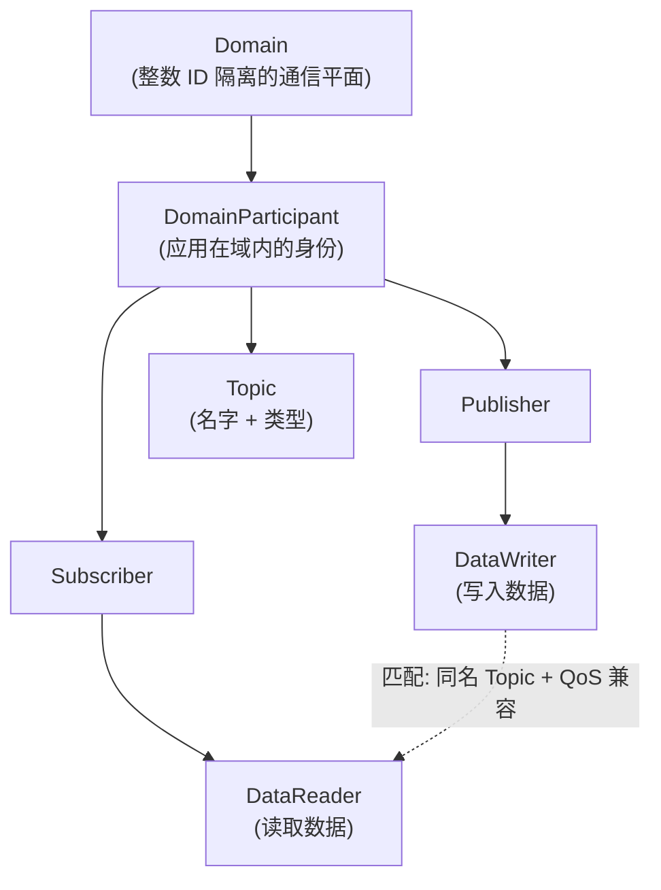

# DDS：数据分发服务

??? note "背景知识"
    - **ROS 2**：基于 DDS 构建的机器人分布式框架，是 DDS 在机器人领域最大的消费者 → [详见](ros2.md)
    - **具身智能数据管线**：DDS 在数据采集阶段承担节点间实时通信 → [详见](embodied-data-pipeline.md)

---

DDS (Data Distribution Service) 是 OMG (Object Management Group) 于 2004 年发布的分布式实时通信标准[^omg-dds]。ROS 2 选择 DDS 作为通信层并非偶然——DDS 的去中心化、强类型、细粒度 QoS 与机器人系统对实时性和容错性的需求高度契合。

## DDS 是一个数据协议

类比 gRPC 有助于理解 DDS 的定位：两者都是**通信协议 + 代码生成工具链**，应用链接库即可使用，无需部署独立服务。

| 维度 | gRPC | DDS |
|------|------|-----|
| 通信模式 | 请求/响应（也支持流） | **发布/订阅**（也支持请求/响应） |
| 接口定义 | Protobuf `.proto` 文件 | OMG IDL `.idl` 文件（或 ROS 2 的 `.msg`/`.srv`） |
| 发现 | 手动指定服务端地址 | **自动发现**（UDP 组播，无需配置） |
| 服务质量 | 无（依赖 HTTP/2 + 应用层重试） | **22+ 种 QoS 策略**（可靠性、时效性、历史保留等） |
| 部署形态 | 链接库，无需独立服务 | 同样是链接库，无需独立服务 |

但 DDS 有一个 gRPC 没有的核心特性：**去中心化**。gRPC 的客户端必须知道服务端在哪里；DDS 的节点启动后通过组播自动发现彼此，无需任何中央协调——机器人不应该因为某个中央服务挂掉而整体瘫痪。

### 三种传输通道

DDS 的 RTPS 协议定义的是逻辑层行为（发现、匹配、QoS），实际数据可以走多种物理通道。DDS 库会根据节点位置**自动选择**最优传输：

| 传输方式 | 适用场景 | 机制 |
|----------|----------|------|
| **UDP**（默认） | 跨机器通信 | 发现流量走 UDP 组播；用户数据走 UDP 单播。无连接，低延迟 |
| **TCP** | 穿越防火墙 / NAT | 面向连接，可靠但延迟高于 UDP |
| **SHM（共享内存）** | 同一台机器、不同进程 | 绕过网络栈，延迟和吞吐远优于 UDP loopback |

**SHM 的工作方式**（以 FastDDS 为例，默认同时启用 UDP + SHM）：

1. 每个 DomainParticipant 启动时在操作系统中创建一块**共享内存段**
2. DataWriter 把数据写入自己的共享内存段
3. Writer 通过一个共享内存环形缓冲区发送**缓冲区描述符**（指针/偏移量），而非数据本身
4. DataReader 收到描述符后直接从 Writer 的共享内存段读取——**数据零拷贝，不经过网络栈**

CycloneDDS 的方案类似但集成了 Eclipse iceoryx：Publisher 从 iceoryx 预分配的共享内存池中申请内存块，写入数据后将所有权"借出"(loan) 给 Subscriber，实现真零拷贝。

---

## 标准体系

DDS 由两个核心规范组成：

| 规范 | 职责 | 类比 |
|------|------|------|
| **DCPS** (Data-Centric Publish-Subscribe) | 上层 API，定义 Topic、DataWriter、DataReader、QoS | SQL 语言标准 |
| **DDSI-RTPS** (Real-Time Publish-Subscribe) | 线上互操作协议，定义发现协议、序列化格式、传输 | TCP/IP 协议 |

DCPS 保证源码级可移植，RTPS 保证不同厂商实现之间可互操作[^omg-rtps]——CycloneDDS 节点能与 FastDDS 节点直接通信。

---

## DCPS 实体模型

| 实体 | 职责 |
|------|------|
| **Domain** | 隔离的通信平面，不同 Domain 间完全隔离 |
| **DomainParticipant** | 应用进入 Domain 的入口，管理所有子实体的生命周期 |
| **Topic** | 数据的逻辑名称 + 类型定义，是发布者和订阅者的匹配点 |
| **DataWriter / DataReader** | 向 Topic 写入 / 读取数据样本 (sample) |
| **Publisher / Subscriber** | Writer / Reader 的管理容器，可施加分组级 QoS（如 Partition） |

---

## 自动发现协议

DDS 的去中心化发现分两阶段：

1. **PDP (Participant Discovery Protocol)**：DomainParticipant 启动时通过 UDP 组播广播自身存在，发现同一 Domain 中的其他 Participant
2. **EDP (Endpoint Discovery Protocol)**：发现对方后，交换 DataWriter / DataReader 的元信息（Topic 名、类型、QoS），**QoS 兼容则自动建立连接**

新节点加入网络无需任何配置即可被发现并开始通信。对机器人场景，这意味着热插拔传感器、动态增减计算节点不需要重启系统。

---

## QoS 策略体系

DDS 的核心竞争力。22+ 种策略中，机器人场景最常用的：

| 策略 | 控制什么 | 典型取舍 |
|------|----------|----------|
| **Reliability** | 数据交付保证 | RELIABLE 保证到达但增加延迟；BEST_EFFORT 低延迟但可能丢包 |
| **Durability** | 新加入者能否收到历史数据 | TRANSIENT_LOCAL 缓存最近数据给晚加入者（如地图） |
| **History** | 保留多少历史样本 | KEEP_LAST(1) 只保留最新值（传感器）；KEEP_ALL 保留全部（日志） |
| **Deadline** | 数据必须在多长时间内更新 | 超时触发告警（安全监控） |
| **Liveliness** | 判断发布者是否存活 | 自动心跳检测节点崩溃 |
| **Ownership** | 多 Writer 写同一 Topic 时谁优先 | EXCLUSIVE + strength 实现主备切换 |

**RxO (Requested vs. Offered) 匹配**：DataReader 请求的 QoS 必须与 DataWriter 提供的兼容，否则不建立连接。例如 Reader 要求 RELIABLE 但 Writer 只提供 BEST_EFFORT，匹配失败。这把通信不兼容从运行时静默故障前移到启动时显式报错。

---

## 主要开源实现

DDS 是标准，类似 SQL 之于数据库。多个实现遵循同一标准，通过 RTPS 协议互操作：

| 实现 | 语言 | 特点 | ROS 2 集成 |
|------|------|------|-----------|
| **Eclipse CycloneDDS** | C | 轻量高性能，Eclipse 基金会治理 | Jazzy+ 默认 rmw |
| **eProsima FastDDS** | C++ | 功能丰富，FIWARE 生态 | 早期 LTS 默认 rmw |
| **RTI Connext** | C++ | 商业版，军工/航空/医疗行业标杆 | 有 rmw 适配 |
| **OpenDDS** | C++ | 社区驱动，美军车辆系统采用 | 无官方 rmw |
| **Zenoh** | Rust | 非 DDS 协议，但 ROS 2 通过 rmw 支持 | rmw_zenoh（实验性） |

---

## 参考资料

[^omg-dds]: OMG. *Data Distribution Service (DDS) v1.4*. https://www.omg.org/spec/DDS/1.4
[^omg-rtps]: OMG. *DDS Interoperability Wire Protocol (DDSI-RTPS) v2.5*. https://www.omg.org/spec/DDSI-RTPS
