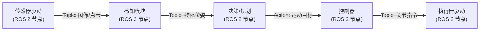

# ROS 2：机器人分布式软件框架

??? note "背景知识"
    - **DDS (Data Distribution Service)**：ROS 2 底层通信标准，去中心化发布/订阅 + 细粒度 QoS → [详见](dds.md)
    - **具身智能数据管线**：传感器到模型的 8 阶段管线，ROS 2 在采集阶段的角色 → [详见](embodied-data-pipeline.md)
    - **具身仿真**：Isaac Lab / MuJoCo 等仿真框架通过 ROS 2 桥接真机部署 → [详见](simulation.md)

---

ROS 2 (Robot Operating System 2) **不是操作系统**，而是一套运行在 Linux / Windows / macOS / RTOS 之上的分布式软件框架，为机器人应用提供进程间通信、硬件抽象、包管理和工具链[^ros2-docs]。

它解决的核心问题是：**让机器人系统中大量异构组件（传感器驱动、感知算法、规划器、控制器）以松耦合方式可靠协作，而无需开发者手写通信、发现和调度逻辑**[^ros2-design]。

## 分层架构

以下是**每个 ROS 2 节点**的软件栈——无论运行在机器人端、伴飞计算机还是远程工作站上，所有节点使用相同的分层结构。ROS 2 是对等架构，没有"服务器 vs 客户端"的角色区分。

```
┌───────────────────────────────────────────┐
│         应用层 (Nodes)                     │
├───────────────────────────────────────────┤
│   客户端库 rclcpp (C++) / rclpy (Python)   │
├───────────────────────────────────────────┤
│   rcl — 语言无关的核心逻辑 (C)             │
├───────────────────────────────────────────┤
│   rmw — 中间件抽象层                       │
├───────────────────────────────────────────┤
│   DDS 实现 (CycloneDDS / FastDDS / Zenoh)  │
├───────────────────────────────────────────┤
│   OS (Linux / Windows / RTOS)              │
└───────────────────────────────────────────┘
```

关键设计决策：

- **rmw 抽象层**：ROS 2 不绑定特定 DDS 供应商。通过 rmw (ROS MiddleWare interface) 对 CycloneDDS、FastDDS、RTI Connext 甚至非 DDS 的 Zenoh 提供统一 API，一个环境变量即可切换底层实现
- **rcl 核心库**：用 C 实现语言无关的公共逻辑（参数解析、名称解析、QoS 策略映射），rclcpp 和 rclpy 基于 rcl 构建，保证不同语言的行为一致
- **去中心化**：无中央协调节点，利用 [DDS 的自动发现机制](dds.md)实现节点间自组网

---

## 通信原语

ROS 2 提供四种通信模式，覆盖机器人系统的不同数据流特征：

### 话题 (Topic) — 异步数据流

发布/订阅模式，一对多、多对多。发布者不知道谁在订阅，订阅者不知道谁在发布。

- **场景**：传感器数据流——摄像头帧、激光雷达点云、IMU 读数、关节编码器
- **数据格式**：强类型 Message（`.msg` 文件用 IDL 定义），自动生成 C++ / Python 序列化代码
- **设计取舍**：解耦带来灵活性，但无确认机制——发布者不知道数据是否被消费

### 服务 (Service) — 同步请求/响应

客户端发请求 → 服务端计算 → 返回响应。阻塞式，适合**短耗时**操作。

- **场景**：查询机器人当前关节状态、触发一次标定计算、切换控制模式
- **设计取舍**：简单直接，但调用方需要等待返回，不适合耗时任务

### 动作 (Action) — 长时间任务 + 反馈

客户端发目标 → 服务端持续执行并发送中间反馈 → 可取消 → 最终返回结果。

- **场景**：导航到目标点、执行机械臂抓取序列、全身运动规划
- **实现**：底层由 Topic（反馈流）+ Service（目标/取消/结果）组合而成
- **设计取舍**：最丰富的交互模式，但复杂度也最高

### 参数 (Parameter) — 运行时配置

节点的类型化配置项（bool / int / float / string / 数组），支持动态修改无需重启。

- **场景**：调整 PID 增益、切换传感器采样频率、启停调试日志

---

## QoS 策略

ROS 2 将 [DDS 的 QoS 体系](dds.md)暴露为上层 API，常用策略子集：

| 策略 | 控制什么 | 机器人场景示例 |
|------|----------|----------------|
| **Reliability** | 可靠 vs 尽力传输 | 控制指令用 RELIABLE；点云用 BEST_EFFORT |
| **Durability** | 新订阅者是否收到历史数据 | 地图用 TRANSIENT_LOCAL（晚加入的节点仍需完整地图） |
| **History** | 保留最近 N 条 vs 全部 | 传感器数据 KEEP_LAST(1)（只关心最新值） |
| **Deadline** | 数据更新的最长间隔 | 安全监控：100ms 内必须收到心跳 |
| **Liveliness** | 发布者是否存活 | 检测传感器驱动节点是否崩溃 |

**RxO 匹配**：订阅者请求的 QoS 必须与发布者提供的兼容，否则不建立连接。例如订阅者要求 RELIABLE 而发布者只提供 BEST_EFFORT，系统在配置阶段就会报错——把运行时的通信故障前移到启动时暴露。

---

## Executor 与调度

Executor 是 ROS 2 中**回调函数的调度引擎**——决定收到消息后、定时器触发后、服务请求到达后，这些回调以什么顺序、在哪个线程上执行。

| Executor 类型 | 行为 | 适用场景 |
|---------------|------|----------|
| **SingleThreadedExecutor** | 所有回调串行执行 | 简单节点，无并发需求 |
| **MultiThreadedExecutor** | 回调分发到线程池并行执行 | 多传感器节点，需要并行处理 |
| **StaticSingleThreadedExecutor** | 启动时固定回调集合，减少运行时开销 | 嵌入式/实时场景 |

**Callback Group** 机制进一步控制回调间的并发关系：

- `MutuallyExclusive`：组内回调互斥，同一时刻只有一个在执行（保护共享状态）
- `Reentrant`：组内回调可并发执行

对实时机器人系统，Executor 的调度策略直接决定控制环路的确定性——这是 ROS 2 在生产部署中最需要精心设计的部分。

---

## Composition：零拷贝进程内通信

默认情况下每个节点是独立进程，通信经 DDS 网络栈。Composition 允许将多个节点加载到**同一进程**中，进程内通信走共享内存零拷贝（Intra-process），绕过 DDS 序列化/反序列化开销。

- **典型收益**：图像等大数据量话题的延迟从毫秒级降到微秒级
- **权衡**：失去进程隔离——一个节点崩溃会拖垮同进程的所有节点

---

## 关键工具链

| 工具 | 职责 |
|------|------|
| **Launch** | Python/XML/YAML 启动脚本，一次启动多节点并配置参数、命名空间、重映射 |
| **tf2** | 坐标变换树，维护传感器/关节/世界坐标系之间的实时变换关系 |
| **rosbag2** | 录制和回放话题数据（ROS bag 格式），用于离线调试和数据集构建 |
| **URDF** | 统一机器人描述格式，定义几何、运动学、物理属性 |
| **RViz** | 3D 可视化工具，实时显示点云、机器人模型、规划轨迹 |
| **colcon** | 构建工具，管理多包工作空间的增量编译 |

---

## 实例：控制关节转到指定位置

以一个 6-DOF 机械臂的单关节位置控制为例，展示一条指令从用户下发到电机执行的完整数据路径。

### 整体数据流

```
用户 / 规划节点
    │  Action: FollowJointTrajectory (目标位置 1.57 rad)
    ▼
JointTrajectoryController (ros2_control 控制器)
    │  进程内写入 command_interface["joint1/position"] = 1.57
    ▼
Controller Manager 实时循环 (read → update → write, 1kHz)
    │  调用 HardwareInterface::write()
    ▼
EtherCAT HardwareInterface 插件
    │  EtherCAT PDO: 目标位置 → 电机驱动器
    ▼
伺服电机驱动器 (硬件)
    │  电流环 / 位置环控制
    ▼
关节电机转动
```

### 逐层解析

**第一层：下发目标——Action vs Topic**

有两种方式把目标位置发送给控制器，对应两种不同的通信原语：

**方式一：Topic 直接发送指令**。通过 `ForwardCommandController` 监听一个 Topic，外部节点向该 Topic 发布目标位置值，控制器收到后直接写入 command_interface。这是**单向射后不管**——发布者不知道关节是否到达目标、也无法取消正在执行的运动。适合简单的遥操作或调试场景。

**方式二：Action 发送轨迹目标**。通过 `JointTrajectoryController` 暴露的 `FollowJointTrajectory` Action 接口，发送包含多路点和时间约束的完整轨迹。Action 提供 Topic 没有的三个能力：**持续反馈**（控制器周期性报告当前关节位置与误差）、**结果确认**（到达目标后返回成功/超差失败）、**可取消**（中途发 cancel 请求，控制器安全停止）。

生产系统几乎都用 Action——机械臂运动是耗时任务，需要知道执行结果并能随时中止。

无论哪种方式，消息都经 [DDS](dds.md) 传输。同机器走 SHM 零拷贝，跨机器走 UDP。

**第二层：ros2_control 实时循环**

`JointTrajectoryController` 运行在 Controller Manager 的**实时线程**中，以 1kHz 频率执行：

1. **read()**：HardwareInterface 从 EtherCAT 总线读取编码器当前位置，写入 `state_interface["joint1/position"]`
2. **update()**：控制器读取 state_interface 获得当前位置，与目标轨迹插值比较，计算下一拍的位置指令，写入 `command_interface["joint1/position"]`
3. **write()**：HardwareInterface 从 command_interface 取出指令，通过 EtherCAT 发给电机

state_interface 和 command_interface 是进程内的共享内存变量，控制器和硬件接口通过直接读写交换数据，保证微秒级延迟。

**第三层：EtherCAT 到电机**

HardwareInterface 的 `write()` 方法内部调用 EtherCAT 主站库（如 SOEM / EtherLab），将位置指令封装为 EtherCAT PDO (Process Data Object) 帧，通过以太网发送给伺服驱动器。驱动器内部的位置环 PID 控制器驱动电机转到目标位置。

### 各层通信方式

| 层级 | 通信方式 | 频率 | 延迟要求 |
|------|----------|------|----------|
| 规划 → 控制器 | ROS 2 Action / Topic | 低频（轨迹下发） | 毫秒级可接受 |
| 控制器 ↔ 硬件接口 | 进程内共享变量 | 1kHz | 微秒级（实时线程） |
| 硬件接口 → 电机 | EtherCAT PDO | 1kHz | 微秒级（硬件总线） |

ros2_control 的核心设计是把"通信灵活性"和"控制实时性"分离[^ros2-control]：节点间通信走 ROS 2 标准通信原语，1kHz 实时控制环路在进程内通过共享变量完成。

---

## 在具身智能中的定位

ROS 2 在具身智能技术栈中扮演**通信与集成层**，而非算法层：



- **数据采集**：rosbag2 录制的 ROS bag 是具身数据集的主要来源之一[^embodied-pipeline]，LeRobot 等框架需要从 ROS bag 中提取并转换数据
- **仿真桥接**：Isaac Lab、MuJoCo 等仿真器通过 ROS 2 接口暴露仿真数据，使同一套 ROS 2 节点可以无缝切换仿真/真机
- **PX4 无人机**：PX4 飞控通过 Micro XRCE-DDS 将内部 uORB 消息桥接到 ROS 2 数据空间
- **局限**：ROS 2 的通信开销（序列化 + 网络栈）对高频控制环路（>1kHz）是瓶颈，此时通常绕过 ROS 2 直接用共享内存或 EtherCAT

---

## 参考资料

[^ros2-design]: ROS 2 Design. *Why ROS 2?* https://design.ros2.org/articles/why_ros2.html
[^ros2-docs]: Open Robotics. *ROS 2 Documentation*. https://docs.ros.org/en/jazzy/
[^embodied-pipeline]: 具身智能数据管线. [详见](embodied-data-pipeline.md)
[^ros2-control]: ROS 2 Control. *Hardware Components*. https://control.ros.org/kilted/doc/ros2_control/hardware_interface/doc/hardware_components_userdoc.html
