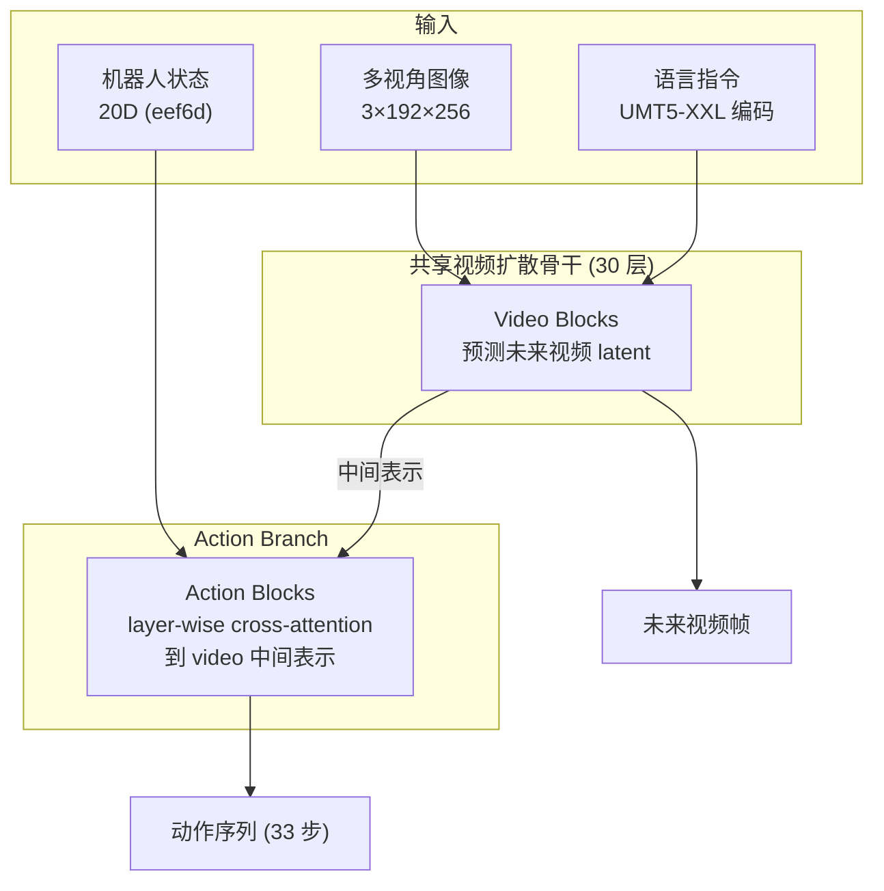
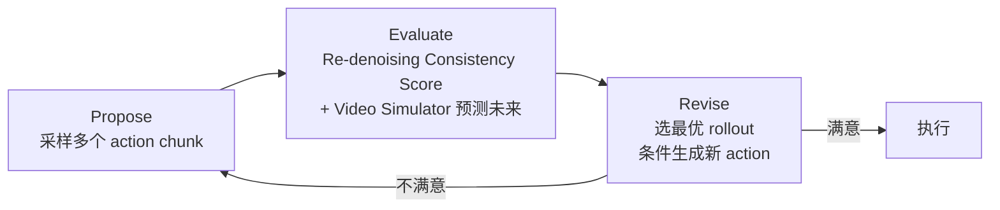

# τ₀-World Model：统一视频-动作世界模型

??? note "背景知识"
    - **具身智能数据类型**：机器人学习的通用四元组（图像、本体感知、动作、语言指令） → [详见](embodied-data-types.md)
    - **扩散模型**：通过迭代去噪从噪声分布生成目标样本的生成模型范式 → [详见](../foundations/diffusion-models.md)
    - **Flow Matching**：条件流匹配，学习从噪声到目标分布的连续向量场 → [详见](../foundations/diffusion-models.md)
    - **OpenPI**：Physical Intelligence 开源的 VLA 微调框架，τ₀-WM 的推理服务器基于其 WebSocket 架构 → [详见](openpi.md)
    - **具身智能数据归一化**：state/action 的 z-score / min-max / 分位数方案 → [详见](embodied-normalization.md)

---

| 属性 | 值 |
|------|-----|
| **开发者** | AGIBot (SII Research) |
| **GitHub** | [sii-research/tau-0-wm](https://github.com/sii-research/tau-0-wm) |
| **论文** | [tau_0_wm.pdf](https://finch-static.agibot.com/VAM/blog/tau_0_wm.pdf) |
| **模型规模** | 5B 参数 |
| **预训练数据** | ~27,300 小时异构数据 |
| **视频骨干** | Wan 2.2 TI2V-5B |
| **许可** | Apache 2.0 |

**一句话定位**：在共享的视频扩散骨干上联合预测未来视频帧和机器人动作序列，通过模态级监督掩码混合训练有/无动作标签的异构数据，并在推理时利用 action-conditioned video simulator 实现 Propose-Evaluate-Revise 测试时计算[^agibot-2026-tau0wm]。

---

## 核心架构：Video Action Model (VAM)

τ₀-WM 的核心是 Video Action Model，基于 Wan 2.2 的视频扩散 Transformer，通过增加 action branch 实现视频-动作联合生成：



关键设计决策：

- **共享表示**：action branch 通过 layer-wise cross-attention 读取 video branch 的中间表示，而非独立编码。这迫使 video branch 学到对控制有用的动态表征——"场景将如何在操作下演变"
- **单次只输出一种模态**：推理时 `return_video` 和 `return_action` 互斥，避免同时生成两种输出的计算冲突。联合去噪（`joint_denoising`）是可选模式
- **文本编码器**：使用 Wan 2.2 自带的 UMT5-XXL（text_len=512），比 OpenPI 的 PaliGemma tokenizer 容量更大

---

## 异构数据与模态级监督掩码

这是 τ₀-WM 在数据层面最核心的设计。传统 VLA（RT-2、OpenVLA、OpenPI）要求训练数据同时包含完整的四元组，τ₀-WM 打破这一约束：

| 数据源 | 规模 | 视频监督 | 动作监督 | 进度/失败标签 |
|--------|------|---------|---------|-------------|
| 真机遥操作 | 17,800 h | :material-check: | :material-check: | 可选 |
| UMI 数据 | 6,500 h | :material-check: | :material-check: | — |
| 自我中心人类视频 | 3,000 h | :material-check: | :material-close: | — |

**监督掩码机制**：每个样本只对它实际包含的信号计算 loss。机器人数据同时监督视频预测和动作生成；人类视频只监督视频预测分支，动作分支 loss 被 mask 掉。缺失的摄像头视角同样用 mask 跳过。

这解决了具身数据的核心矛盾：**有动作标签的机器人数据贵且场景单一，无动作标签的人类视频便宜且多样**。通过 mask 让两者在同一模型中互补——人类视频提供广泛的物体交互动态知识，机器人数据提供可执行的控制接地。

---

## 数据格式与动作空间

### 推理时数据接口

从部署代码提取的 payload 结构[^agibot-2026-tau0wm]：

| 字段 | 类型 | Shape | 说明 |
|------|------|-------|------|
| `obs` | float32 | `[3, 3, 192, 256]` | 3 视角（top_head / hand_left / hand_right）× RGB × H × W，范围 \[-1, 1\] |
| `prompt` | string | — | 语言指令 |
| `state` | float32 | `[14]` | 双臂 EEF 绝对位姿：2 × (xyz + 四元数 xyzw) |
| `gripper_states` | float32 | `[2]` | 左右夹爪，范围 0–120（0=开，120=闭） |
| `execution_step` | int | — | 从预测的 action chunk 中取前多少步执行 |

输出 action shape 为 `[T, 16]`：每臂 xyz + 四元数 xyzw + 夹爪开合度（0–1），共 2 × 8 = 16 维。

### 内部动作表示：eef6d

模型内部不直接使用四元数。输入时自动将四元数转换为 **6D rotation**[^zhou-2019-rotation]，训练和去噪都在 eef6d 空间进行：

| 表示 | 维度 | 每臂构成 | 使用场景 |
|------|------|---------|---------|
| **eef6d（内部）** | 20D | xyz(3) + 6D-rot(6) + gripper(1) = 10 × 2 | 训练、扩散去噪 |
| **eef-quat（外部）** | 16D | xyz(3) + quat-xyzw(4) + gripper(1) = 8 × 2 | 推理输入/输出 |

选择 6D rotation 的原因：四元数有对径等价性（q 和 -q 表示同一旋转），导致回归目标不连续；6D rotation 是连续化表示，对神经网络梯度更友好[^zhou-2019-rotation]。

### 动作类型：相对预测 → 绝对输出

训练时（`action_type: relative`）模型预测相对于当前状态的 EEF 增量。推理时的后处理链路：

```
扩散去噪 → 反归一化(mean-std) → 相对 eef6d → 累加当前状态 → 绝对 eef-quat 输出
```

### Action Chunk 配置

| 参数 | 值 | 说明 |
|------|-----|------|
| `action_chunk` | 33 | 一次预测 33 步未来动作 |
| `chunk` | 9 | 对应 9 帧视频（video branch 的时间维度） |
| `execution_step` | 1–100 | 实际执行前 N 步，由客户端指定 |

与[现有框架的 action chunking 对比](embodied-data-types.md#action-chunking)：介于 Diffusion Policy（4–16）和 ALOHA（50）之间。

### 归一化

使用 z-score（mean-std）归一化，统计量存储在 `statistics.json` 中，state 和 action 各 20 维独立计算均值/标准差。与 [OpenPI 的归一化策略](openpi.md)相同类型，但维度和物理含义不同。详见[归一化方案对比](embodied-normalization.md)。

---

## 推理时计算：Propose-Evaluate-Revise

τ₀-WM 的 world model 能力使其在推理时不只做单次前向预测，而是分配额外计算来筛选和改进动作：



1. **Propose**：Policy 采样多个候选 action chunk
2. **Evaluate**：用 Re-denoising Consistency Score（衡量候选动作与学到的动作分布的一致性）排序；分数不够高时，启动 action-conditioned video simulator 预测各候选的视觉后果和任务进度轨迹
3. **Revise**：选择最有前景的 rollout，以该未来视频为条件重新生成动作

这将具身控制从「反应式」变为「预测式」——执行前先在心理模型中模拟后果，类似人类抓取易碎物体前的下意识预判。代价是推理延迟增加（多轮扩散采样 + 视频生成）。

---

## 与现有框架的数据需求对比

| 维度 | OpenPI | τ₀-WM | 关键差异 |
|------|--------|-------|---------|
| **视觉输入** | 3 视角 224×224 | 3 视角 192×256 | 分辨率不同 |
| **状态表示** | 关节空间（默认） | EEF 笛卡尔空间（6D rot） | 动作空间根本不同 |
| **动作表示** | 关节绝对角度 / EEF | 相对 EEF 6D rotation | τ₀-WM 用连续化旋转 |
| **action chunk** | 50（默认） | 33 | — |
| **语言指令** | 必需 | 必需 | — |
| **训练数据要求** | 完整四元组 | **允许缺失动作标签** | 最大差异：异构混合训练 |
| **归一化** | z-score / 分位数 | z-score | — |
| **视频预测** | 无 | 联合预测未来视频 | 世界模型独有 |
| **推理服务器** | WebSocket | WebSocket（基于 OpenPI） | 同一套协议 |

---

## 参考资料

[^agibot-2026-tau0wm]: AGIBot SII Research. *τ₀-World Model: A Unified Video-Action World Model for Robotic Manipulation*. 2026. https://finch.agibot.com/research/tau0-wm
[^zhou-2019-rotation]: Zhou et al. *On the Continuity of Rotation Representations in Neural Networks*. CVPR 2019. https://arxiv.org/abs/1812.07035
