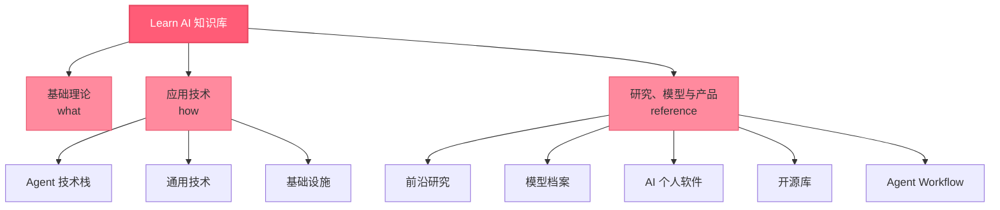

# Learn AI

个人 AI 前沿知识库。系统梳理 AI 核心技术，每日自动追踪社区与行业动态。

## 网站主题

本知识库聚焦 **AI 技术方案革新与工程亮点**，记录值得长期关注的技术突破，而非功能清单或通用知识。

### 知识体系拓扑

---

## 最近更新


- **{{ entry.date }} — [{{ entry.title }}]({{ entry.link }}){{ entry.title }}**

    {{ entry.description }}



