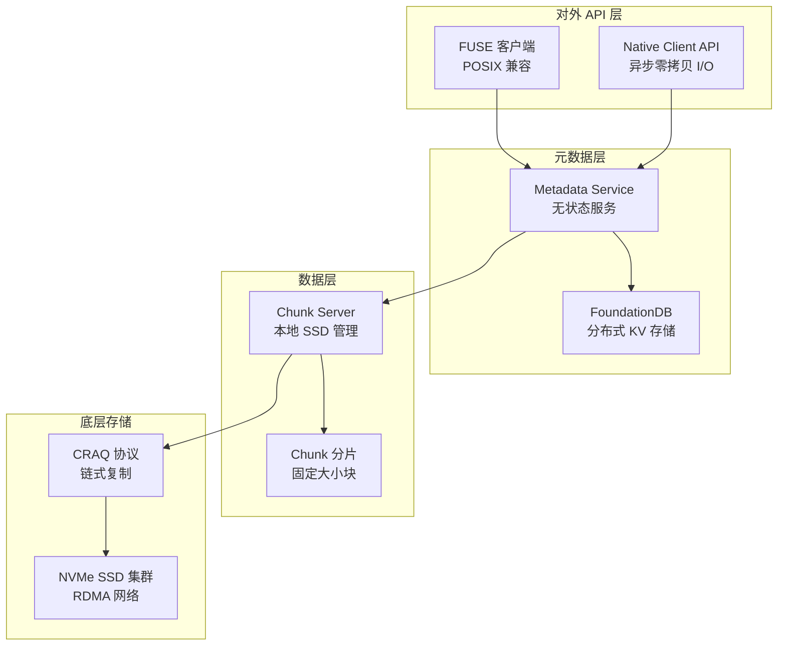

# 3FS 分布式文件系统

??? note "背景知识"
    - **POSIX 文件系统语义**：标准的 open/read/write/close 接口，应用无需感知底层存储拓扑
    - **RDMA**：远程直接内存访问，绕过 CPU 直接在网卡间传输数据，微秒级延迟 → [详见](infrastructure.md)
    - **InfiniBand / RoCE**：HPC 集群主流高速互联协议 → [详见](infrastructure.md#23)
    - **Chain Replication**：链式复制协议，通过有序复制链保证强一致性
    - **FoundationDB**：分布式键值存储，提供可序列化快照隔离（SSI）事务

> 3FS（Fire-Flyer File System）是 DeepSeek 自研的分布式文件系统，专为 AI 训练和推理工作负载设计[^deepseek-3fs]。它的核心设计目标是：**在数千节点的 AI 集群上，通过 RDMA 网络和 NVMe SSD 集群，提供 TB/s 级聚合吞吐，同时保持 POSIX 强一致性语义**。

---

## 1. 架构总览：四层设计

3FS 采用清晰的四层架构，从上到下依次为：



**层次职责**：

| 层次 | 核心组件 | 职责 |
|------|---------|------|
| 对外 API 层 | FUSE + Native Client | 提供文件系统接口，FUSE 兼容 POSIX，Native Client 提供高性能异步 I/O |
| 元数据层 | Metadata Service + FoundationDB | 管理文件元数据（inode、目录项），无状态设计，强一致性事务 |
| 数据层 | Chunk Server + Chunk | 管理文件数据分片，本地 SSD 存储，CRAQ 复制协议 |
| 底层存储 | CRAQ + NVMe SSD + RDMA | 链式复制保证强一致性，NVMe SSD 提供高性能存储，RDMA 提供低延迟网络 |

**关键设计决策**：

1. **元数据与数据分离**：Metadata Service 只管理元数据，数据路径完全绕过元数据层
2. **无状态元数据服务**：Metadata Service 无状态，可水平扩展，故障自动恢复
3. **链式复制**：通过 CRAQ 协议在 Chunk Server 间实现强一致性复制
4. **RDMA 网络**：全链路 RDMA，从客户端到存储节点，零拷贝数据传输

---

## 2. 对外 API 层：FUSE + Native Client

3FS 提供两套 API，兼顾兼容性和性能：

### 2.1 FUSE 客户端

**特点**：
- 标准 POSIX 兼容，应用无需修改代码
- 通过 FUSE 内核模块实现文件系统语义
- 适合通用场景，部署简单

**局限性**：
- **内存拷贝开销**：用户态和内核态之间数据拷贝消耗内存带宽
- **多线程扩展性差**：FUSE 内核模块的 spinlock 限制，约 400K IOPS 上限
- **并发写入限制**：Linux 5.x FUSE 不支持同一文件的并发写入

**适用场景**：数据分析、通用应用、对性能要求不极致的场景

### 2.2 Native Client API

**特点**：
- 异步零拷贝 I/O，绕过 FUSE 限制
- 受 Linux `io_uring` 启发，提供高效的 I/O 队列机制
- 支持批量 I/O 请求，减少 RPC 开销

**核心数据结构**：

| 结构 | 作用 | 类比 |
|------|------|------|
| **Iov** | 大块共享内存区域，用于零拷贝读写 | RDMA 内存注册区域 |
| **Ior** | 小型环形缓冲区，用于提交 I/O 请求 | Linux `io_uring` 的 submission queue |

**工作流程**：

```
1. 应用调用 open() 获取 fd
2. 通过 hf3fs_reg_fd() 注册 fd 到 Native Client
3. 应用准备 Iov（共享内存区域）
4. 应用通过 Ior 提交 I/O 请求（批量）
5. Native Client 批量处理请求，直接通过 RDMA 访问存储节点
6. 完成后通过 Ior 返回结果
```

**性能优势**：
- 零拷贝：数据直接在应用内存和存储节点间传输
- 批量 I/O：减少 RPC 开销，提高吞吐
- 绕过 FUSE 限制：突破 400K IOPS 上限

**适用场景**：AI 训练数据加载、KVCache、高性能计算

---

## 3. 元数据层：FoundationDB + 无状态服务

### 3.1 Metadata Service 设计

**无状态架构**：

```
传统有状态元数据服务：
Client → Metadata Service (本地存储) → 磁盘
         ↓ 故障需要恢复本地状态

3FS 无状态元数据服务：
Client → Metadata Service (无状态) → FoundationDB (分布式存储)
         ↓ 故障直接切换到其他实例
```

**优势**：
- **水平扩展**：可部署多个 Metadata Service 实例，负载均衡
- **故障恢复**：实例故障时，客户端自动切换到其他实例
- **升级维护**：滚动升级无需停机

### 3.2 FoundationDB 存储模型

**元数据结构**：

| 元数据类型 | 存储结构 | Key 格式 | Value 内容 |
|-----------|---------|---------|-----------|
| Inode | 文件/目录/符号链接属性 | `INOD` + inode ID (little-endian) | 权限、大小、时间戳、chunk 布局 |
| Directory Entry | 目录项 | `DIRE` + parent inode ID + name | 子 inode ID |

**文件 inode 扩展属性**：
- 文件长度
- Chunk 大小
- 选择的 chain table 范围
- Shuffle 种子（用于 chunk 分布）

**目录 inode 扩展属性**：
- 父目录 inode ID（用于检测循环）
- 默认布局配置（chain table、chunk size、stripe size）

**事务隔离**：FoundationDB 提供 Serializable Snapshot Isolation (SSI)，保证元数据操作的强一致性。

---

## 4. 数据层：Chunk 分片与分配

### 4.1 Chunk 分片机制

**分片策略**：
- 文件按固定大小（默认 1MB）切分为等大小的 chunks
- 每个 chunk 通过 CRAQ 协议复制到多个存储节点
- Chunk ID = inode ID + chunk index

**布局分配流程**：

```
1. 文件创建时，Metadata Service 从 chain table 中选择连续的复制链
   - 选择策略：round-robin
   - 选择数量：基于 stripe_size 参数
   - 随机 shuffle：生成随机种子打乱链顺序

2. 为文件分配 chunk 布局信息：
   - chain table 范围
   - chunk size
   - shuffle seed

3. 客户端打开文件时，获取布局信息
4. 客户端独立计算 chunk ID 和对应的复制链
5. 后续 I/O 操作无需经过 Metadata Service
```

**设计目标**：
- **负载均衡**：通过 round-robin + shuffle 确保跨链和 SSD 的均衡分布
- **元数据卸载**：客户端可独立计算 chunk 位置，减少元数据服务压力
- **灵活配置**：支持目录级配置（chain table、chunk size、stripe size）

### 4.2 Chunk 存储格式

**存储路径**：每个 Chunk Server 管理多个本地 SSD，数据存储在 `/storage/data{N}/3fs/` 路径下。

**空间管理**：
- **磁盘空间阈值**：
  - `disk_low_space_threshold = 96%`：低空间告警
  - `disk_reject_create_chunk_threshold = 98%`：拒绝创建新 chunk
  - `emergency_recycling_ratio = 95%`：紧急回收触发
- **预留空间**：`max_reserved_chunks = 1GB`，预留空间用于紧急情况
- **动态调整**：每 10 秒更新一次目标大小 (`update_target_size_interval = '10s'`)

---

## 5. CRAQ：链式复制协议详解

CRAQ（Chain Replication with Apportioned Queries）是 3FS 的核心一致性协议，它在传统链式复制的基础上优化了读性能。

### 5.1 传统链式复制的问题

**传统 Chain Replication**：

```
写路径：Client → Head → Middle → Tail
读路径：Client → Tail
```

**问题**：
- **写延迟高**：写操作必须等待整个链完成（Head → Middle → Tail）
- **读压力大**：所有读操作都集中到 Tail，成为瓶颈

### 5.2 CRAQ 的优化

**核心思想**：**写操作仍然走完整链，但读操作可以从任意节点读取最新版本**。

**版本管理**：
- 每个 chunk 维护一个版本号（monotonically increasing）
- 写操作递增版本号，沿链传播
- 每个节点记录已知的最新版本号

**读操作优化**：

```
传统链式复制读：
Client → Tail (总是从 Tail 读取)

CRAQ 读：
Client → 任意节点 (选择延迟最低的)
         ↓
         检查本地版本号
         ↓
         如果版本号 >= 客户端期望版本，直接返回
         否则，沿链向前查询最新版本
```

**写操作流程**：

```
1. Client 向 Head 发送写请求（数据 + 版本号）
2. Head 分配新版本号（v+1），写入本地，转发到 Middle
3. Middle 写入本地，转发到 Tail
4. Tail 写入本地，向 Head 发送确认
5. Head 向 Client 返回成功
```

### 5.3 CRAQ 的性能优势

| 指标 | 传统链式复制 | CRAQ |
|------|------------|------|
| 写延迟 | 3 跳 RTT | 3 跳 RTT |
| 读延迟 | 1 跳 RTT（到 Tail） | 1 跳 RTT（到最近节点） |
| 读吞吐 | 受限于 Tail | 所有节点分担 |
| 一致性 | 强一致性 | 强一致性 |

**关键权衡**：
- **写路径不变**：CRAQ 没有优化写延迟，写操作仍需走完整链
- **读路径优化**：读操作可以从任意节点读取，显著提高读吞吐
- **适用场景**：AI 训练工作负载读多写少（数据加载、KVCache 读），CRAQ 的优化非常契合

### 5.4 CRAQ 在 3FS 中的实现

**复制链配置**：
- Chain table 定义复制链的拓扑
- 每条链包含多个 Chunk Server（通常 3 个，提供 2 副本冗余）
- 支持多条链并行，提高整体吞吐

**故障处理**：
- **Head 故障**：Middle 晋升为新 Head，重新配置链
- **Middle 故障**：跳过故障节点，链缩短
- **Tail 故障**：Middle 成为新 Tail

**数据恢复**：
- 故障节点恢复后，从邻居节点拉取最新数据
- 通过版本号确定需要恢复的 chunk

---

## 6. 底层存储：NVMe SSD + RDMA 网络

### 6.1 NVMe SSD 集群

**硬件配置示例**（来自 3FS 官方文档）：
- 每个 Chunk Server：16 × 14TB NVMe SSD
- 单节点存储容量：224 TB
- 180 个存储节点：总容量 ~40 PB

**性能特征**：
- **高 IOPS**：NVMe SSD 提供 10万+ IOPS
- **低延迟**：微秒级访问延迟
- **高带宽**：单盘 3-7 GB/s，节点级 50-100 GB/s

### 6.2 RDMA 网络

**网络拓扑**：
- **存储节点**：2 × 200Gbps InfiniBand NIC
- **计算节点**：1 × 200Gbps InfiniBand NIC
- **网络协议**：InfiniBand 或 RoCE

**RDMA 优势**：
- **零拷贝**：数据直接在网卡间传输，绕过 CPU
- **低延迟**：微秒级网络延迟
- **高吞吐**：200Gbps 带宽充分利用

**性能示例**（来自 3FS 官方文档）：
- 180 节点集群：6.6 TiB/s 聚合读吞吐
- 25 节点集群：3.66 TiB/min GraySort 吞吐

---

## 7. 与 AI 训练工作负载的关联

3FS 在 AI 基础设施中的位置是**高性能存储层**：

| AI 训练阶段 | 3FS 的角色 | 关键需求 | 3FS 解决方案 |
|------------|-----------|---------|-------------|
| 数据加载 | 数千 GPU 节点并发读训练数据 | 高读带宽、低延迟 | Native Client + CRAQ 读优化 + RDMA |
| Checkpoint 写入 | 周期性保存模型状态 | 高写带宽、强一致性 | CRAQ 写复制 + 条带化 + RDMA |
| KVCache 推理 | 缓存 LLM 推理的 KV 对 | 高读吞吐、大容量 | Native Client + NVMe SSD 集群 |

**与 Lustre 的对比**：

| 维度 | Lustre | 3FS |
|------|--------|-----|
| 元数据存储 | 有状态 MDS | 无状态 + FoundationDB |
| 一致性协议 | LDLM 锁 | CRAQ 链式复制 |
| 网络 | LNet（自建协议） | 标准 RDMA |
| 客户端 | 内核模块 | FUSE + Native Client |
| 适用场景 | HPC 通用 | AI 训练专用 |

**3FS 的独特价值**：
- **强一致性**：CRAQ 保证数据强一致性，应用无需担心数据不一致
- **高性能**：RDMA + NVMe SSD + Native Client，充分利用硬件性能
- **AI 优化**：针对 AI 训练工作负载优化（读多写少、大文件、高并发）

---

## 参考资料

[^deepseek-3fs]: DeepSeek. *Fire-Flyer File System (3FS)*. 2025. https://github.com/deepseek-ai/3FS
