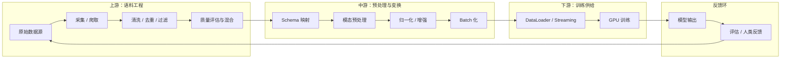

# AI 数据管线

??? note "背景知识"
    - **结构化数据格式**：Parquet、Arrow、Lance 等列式格式的设计权衡 → [详见](structured-data-format.md)
    - **分布式训练**：数据加载到梯度更新的完整链路 → [详见](distributed-training.md)
    - **LLM 训练流程**：预训练 → SFT → RLHF 的三阶段数据需求 → [详见](llm-training.md)

---

所有 ML 系统都需要数据管线（data pipeline）：把**原始数据**变成**模型可消费的张量**，再把模型输出变回有意义的结果。但"数据管线"远不止预处理——从原始数据的采集和整理，到训练时的高效供给，再到模型输出反哺下一轮训练，整条链路的每个环节都有独立的技术问题。

## 全景：端到端数据流



| 环节 | 核心问题 | 技术关注点 |
|------|---------|-----------|
| **语料工程** | 原始数据 → 高质量训练语料 | 去重、过滤、混合配比、合成数据 |
| **预处理与变换** | 多源异构 → 统一张量 | Schema 对齐、模态转换、归一化、增强 |
| **训练供给** | 存储 → GPU 无断流 | I/O 流水线、格式选型、流式/物化权衡 |
| **反馈环** | 模型输出 → 新训练数据 | RLHF、合成数据、主动学习 |

---

## 语料工程：从原始数据到训练语料

训练数据的质量直接决定模型能力上限。语料工程的核心挑战不是"获取数据"，而是**从海量噪声中提炼高质量信号**。

### 去重

重复数据导致模型在重复样本上过拟合、浪费算力，且劣化泛化能力[^lee-2022]。

| 方法 | 原理 | 适用场景 | 权衡 |
|------|------|---------|------|
| **精确去重** | 文档级 hash（MD5/SHA） | 完全相同的副本 | 快但漏掉近似重复 |
| **MinHash + LSH** | $k$ 个哈希函数估计 Jaccard 相似度，LSH 分桶加速检索 | 近似重复（转载、轻微编辑） | 概率性，可调 false positive/negative |
| **后缀数组** | 找出共享的长子串（如 50+ token 重复片段） | 段落级抄袭、模板文本 | 内存高，适合离线批处理 |
| **语义去重** | Embedding 空间聚类，去除语义重复 | 同一事件的不同报道 | 依赖 embedding 质量，计算成本高 |

实践中通常分层组合：先精确去重（$O(n)$），再 MinHash 过滤近似重复（$O(n)$），最后可选语义去重。

### 质量过滤

| 策略 | 做法 | 权衡 |
|------|------|------|
| **基于困惑度** | 用参考 LM（如 KenLM）评分，过滤困惑度过高/过低的文档 | 简单高效；偏向"像训练数据"的文本 |
| **分类器过滤** | 训练 fastText/BERT 分类器区分高质量（如维基百科）和低质量文本 | 灵活；分类器偏差会传导到训练数据 |
| **启发式规则** | 长度/重复率/特殊字符比例/语言检测 | 无模型依赖；规则需要大量人工调参 |
| **有害内容过滤** | 毒性分类器 + PII 正则匹配 + 黑名单 URL | 安全必需；过度过滤损失多样性 |

FineWeb[^penedo-2024] 的实践表明，**过滤策略的选择比数据规模更重要**——15T token 经过精细过滤后效果优于未过滤的数倍数据。

### 数据混合

预训练数据来自多个领域（网页、书籍、代码、论文、对话），**混合比例直接影响模型在各领域的表现**。

核心权衡：**代表性 vs 质量**——按自然分布混合会被低质量网页淹没，过度上采样高质量源则限制多样性。

| 策略 | 做法 | 特点 |
|------|------|------|
| **启发式加权** | 手动设定比例（如代码 10%、学术 15%、网页 60%） | 简单直接，依赖经验 |
| **温度采样** | 对数据源 $i$ 的采样概率 $p_i \propto n_i^{1/T}$，温度 $T$ 控制偏离自然分布的程度 | 单参数可调，易于实验 |
| **课程学习** | 训练早期侧重多样性（高温度），后期偏向高质量源（低温度） | 兼顾覆盖面和精度，调参复杂 |

### 合成数据

当真实标注数据稀缺或成本过高时，合成数据成为关键补充：

| 类型 | 做法 | 典型场景 |
|------|------|---------|
| **模型蒸馏** | 强模型生成训练数据供弱模型学习 | SFT 指令数据生成、代码生成 |
| **自我博弈** | 模型与自身或对手交互产生数据 | 数学推理、代码竞赛 |
| **仿真生成** | 物理模拟器批量生成传感器数据 | 自动驾驶、具身智能 → [详见](../embodied-infrastructure/simulation.md) |
| **规则扩增** | 模板填充、回译、同义改写 | 低资源语言、数据增强 |

风险：迭代训练在自身生成的数据上会逐步丧失分布多样性（model collapse）[^shumailov-2024]，需要持续混入真实数据。

---

## 预处理与变换：通用阶段模型

将原始数据变成模型输入张量，无论场景都经历以下逻辑阶段：

| 阶段 | 做什么 | 典型操作 |
|------|--------|----------|
| **Schema 映射** | 统一不同数据源的命名/结构 | key 重命名、字段对齐、缺失字段填充 |
| **模态预处理** | 各模态独立清洗 | 图像 resize/crop、文本 tokenization、音频 mel-spectrogram |
| **归一化** | 拉到统一尺度 | min-max、z-score、分位数截断 |
| **时序窗口** | 组织时间维度 | 历史帧堆叠、滑动窗口、序列截断/padding |
| **表示转换** | 变换到模型期望的表示空间 | embedding 查表、离散化/连续化、坐标系变换 |
| **数据增强** | 提升泛化能力 | 随机裁剪、噪声注入、mixup |
| **Batch 化** | 准备好给加速器 | collation、device placement、混合精度转换 |

这些阶段在 CV（torchvision transforms）、NLP（HuggingFace tokenizers + data collator）、语音（torchaudio pipelines）中都有对应实现，只是具体操作不同。

---

## 训练时数据供给：存储到 GPU

训练供给的目标是**让 GPU 永远不等数据**。GPU FLOPS 增速远超存储带宽增速，数据供给正在成为训练瓶颈。

### 流式 vs 物化

| 方式 | 做法 | 优势 | 劣势 |
|------|------|------|------|
| **物化数据集** | 预处理后落盘，训练时直接读取 | 训练时零预处理开销、可随机访问 | 占用大量存储，修改预处理需重新生成 |
| **流式处理** | 训练时实时读取 + 预处理 | 存储效率高、支持无限大数据集 | 难以随机打乱，预处理增加延迟 |
| **混合方案** | 关键步骤（tokenization）预物化，轻量步骤（增强）运行时做 | 平衡存储和灵活性 | 管线复杂度增加 |

### 存储格式选型

格式选型直接影响 I/O 吞吐和 GPU 利用率 → [详见结构化数据格式](structured-data-format.md)。

关键权衡：

- **顺序扫描**（预训练）→ Parquet / WebDataset（压缩率优先）
- **随机访问**（微调、强化学习）→ Lance / IndexedDataset（访问延迟优先）
- **GPU 直接消费** → Arrow / Feather + GPUDirect Storage（零拷贝优先）

### DataLoader 流水线

训练时数据加载需要多级流水线来隐藏 I/O 延迟 → [详见分布式训练数据流](distributed-training.md)：

```
存储 → [prefetch 线程] → CPU 内存 → [预处理 worker] → [pinned memory] → GPU HBM
```

关键优化点：多 worker 并行预处理、异步 prefetch、pin_memory 加速 H2D 传输。分布式场景下还需要跨节点数据分片和 shuffle 策略，避免各 GPU 看到重复样本。

---

## 数据反馈环

传统管线是单向的（数据 → 模型），现代 AI 系统越来越依赖**模型输出反哺数据**的闭环。

### RLHF / RLAIF 数据环

强化学习对齐引入了新的数据流模式 → [详见 LLM 训练流程](llm-training.md)：

```
模型生成候选 → 人类/AI 标注偏好 → 训练奖励模型 → 优化策略 → 生成更好的候选 → …
```

这个环路每轮产生新的训练数据（偏好对），且数据分布随模型能力变化——模型越强，需要越难的偏好对才能继续提升。数据管线需要支持**在线生成 + 实时标注 + 即时训练**的快速迭代。

### 合成数据自举

模型生成的数据反哺自身训练（self-improvement loop）：

- **数学/代码**：模型生成解题过程 → 验证器检查正确性 → 正确样本加入训练集
- **指令跟随**：强模型批量生成 SFT 数据 → 过滤后训练弱模型
- **风险**：model collapse[^shumailov-2024]——迭代训练在自身生成的数据上逐步丧失分布多样性

### 生产数据飞轮

部署后的模型持续生成可用于改进的信号：

```
用户请求 → 模型推理 → 用户反馈（隐式/显式）→ 标注 → 重新训练 → 更好的模型
```

核心技术问题：**数据漂移检测**（输入分布偏移时触发重训练）、**隐私合规**（用户数据脱敏）、**主动学习**（优先标注模型最不确定的样本，最大化标注效率）。

---

## 开环 vs 闭环：管线方向的根本差异

上述各环节在所有 AI 系统中都存在，但管线的**方向性**因系统类型而异——模型输出**是给人看的**还是**直接驱动物理执行器的**，决定了管线架构的复杂度。

```
开环（CV / NLP）：
  原始数据 → [前向管线] → 模型 → 输出给人看
                                    ↓
                              评估指标（accuracy, BLEU, ...）

闭环（具身 / 自动驾驶 / 工业控制）：
  传感器 → [前向管线] → 模型 → [逆向管线] → 执行器 → 物理世界
     ↑                                                  │
     └──────────── 传感器再次采集 ←──────────────────────┘
```

| 维度 | 开环 | 闭环 |
|------|------|------|
| **管线方向** | 仅前向 | 前向 + 逆向 |
| **逆向路径** | 不存在 | 必须把模型输出变回执行器可执行的指令 |
| **变换一致性** | 无要求 | 前向和逆向必须**严格对称**——归一化参数、变换顺序、有状态步骤的状态管理都必须一致 |
| **错误后果** | 指标下降 | 物理损坏、安全事故 |
| **实时约束** | 无（离线训练 + 异步推理） | 管线延迟直接影响控制频率（10-100 Hz） |
| **统计量管理** | 训练时算好即可 | 统计量必须持久化并在推理时**原样加载**；训练/推理不一致 = 物理失控 |

### 双向变换一致性——闭环管线的核心难题

开环系统的前向管线有 bug，最多导致精度下降。闭环系统如果前向和逆向管线不对称，模型输出的物理含义被篡改——例如训练时做了 `normalize(action)`，推理时忘了 `denormalize`，机器人收到的指令完全不是模型想表达的。

在管线包含**有状态变换**时极易出错：相对动作转换（$a_t^{rel} = a_t^{abs} - s_t$）需要记住当前状态 $s_t$，前向和逆向的状态管理必须精确匹配。

主要应对模式：

| 模式 | 做法 | 代表 |
|------|------|------|
| **可逆 Transform 栈** | 每个变换自带逆操作，逆向路径自动按逆序执行 | OpenPI（具身） |
| **显式双路径管线** | `forward()` / `inverse()` 分开声明，框架运行时校验 I/O 合约 | LeRobot[^lerobot-2026]（具身） |
| **端到端模型内化** | 模型直接输出原始控制量，管线不做逆向变换 | 部分端到端自动驾驶方案 |

### 实时约束

闭环系统管线延迟直接影响控制频率，延迟超过控制周期意味着执行器在"盲飞"：

- **具身操控**：30-100 Hz，单帧预算 10-33ms
- **自动驾驶**：10-20 Hz 决策频率，感知管线 50-100ms
- **工业控制**：PLC 扫描周期 1-10ms

具身智能管线因**硬件碎片化**最为复杂（数百种机器人 × 异构动作空间 × 碎片化通信协议）→ [详见具身智能数据管线](../embodied-infrastructure/embodied-data-pipeline.md)。

---

## 场景对比

不同 AI 场景的数据管线面对的核心问题分布截然不同：

| 维度 | LLM 预训练 | SFT / RLHF | 多模态 | 推荐系统 | 具身智能 | 自动驾驶 |
|------|-----------|-------------|--------|---------|---------|---------|
| **数据规模** | TB-PB | GB-TB | TB（图文对） | TB（日志） | GB（稀缺） | TB（传感器） |
| **主要瓶颈** | 语料质量与去重 | 标注质量与成本 | 模态对齐 | 特征时效性 | 硬件碎片化 | 传感器标定 |
| **管线方向** | 开环 | 开环 + 反馈环 | 开环 | 开环 + 在线特征 | 闭环 | 闭环 |
| **实时要求** | 无 | 无 | 无 | 在线特征 <100ms | 10-33ms | 50-100ms |
| **数据反馈** | 弱（版本迭代） | 强（RLHF 环路） | 中 | 极强（实时反馈） | 中（仿真回灌） | 中（corner case 采集） |
| **合成数据** | 低 → 增长中 | 高（蒸馏生成） | 中 | 低 | 高（仿真主导） | 高（仿真 + 重放） |
| **典型格式** | Parquet / JSONL | JSONL / Arrow | WebDataset / Lance | 特征存储 | HDF5 / LeRobot | ROS bag / Parquet |

---

## 参考资料

[^lee-2022]: Lee et al. *Deduplicating Training Data Makes Language Models Better*. ACL 2022. https://arxiv.org/abs/2107.06499
[^penedo-2024]: Penedo et al. *The FineWeb Datasets: Decanting the Web for the Finest Text Data at Scale*. 2024. https://arxiv.org/abs/2406.17557
[^shumailov-2024]: Shumailov et al. *AI models collapse when trained on recursively generated data*. Nature 2024. https://www.nature.com/articles/s41586-024-07566-y
[^lerobot-2026]: Cadène et al. *LeRobot: End-to-End Learning for Real-World Robotics in a Million Lines of Code*. ICLR 2026. https://github.com/huggingface/lerobot
