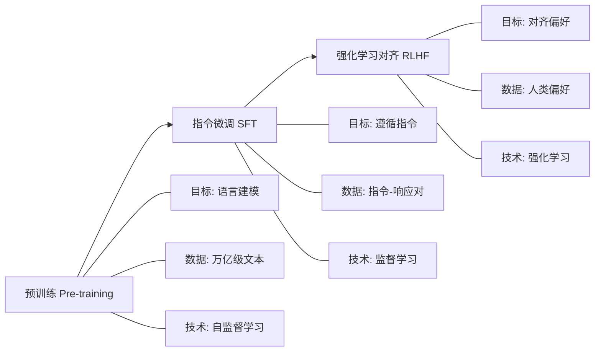

??? note "背景知识"
    - **预训练（Pre-training）**：在大规模文本上自监督学习语言知识和推理能力
    - **指令微调（SFT）**：用指令-响应对训练模型学会遵循指令
    - **RLHF**：用人类反馈训练奖励模型来优化 LLM 行为
    - **对齐（Alignment）**：让模型行为符合人类意图和价值观

## 三阶段训练流程

LLM 训练分为三个阶段，每个阶段的目标、数据和技术都不同：

## 预训练（Pre-training）

**目标**：学习语言知识、世界知识、推理能力

**数据**：
- 规模：万亿级 token（如 GPT-3 用了 300B token，Llama 2 用了 2T token）
- 来源：网页、书籍、代码、论文
- 特点：无标注，纯文本

**技术**：
- 自监督学习：预测下一个 token（语言建模目标）
- 损失函数：交叉熵 $L = -\sum \log P(x_t | x_{<t})$
- 架构：Transformer decoder-only（如 GPT 系列）或 encoder-decoder（如 T5）
- 训练技巧：学习率 warmup + cosine decay、梯度裁剪、混合精度训练
- 训练方式：分布式训练（数据并行 + 模型并行 + 流水线并行）[^training-evolution]
- 训练时长：数月

**产出**：
- 基座模型（Base Model）
- 具备语言理解和生成能力
- 但不知道"说什么是对的"

## 指令微调（SFT）

**目标**：让模型学会遵循指令，变成有用的助手

**数据**：
- 规模：百万级指令-响应对
- 来源：人工标注、合成数据
- 特点：有明确的输入-输出映射

**技术**：
- 监督学习：拟合指令-响应映射
- 损失函数：交叉熵（对响应部分计算损失）
- 数据质量：指令多样性、响应质量是关键，通常需要多轮人工审核
- 指令格式：统一的 prompt 模板（如 `### Instruction:\n...\n### Response:\n...`）
- 混合训练：SFT 数据 + 预训练数据混合，防止灾难性遗忘
- 训练方式：通常在预训练基础上微调（小学习率，如 1e-5）
- 训练时长：数小时到数天

**产出**：
- 指令跟随模型（Chat Model）
- 能理解并执行指令
- 但仍可能有有害、不准确输出

## 强化学习对齐（RLHF）

**目标**：让模型输出符合人类偏好（有用、无害、诚实）

**数据**：
- 规模：十万到百万级偏好对
- 来源：人类标注（哪个回答更好）
- 特点：相对偏好，而非绝对标签

**技术**：
- 奖励建模：训练奖励模型（RM）预测人类偏好，通常用 SFT 模型初始化
- 偏好数据收集：对同一 prompt 生成多个响应，人类标注排序（A > B > C）
- 策略优化算法：
  - **PPO**：Proximal Policy Optimization，生成候选 → RM 打分 → 策略更新
  - **DPO**：Direct Preference Optimization，跳过 RM，直接用偏好数据优化策略
  - **KTO**：Kahneman-Tversky Optimization，不需要 pair 对，基于前景理论
- 关键约束：KL 散度惩罚 $D_{KL}(\pi_\theta || \pi_{ref})$，防止策略偏离基础模型
- 训练技巧：混合训练（RL 信号 + SFT 信号）、奖励模型集成、批量采样
- 训练时长：数小时到数天

**产出**：
- 对齐模型（Aligned Model）
- 输出符合人类价值观
- 更安全、更有用

## 三阶段对比

| 维度 | 预训练 | 指令微调 | RLHF |
|------|--------|----------|-------|
| **目标** | 学习语言知识 | 学会遵循指令 | 对齐人类偏好 |
| **数据规模** | 万亿级 token | 百万级样本 | 十万级偏好对 |
| **数据来源** | 网页、书籍、代码 | 人工标注、合成 | 人类偏好标注 |
| **损失函数** | 交叉熵（语言建模） | 交叉熵（指令跟随） | 奖励最大化 + KL 惩罚 |
| **训练方式** | 从零训练 | 微调 | 微调 |
| **训练时长** | 数月 | 数小时-数天 | 数小时-数天 |
| **计算成本** | 极高 | 中等 | 中等 |
| **关键挑战** | 分布式训练、显存优化 | 数据质量、过拟合 | 奖励黑客、训练稳定性 |

## 为什么分三阶段？

### 数据性质不同

- 预训练需要海量无标注文本（容易获取）
- SFT 需要指令-响应对（需要人工标注，成本高）
- RLHF 需要人类偏好（需要人工标注，成本更高）

无法在预训练中完成 SFT 和 RLHF，因为：
- 人类偏好标注无法达到万亿级规模
- 预训练文本没有"哪个回答更好"的标注

### 目标函数冲突

- 预训练要学"所有可能的文本分布"
- SFT 要学"指令跟随的文本分布"
- RLHF 要学"人类偏好的文本分布"

三者优化方向不同，混在一起训练会相互干扰。

### 计算成本考虑

- 预训练已经很贵（数月、数百万美元）
- 如果在预训练中混入 SFT/RLHF 目标，会显著增加复杂度
- 分阶段训练更灵活：一个基座模型可以用不同的 SFT/RLHF 策略适配不同场景

## 与传统训练的区别

| 维度 | 传统训练（如 MNIST） | LLM 训练 |
|------|---------------------|----------|
| **数据来源** | 静态数据集 | 预训练：动态文本 SFT：指令-响应对 RLHF：交互生成 |
| **训练阶段** | 单阶段 | 三阶段（预训练 → SFT → RLHF） |
| **目标** | 拟合已知标签 | 预训练：语言建模 SFT：指令跟随 RLHF：奖励最大化 |
| **数据规模** | 固定数据集 | 预训练：万亿级 SFT/RLHF：百万级 |
| **训练方式** | 从零训练 | 预训练：从零 SFT/RLHF：微调 |
| **反馈机制** | 即时标签 | 预训练：自监督 SFT：即时标签 RLHF：延迟奖励 |

## 参考资料

[^training-evolution]: 训练范式演进（CPU → GPU → 分布式）→ [详见](./training-evolution.md)
