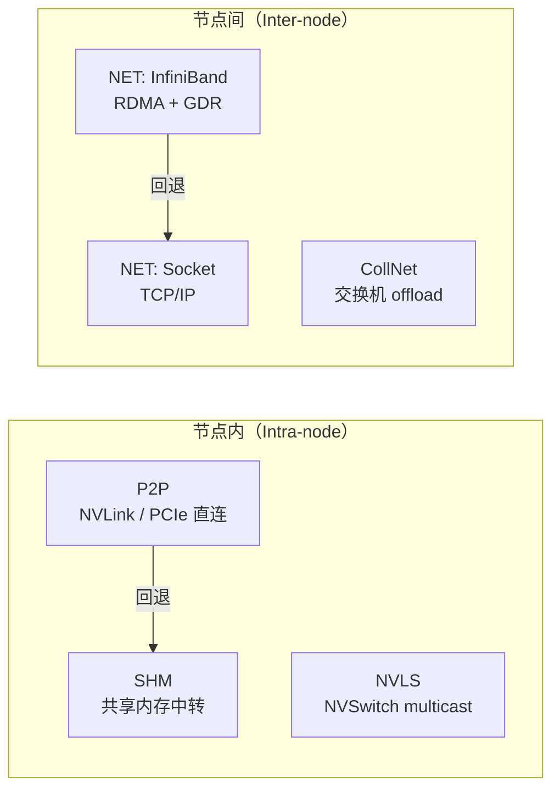

??? note "背景知识"
    - **分布式训练**：多 GPU 协作训练大模型的系统架构 → [详见](./distributed-training.md)
    - **NVLink / NVSwitch**：NVIDIA GPU 间的高速互联，提供数百 GB/s 的双向带宽 → [详见](../hardware/nvlink.md)
    - **InfiniBand / RoCE**：节点间高速网络，支持 RDMA 绕过 CPU 直接访问远端内存 → [详见](../hardware/nvidia-connectx.md)
    - **All-Reduce**：所有 GPU 的数据求和并分发的集合通信原语，数据并行梯度同步的核心操作 → [详见](./dp.md)

---

## NCCL 解决什么问题

分布式训练需要 GPU 之间大量交换数据（梯度同步、激活值传递、参数分片拉取）。用 CUDA IPC + socket 也能发数据，但 NCCL[^nccl-repo] 的价值在于**在任意 GPU 拓扑上把集合通信跑到接近硬件带宽上限**。

这是一个复杂的优化问题：同一集群内，节点内 GPU 可能通过 NVLink/PCIe/NVSwitch 互连，节点间可能走 InfiniBand 或 RoCE，每条链路带宽不同、延迟不同。NCCL 自动探测拓扑、选择算法、流水线化传输、在 GPU kernel 内融合计算与通信——用户只需调用一个 `ncclAllReduce`。

---

## 数据操作 API

NCCL 的数据操作分三类，对应不同的通信范式。

### 集合通信（Collective）

所有 rank 共同参与，最核心的 API：

| API | 语义 | 典型用途 |
|-----|------|----------|
| `ncclAllReduce` | 所有 rank 数据 reduce，结果广播给每个 rank | DP 梯度同步 |
| `ncclReduceScatter` | reduce 后切分，每个 rank 得到结果的一段 | FSDP/ZeRO 梯度同步 |
| `ncclAllGather` | 每个 rank 发自己的数据，所有 rank 收到完整拼接 | FSDP 参数重组 |
| `ncclBroadcast` | root rank 数据复制到所有 rank | 参数初始化广播 |
| `ncclReduce` | 所有 rank 数据 reduce 到 root rank | 单点聚合 |

> **rank** = 参与通信的每个进程/GPU 的唯一编号（0 到 N-1）。

### 集合操作的执行模型

集合操作分两个阶段：**communicator 初始化**建立拓扑关系，**每次调用**只声明数据地址。

```
阶段一：ncclCommInitAll / ncclCommInitRank（一次性）
  ├─ 探测硬件拓扑（NVLink / PCIe / NVSwitch / IB）
  ├─ 选择通信算法和路径（如 Ring: GPU0→GPU1→GPU2→GPU3→GPU0）
  └─ 生成 communicator 对象，每个 comm 都知道完整拓扑

阶段二：ncclAllReduce（每次集合调用）
  每个 rank 只声明三件事：我是谁（comm）、输入在哪（sendbuff）、输出放哪（recvbuff）
  所有 rank 凑齐后，NCCL 按初始化时选好的路径执行数据传输
```

以 4 GPU Ring AllReduce 为例：

```
ncclGroupStart();
ncclAllReduce(send0, recv0, ..., comms[0], ...)  → rank 0 报到："我的数据在 send0"
ncclAllReduce(send1, recv1, ..., comms[1], ...)  → rank 1 报到："我的数据在 send1"
ncclAllReduce(send2, recv2, ..., comms[2], ...)  → rank 2 报到："我的数据在 send2"
ncclAllReduce(send3, recv3, ..., comms[3], ...)  → rank 3 报到："我的数据在 send3"
ncclGroupEnd();  ← 4 个 rank 凑齐，按已选好的 Ring 路径执行
                    完成后：recv0 = recv1 = recv2 = recv3 = send0 + send1 + send2 + send3
```

集合操作要求 communicator 中**所有 rank 都参与**——任何一个 rank 缺席，其他 rank 会无限等待（死锁）。单进程管多 GPU 时必须用 `ncclGroupStart/End` 包裹循环；多进程（每进程一卡，主流做法）则各自调用一次即可。

### 点对点通信（P2P, since 2.7）

任意两个 rank 之间的显式收发，通过 `ncclGroupStart/ncclGroupEnd` 组合多个 Send/Recv 可表达 scatter、gather、all-to-all 等任意模式：

```
ncclGroupStart();
for (int r = 0; r < nranks; r++) {
    ncclSend(sendbuff[r], count, type, r, comm, stream);
    ncclRecv(recvbuff[r], count, type, r, comm, stream);
}
ncclGroupEnd();  // all-to-all
```

### 单侧远程内存访问（RMA, since 2.29）

目标 rank 不需要显式参与，写入方直接操作远端注册的对称内存窗口。核心 API 为 `ncclPutSignal`（写数据 + 更新 signal）和 `ncclWaitSignal`（等待 signal 到达）。

NCCL 2.28.7 还引入了 **GIN（GPU-Initiated Networking）** 设备端 API，允许 GPU kernel 内部直接发起 `put` 操作，不需要回到 host。

---

## 传输层架构

NCCL 定义了四种传输类型，按优先级自动选择：



### 节点内传输

| Transport | 优先级 | 条件 | 数据通路 |
|-----------|--------|------|----------|
| **P2P** | 最高 | GPU 间有 NVLink/PCIe 直连，`cudaDeviceCanAccessPeer` 为 true | CUDA IPC 或 cuMem API，数据在 GPU 显存间直接传输，不经过 host |
| **SHM** | P2P 回退 | 同一主机但 GPU 间无法直接 P2P | POSIX 共享内存：GPU → host SHM → GPU，经过两次 PCIe 拷贝 |
| **NVLS** | 特殊 | 有 NVSwitch 的节点（H100/B200） | NVSwitch 硬件 multicast，reduce 操作由交换机完成 |

### 节点间传输

| Transport | 条件 | 依赖 | 数据通路 |
|-----------|------|------|----------|
| **NET: IB** | 有 RDMA 网卡 | 运行时 `dlopen("libibverbs.so")`，**非**编译时依赖 | IB Verbs API 管理 QP，支持 GPUDirect RDMA（网卡直读 GPU 显存） |
| **NET: Socket** | IB 不可用时回退 | 标准 Berkeley Sockets | TCP/IP，多 socket 并行 + 多线程最大化带宽 |
| **CollNet** | 有 SHARP 交换机 | 外部 `ncclCollNet_t` 插件 | reduce 操作 offload 到 IB 交换机硬件 |

关键设计：**网络插件机制**。NCCL 通过 `ncclNet_t` 接口抽象网络后端，内置 IB 和 Socket 两种实现，第三方可编译 `libnccl-net.so` 提供自定义后端（如 AWS EFA 的 `aws-ofi-nccl` 通过 libfabric 对接）。NCCL 初始化时 `dlopen` 加载，无硬编译依赖。

---

## 通信算法

### 算法类型

以 AllReduce（数据量 $S$，$P$ 个 GPU）为例：

| 算法 | 拓扑 | 每 GPU 收发量 | 跳数 | 核心权衡 |
|------|------|---------------|------|----------|
| **Ring** | GPU 排成环 | $2(P{-}1)/P \times S$ | $2(P{-}1)$ | **带宽最优**：逼近理论下界；延迟随 $P$ 线性增长 |
| **Tree** | 双二叉树 | $\sim 2S$ | $\sim 2\log_2 P$ | **延迟低**：跳数对数增长；但每 GPU 传输量更大 |
| **NVLS** | NVSwitch multicast | 硬件完成 | 1 | 需要 NVSwitch 硬件，reduce 由交换机执行 |
| **CollNet** | 交换机 SHARP | $2S$（节点内）+ $S$（节点间） | — | 节间通信量减半，需要 SHARP 交换机 |

直觉：**Ring 是"用延迟换带宽效率"，Tree 是"用带宽换延迟"**。

Ring 为什么带宽最优？以 4 GPU AllReduce 为例，数据被切成 4 个 chunk，沿环流水线传递：

```
ReduceScatter 阶段（3 步，每步传 S/4）：
  Step 1: GPU0→GPU1  GPU1→GPU2  GPU2→GPU3  GPU3→GPU0
  Step 2: GPU0→GPU1  GPU1→GPU2  GPU2→GPU3  GPU3→GPU0
  Step 3: GPU0→GPU1  GPU1→GPU2  GPU2→GPU3  GPU3→GPU0

AllGather 阶段（3 步，每步传 S/4）：
  （同样 3 步沿环传递，此时已经是 reduce 后的结果）
```

所有链路**同时工作**，总传输量 $2(P{-}1) \times S/P$ 是理论最小值。朴素实现（汇聚到 root 再广播）只用了 1 条链路。

### 通信协议

确定算法后，chunk 在相邻 GPU 之间的同步方式还有三种协议可选[^nccl-2025-demystifying]：

| 协议 | 同步机制 | 有效载荷 | 带宽利用率 | 每跳延迟 |
|------|----------|----------|------------|----------|
| **Simple** | 内存屏障（memory fence） | 整个 chunk | ~100% | ~6 us |
| **LL** | 4B data + 4B flag，8B 原子写 | 50% | 25~50% | ~1 us |
| **LL128** | 120B data + 8B flag，128B 对齐写 | ~94% | ~95% | ~2 us |

LL128 的巧妙之处：利用 NVLink 保证 128B 写入的**顺序可见性**——接收端看到 flag 时，前面 120B 数据一定已经到达。这样既避免了 Simple 协议昂贵的内存屏障，又不像 LL 那样浪费一半带宽在 flag 上。但它**只在 NVLink 上安全**，PCIe 可能拆分 128B 写入导致数据损坏。

### 算法选择：代价模型

NCCL 对每次集合调用**动态选择**算法和协议。同一个训练任务里，4 MB 的梯度 bucket 可能走 Ring+Simple，紧接着 8 KB 的控制消息走 Tree+LL。

选择过程：

1. **初始化阶段**：探测完整拓扑（PCIe 树、NVLink 矩阵、网卡位置），为每种算法构建拓扑图并计算理论带宽
2. **每次调用**：对所有可行的 算法 $\times$ 协议 组合估算耗时，取最优

$$T_{\text{est}} = \text{latency}(\text{hw}, \text{algo}, \text{proto}) + \frac{S}{\text{bw}_{\text{eff}}(\text{hw}, \text{algo}, \text{proto})}$$

其中 latency 和 $\text{bw}_{\text{eff}}$ 是根据硬件类型（NVLink/PCIe/NET）和 GPU 架构（Hopper/Blackwell）预设的经验常数，定义在 `src/graph/tuning.cc` 中。

| 决策因子 | 影响 |
|----------|------|
| 消息大小 | 小消息 → 延迟主导 → Tree + LL/LL128；大消息 → 带宽主导 → Ring + Simple |
| GPU 数量 | $P$ 越大，Ring 延迟劣势越明显（$2(P{-}1)$ 跳），Tree 对数优势越大 |
| 互连类型 | NVLink → LL128 可用；纯 PCIe → 退回 LL 或 Simple |
| 节点数 | 多节点时网络带宽成瓶颈，Tree 跳数优势更突出 |
| 硬件能力 | NVSwitch → NVLS 可用；SHARP 交换机 → CollNet 可用 |

---

## 核心工程设计

### GPU kernel 级实现

NCCL 的集合操作不是"CPU 编排 + GPU 被动搬运"，而是直接以 **CUDA kernel** 运行在 GPU 上：

- **边收边算边发**：Ring AllReduce 中，reduce 的加法运算在数据搬运过程中同时完成，不需要单独的 reduce kernel
- **多 channel 并行**：每个 channel 绑定一个 SM，多 channel 充分利用 NVLink 的多条物理链路
- **流水线 chunk**：大 buffer 切成小 chunk 在拓扑上流水线推进——chunk 0 在 GPU 1→2 传输时，chunk 1 已经在 GPU 0→1 传输

### 拓扑感知选路

NCCL 在 communicator 初始化时解析硬件拓扑，为每对 rank 选择最优传输。换硬件不需要改代码——同一个 `ncclAllReduce` 调用，在 DGX H100（NVSwitch）上走 NVLS，在 PCIe 互连的消费级 GPU 上走 Ring+SHM，在跨节点时走 IB RDMA + GDR。

### 网络后端解耦

通过 `ncclNet_t` 插件接口和运行时 `dlopen`，NCCL 的 CUDA 构建与网络栈构建完全解耦：

- 没有 `libibverbs` → 自动回退 Socket
- 有自定义网络（EFA、Slingshot）→ 加载 `libnccl-net.so` 插件
- 升级网络驱动不需要重编译 NCCL

---

## 参考资料

[^nccl-2025-demystifying]: Hu et al. *Demystifying NCCL: An In-depth Analysis of GPU Communication Protocols and Algorithms*. 2025. https://arxiv.org/abs/2507.04786
[^nccl-repo]: NVIDIA/nccl — GitHub 仓库（源码、网络插件接口文档）. https://github.com/NVIDIA/nccl
