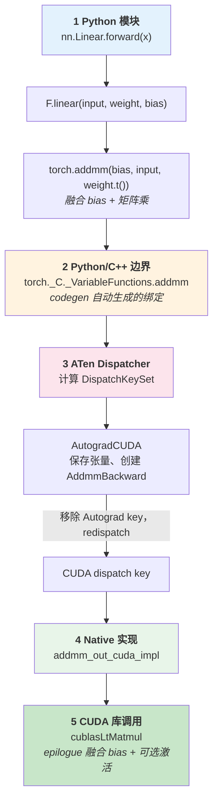

??? note "背景知识"
    - **算子（Operator）**：深度学习框架中计算图的基本执行单元，封装了不同硬件后端的 kernel 实现
    - **CUDA kernel**：运行在 NVIDIA GPU 上的并行计算函数，是算子在 GPU 后端的具体实现
    - **cuBLAS / cuBLASLt**：NVIDIA 线性代数库，提供高度优化的矩阵乘法实现（GEMM）
    - **cuSPARSE**：NVIDIA 稀疏矩阵运算库，提供稀疏矩阵 x 稠密矩阵乘法（SpMM）等操作
    - **分布式训练**：多 GPU 协作训练大模型的系统架构 → [详见](./distributed-training.md)

---

## 核心问题

用 PyTorch 写一行 `y = nn.Linear(768, 512)(x)` 就能在 GPU 上完成矩阵乘加——但这一行 Python 到底经历了什么，才变成 GPU 上的一次 `cublasLtMatmul` 调用？

这条路径横跨 5 个层次：**Python 模块 → Python/C++ 边界 → ATen Dispatcher → Native 实现 → CUDA 库调用**。理解它，才能理解为什么 PyTorch 既能保持 Python 的灵活性，又能把计算高效地下沉到 GPU。

---

## 主线路径全景

下图只展示 **CUDA + 2D 稠密张量**的主线路径（nD 输入会先 flatten 到 2D 再走同一条路；稀疏张量通过 `SparseCUDA` / `SparseCsrCUDA` dispatch key 分流到 `cusparseSpMM`，不在此展开）。



---

## 逐层拆解

### 第 1 层：Python 模块

```
torch/nn/modules/linear.py → torch/nn/functional.py → aten/src/ATen/native/Linear.cpp
```

`nn.Linear.forward()` 调用 `F.linear(input, weight, bias)`[^pytorch-repo]。对于 2D input + 有 bias 的主线场景，直接调用 `at::addmm(bias, input, weight.t())`，一步完成 $\text{bias} + \text{input} \times W^T$。

为什么用 `addmm` 而不是先 `mm` 再 `add`？因为 cuBLAS 原生支持 $\beta C + \alpha AB$ 这个融合操作——`addmm` 可以在一次 kernel 中完成矩阵乘和加偏置，省掉一次中间结果的显存读写。nD 输入会先 flatten 到 2D 再走同一条路；无 bias 时退化为 `matmul`。

### 第 2 层：Python/C++ 边界

```
tools/autograd/gen_python_functions.py → torch/csrc/autograd/python_torch_functions.cpp（生成）
```

`torch.addmm` 不是手写的 Python 函数。PyTorch 的构建流程从 `native_functions.yaml` 自动生成 C++ 绑定代码，编译进 `torch._C` 模块，再由 `torch/__init__.py` 重新导出：

```
native_functions.yaml            # 算子声明（schema + dispatch 映射）
        ↓ codegen
python_torch_functions.cpp       # 生成的 Python → C++ 绑定
        ↓ 编译
torch._C._VariableFunctions      # C++ 函数暴露给 Python
        ↓ 重导出
torch.addmm                      # 用户看到的 API
```

这套 codegen 机制让 PyTorch 的 ~2000 个算子不需要手写绑定代码。

### 第 3 层：ATen Dispatcher

```
c10/core/DispatchKey.h → aten/src/ATen/core/dispatch/Dispatcher.h
```

Dispatcher 是 PyTorch 算子系统的核心——它根据张量属性（设备、布局、是否需要梯度）决定调用哪个 kernel。

**剥洋葱式分发**：Dispatcher 不是一次性选中最终 kernel，而是按优先级逐层"剥洋葱"。对于 CUDA 稠密张量的主线：

1. **`AutogradCUDA`**（最高优先级）：保存输入张量，创建 `AddmmBackward` grad_fn 用于反向传播。完成后从 dispatch key set 中移除自己，**redispatch** 到下一层
2. **`CUDA`**：执行实际计算，调用 `addmm_out_cuda_impl`

`addmm` 在 `native_functions.yaml` 中的声明[^pytorch-repo]：

```yaml
- func: addmm(Tensor self, Tensor mat1, Tensor mat2, *, Scalar beta=1, Scalar alpha=1) -> Tensor
  structured_delegate: addmm.out
  dispatch:
    SparseCPU: addmm_sparse_dense_cpu
    SparseCUDA: addmm_sparse_dense_cuda
    SparseCsrCPU, SparseCsrCUDA: addmm_sparse_compressed_dense
```

稠密 CUDA 路径不在 `dispatch` 表里——它走默认的 `structured_delegate: addmm.out`，由 structured kernel 机制自动处理。只有稀疏路径需要显式注册到不同的 dispatch key（`SparseCUDA`、`SparseCsrCUDA`），最终调用 `cusparseSpMM`。

### 第 4 层：Native 实现

```
aten/src/ATen/native/cuda/Blas.cpp → aten/src/ATen/cuda/CUDABlas.cpp
```

`addmm_out_cuda_impl` 进入 CUDA 端的 C++ 实现。对于主线场景（bias 是 1D 向量且 $\beta=1$），选择 **cuBLASLt** 路径，因为 cuBLASLt 支持 **epilogue 融合**：在一次 kernel 中完成 GEMM + bias + 可选激活函数（ReLU/GELU）。`nn.Linear` + 激活函数原本需要两次 kernel launch 和一次中间结果的显存读写，epilogue 融合后变成一次。

不满足条件时（如 bias 是 2D 或 $\beta \neq 1$）回退到经典 `cublasGemmEx`，不融合 bias。

### 第 5 层：CUDA 库调用

主线路径最终落到 NVIDIA 闭源库的一次调用：

```
cublasLtMatmul(handle, matmulDesc, alpha, A, A_desc, B, B_desc, beta, bias, bias_desc, C, C_desc, algo, workspace, workspaceSize, stream)
```

计算 $C = \alpha \cdot A B + \beta \cdot \text{bias}$，并在 epilogue 中可选地融合激活函数。从这里开始就是 NVIDIA 闭源实现——内部针对不同 GPU 架构（Ampere/Hopper/Blackwell）有不同的优化 kernel。

---

## 关键设计决策

| 设计点 | 决策 | 权衡 |
|--------|------|------|
| `addmm` 融合 | `F.linear` 默认用 `addmm` 而非 `mm` + `add` | 利用 cuBLAS 原生 $\beta C + \alpha AB$，省一次显存读写 |
| cuBLASLt 优先 | 默认走 cuBLASLt 而非 cuBLAS | epilogue 融合收益大（GEMM + bias + 激活一次完成），某些形状可能不如 cuBLAS |
| Codegen 生成绑定 | ~2000 个算子的 Python/C++ 绑定全部自动生成 | 构建复杂度高，但消除了手写绑定的维护负担 |
| Dispatcher 分层剥离 | Autograd、Backend 等以 dispatch key 叠加 | 每次调用多一层间接开销，但新后端（XLA/Metal）只需注册 key |

---

## 参考资料

[^pytorch-repo]: PyTorch — GitHub 仓库（源码、native_functions.yaml、derivatives.yaml）. https://github.com/pytorch/pytorch
