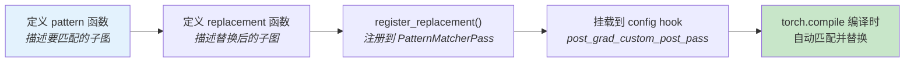

??? note "背景知识"
    - **ATen Dispatcher**：PyTorch 算子系统的核心路由器，根据 dispatch key 选择 kernel → [详见](./operator-dispatch.md)
    - **native_functions.yaml**：PyTorch 内置 ~2000 个算子的声明文件，编译时由 codegen 生成绑定代码 → [详见](./operator-dispatch.md)
    - **dispatch key**：标识张量属性（设备、布局、是否需要梯度）的枚举值，Dispatcher 据此路由到对应 kernel
    - **FX Graph**：`torch.compile` 捕获的计算图表示，是图级优化（如算子融合）的操作对象

---

## 核心问题

`native_functions.yaml` 随 PyTorch 一起编译打包，第三方无法修改。但实际场景中经常需要：新硬件要实现已有算子、推理框架要添加融合规则、业务代码要接入自定义 CUDA kernel。

PyTorch 的解法是把 Dispatcher 设计为**运行时可扩展的注册表**——`native_functions.yaml` 只是编译时的批量预注册，外部代码可以在运行时往同一个 Dispatcher 追加注册。这套机制分三个层面。

---

## 场景一：接入新硬件后端

新硬件（XLA/TPU、华为 NPU、Apple MPS 等）需要给 `aten` 命名空间下的已有算子提供自己的 kernel 实现。

### 机制：`TORCH_LIBRARY_IMPL` 注册到新 dispatch key

PyTorch 预留了 `PrivateUse1` / `PrivateUse2` / `PrivateUse3` 三个 dispatch key 供第三方后端使用。注册后，当张量在该设备上时，Dispatcher 自动路由到对应实现。

```
TORCH_LIBRARY_IMPL(aten, PrivateUse1, m) {
    m.impl("addmm", &my_npu_addmm);
    m.impl("mm", &my_npu_mm);
    m.impl("conv2d", &my_npu_conv2d);
    // ... 需要实现几百个算子
}
```

### 算子分类与实现策略

并非所有算子都需要手写 kernel。PyTorch 按实现方式将算子分为三类：

| 类型 | 含义 | 新后端是否必须实现 |
|------|------|-------------------|
| **Backend-specific** | 无默认实现，各后端独立提供 kernel | 必须，否则调用时报错 |
| **CompositeExplicitAutograd** | 有用其他算子组合的默认实现（仅推理） | 可选，默认实现自动可用 |
| **CompositeImplicitAutograd** | 有用其他算子组合的默认实现（推理 + autograd） | 可选，默认实现自动可用 |

实际策略：先实现核心算子（matmul、conv、elementwise 等），Composite 算子会自动基于这些核心算子工作。只有当默认组合实现性能不佳时，才为特定 Composite 算子提供专用 kernel[^pytorch-extend-backend]。

### 典型案例

- **torch_xla**（Google TPU）：通过 `TORCH_LIBRARY_IMPL(aten, XLA, m)` 注册，将 PyTorch 算子映射到 XLA HLO IR，再由 XLA 编译到 TPU
- **torch_npu**（华为昇腾）：注册到 `PrivateUse1`，将算子映射到 CANN 算子库
- **MPS**（Apple Silicon）：已合入 PyTorch 主线，使用 `MPS` dispatch key

### 不能覆盖已有后端

Dispatcher 对同一个 `(算子, dispatch_key)` 只允许一个注册。例如 `(aten::addmm, CUDA)` 已被 PyTorch 核心占用，第三方无法通过 `TORCH_LIBRARY_IMPL` 替换它——这是有意为之，防止多个库互相覆盖导致不可预测行为。

如果需要替换已有后端的实现，应在更上层操作：模型代码中替换模块、`__torch_dispatch__` 拦截、或 `torch.compile` 的 pattern matching（见场景二）。

---

## 场景二：添加算子融合规则

通过 `torch.compile` / TorchInductor 的 **pattern matcher** 在编译期做图级"搜索-替换"——匹配特定子图模式，替换为融合实现。

### 机制：`register_replacement` + config hook



以 Conv + BatchNorm 融合为例[^pytorch-conv-bn-fuser]：

```
# 1. 描述要匹配的子图：conv2d → batch_norm
def conv_bn_pattern(x, conv_w, conv_b, bn_mean, bn_var, bn_w, bn_b):
    out = F.conv2d(x, conv_w, conv_b)
    out = F.batch_norm(out, bn_mean, bn_var, bn_w, bn_b, training=False)
    return out

# 2. 描述替换后的子图：融合权重后只做一次 conv2d
def conv_bn_replacement(x, conv_w, conv_b, bn_mean, bn_var, bn_w, bn_b):
    fused_w, fused_b = fuse_conv_bn_weights(...)
    return F.conv2d(x, fused_w, fused_b)

# 3. 注册
register_replacement(conv_bn_pattern, conv_bn_replacement,
                     example_inputs, fwd_only, patterns)
```

### 挂载点

Inductor 编译 pipeline 提供多个阶段的 hook：

| Config Hook | 阶段 | 典型用途 |
|---|---|---|
| `pre_grad_custom_pass` | autograd 展开前 | 高层算子替换（Conv+BN） |
| `joint_custom_pre_pass` | 联合前向+反向图 | 训练相关融合 |
| `post_grad_custom_post_pass` | 后端 lowering 后 | **最常用**——算子融合 |

挂载方式：

```
import torch._inductor.config as config

class MyFusionPass(PatternMatcherPass):
    def __init__(self):
        super().__init__()
        register_replacement(pattern, replacement, inputs, fwd_only, self)

    def __call__(self, graph):
        self.apply(graph)

config.post_grad_custom_post_pass = MyFusionPass()
model = torch.compile(model)  # 编译时自动应用
```

### 低级 API

`register_lowering_pattern` 直接用 `CallFunction` 构建匹配模式，不需要 trace 函数：

```
@register_lowering_pattern(
    CallFunction(aten.add,
        CallFunction(aten.mm, Arg(), Arg()),
        CallFunction(aten.mm, Arg(), Arg())))
def fused_double_mm(match, a, b, c, d):
    return my_fused_kernel(a, b, c, d)
```

### 实际案例：vLLM 的 RMSNorm + FP8 量化融合

vLLM 用 `register_replacement` 把 `rms_norm` → `fp8_quant` 两步融合成一个 kernel，减少一次 HBM 读写[^vllm-fusion]。对于涉及 inplace 修改的 custom op，需要通过 `auto_functionalized` 包装才能在 FX 图上正确建立数据依赖。

---

## 场景三：注册自定义算子（Python 层调用）

当操作无法用已有 PyTorch 算子组合表达时（自定义 CUDA kernel、第三方 C++ 库），需要注册为 PyTorch 算子。

### 两套 API

| API | 语言 | `torch.compile` 行为 | 适用场景 |
|-----|------|---------------------|----------|
| `torch.library.custom_op` | Python | **不透明**——compile 不 trace 进内部 | 已有 CUDA/C++ kernel 接入 |
| `TORCH_LIBRARY` + `TORCH_LIBRARY_IMPL` | C++ | 同上 | 纯 C++ 环境、无 Python 依赖 |

### Python API：`torch.library.custom_op`

```
@torch.library.custom_op("mylib::fused_rmsnorm", mutates_args=())
def fused_rmsnorm(x: Tensor, weight: Tensor, eps: float) -> Tensor:
    return my_cuda_rmsnorm(x, weight, eps)   # 调用 CUDA kernel
```

注册后通过 `torch.ops.mylib.fused_rmsnorm(x, w, eps)` 调用。

#### 必须注册的附加信息

仅定义 forward 不够——需要告诉 PyTorch 子系统如何与这个算子协作：

| 注册项 | 用途 | 不注册的后果 |
|--------|------|-------------|
| `register_fake` | 描述输出 shape/dtype（无真计算） | `torch.compile` 报错或 graph break |
| `register_autograd` | 定义反向传播梯度计算 | 训练时报错 |

```
@torch.library.register_fake("mylib::fused_rmsnorm")
def _(x, weight, eps):
    return torch.empty_like(x)  # 只描述输出元信息

@torch.library.register_autograd("mylib::fused_rmsnorm")
def _(ctx, x, weight, eps):
    ...  # 保存张量、定义 backward
```

### C++ API：`TORCH_LIBRARY`

```
// 1. 声明算子 schema
TORCH_LIBRARY(mylib, m) {
    m.def("fused_rmsnorm(Tensor x, Tensor weight, float eps) -> Tensor");
}

// 2. 注册 CUDA 实现
TORCH_LIBRARY_IMPL(mylib, CUDA, m) {
    m.impl("fused_rmsnorm", &fused_rmsnorm_cuda);
}

// 3. 可选：注册 CPU fallback
TORCH_LIBRARY_IMPL(mylib, CPU, m) {
    m.impl("fused_rmsnorm", &fused_rmsnorm_cpu);
}
```

编译为 `.so` 后，Python 侧 `import` 时触发静态初始化，算子自动注册到 Dispatcher。

### `custom_op` 与 `torch.compile` 的关系

`custom_op` 注册的算子对 `torch.compile` 是**不透明的黑盒**——compile 能把它编进图里（不会 graph break），但无法 trace 进内部做进一步融合：

```
torch.compile 看到的图:
  fused_kernel_1 → [fused_rmsnorm (opaque)] → fused_kernel_2
                    ↑ compile 无法穿透此边界
```

对于本身就是重计算的融合 kernel（如 FlashAttention），不透明问题不大。但对于轻量逐元素操作，这个边界会阻止与周围算子的融合。如果需要 compile 穿透，应使用 `torch.library.triton_op`（Triton kernel 专用 → [详见 Triton 编译器架构](./triton-compiler.md)）。

### 实际案例：flash-attn 包

`pip install flash-attn` 的注册流程完整展示了 C++ kernel + Python 注册的配合[^flash-attn-repo]：

1. C++ 侧用 `TORCH_LIBRARY` 声明 schema + 绑定 CUDA kernel
2. 编译为 `_C.so`，`import flash_attn._C` 时自动注册到 Dispatcher
3. Python 侧用 `@torch.library.custom_op` 包装，添加 `register_fake` 支持 `torch.compile`

---

## 三种场景对比

| | 接入新硬件 | 添加融合规则 | 注册自定义算子 |
|---|---|---|---|
| **操作对象** | 已有 aten 算子 | FX 计算图 | 全新算子 |
| **核心 API** | `TORCH_LIBRARY_IMPL(aten, Key)` | `register_replacement` | `torch.library.custom_op` / `TORCH_LIBRARY` |
| **注册时机** | 运行时（import / dlopen） | 编译时（`torch.compile`） | 运行时（import / dlopen） |
| **需要改 PyTorch 源码** | 不需要 | 不需要 | 不需要 |
| **典型使用者** | 硬件厂商（XLA、NPU） | 推理框架（vLLM） | CUDA kernel 库（flash-attn） |

三种机制注册进的都是同一个 Dispatcher（场景一、三）或同一个编译 pipeline（场景二），与 PyTorch 内置算子享受同等的 autograd、dispatch、compile 支持。

---

## 参考资料

[^pytorch-extend-backend]: PyTorch — Extending dispatcher for a new backend in C++. https://docs.pytorch.org/tutorials/advanced/extend_dispatcher.html
[^pytorch-conv-bn-fuser]: PyTorch — Building a Convolution/Batch Norm fuser with torch.compile. https://docs.pytorch.org/tutorials/intermediate/torch_compile_conv_bn_fuser.html
[^vllm-fusion]: Karthick Panner Selvam. *Learn by doing: TorchInductor Pattern Matcher*. 2026. https://karthick.ai/blog/2026/Learn-By-Doing-Torchinductor-Pattern-Matcher/
[^flash-attn-repo]: Dao-AILab — flash-attention GitHub 仓库. https://github.com/Dao-AILab/flash-attention
