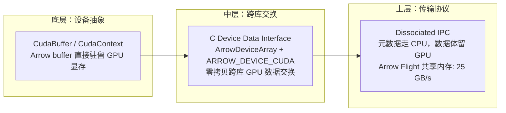
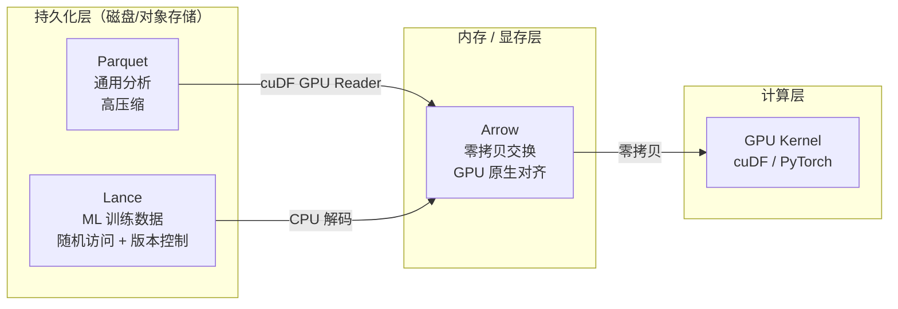

# 结构化数据格式与 GPU 亲和性

??? note "背景知识"
    - **列式存储**：按列而非按行组织数据，同一列的值连续存储，利于压缩和向量化扫描
    - **GPU SIMT 执行模型**：GPU 以 warp（32 线程）为单位执行，相邻线程访问连续内存（coalesced access）时带宽最高 → [详见](infrastructure.md)
    - **GPUDirect Storage**：存储设备直接访问 GPU 显存，绕过 CPU bounce buffer → [详见](infrastructure.md#27)
    - **零拷贝（Zero-Copy）**：数据在不同框架/设备间传递时不复制底层 buffer，只传递指针和元数据

> AI 数据管道的核心矛盾：**数据在磁盘上以压缩格式存储，但 GPU 需要连续、对齐、固定宽度的内存布局来高效计算**。格式设计的本质是在磁盘效率与 GPU 亲和性之间找到 Pareto 最优点。

---

## 1. 三种格式的定位

```
磁盘 ──────────────────────────────────────────────── 内存/显存

  Parquet              Lance                 Arrow / Feather
  (通用分析格式)        (ML 数据湖格式)         (内存交换标准)
  高压缩 · 批量扫描     随机访问 · 版本控制       零拷贝 · GPU 原生对齐
```

| 维度 | Parquet | Lance | Arrow / Feather |
|------|---------|-------|-----------------|
| 定位 | 磁盘列式存储的事实标准 | AI/ML 工作负载的列式湖仓格式 | 语言无关的内存列式交换标准 |
| 数据布局 | File → Row Group → Column Chunk → Page | Fragment → Data File（无 Row Group） | 连续列 buffer + null bitmap |
| 压缩策略 | 编码（Dictionary/RLE/Delta）+ 通用压缩（Snappy/Zstd） | 自适应结构编码（Mini-block / Full-zip）+ LZ4 | 可选 LZ4/Zstd（Feather V2） |
| GPU 亲和性 | 中（需调优） | 中高（侧重 ML 路径） | 最高（内存层面） |

---

## 2. Apache Parquet：需要 GPU-aware 调优的事实标准

### 2.1 格式结构

```
┌─────────────────────────────────┐
│  PAR1 (Magic)                   │
├─────────────────────────────────┤
│  Row Group 0                    │
│  ├─ Column Chunk 0 (Pages...)   │ ◄── 最小独立读取单元 = Page
│  ├─ Column Chunk 1 (Pages...)   │
│  └─ ...                        │
├─────────────────────────────────┤
│  Row Group 1                    │
│  └─ ...                        │
├─────────────────────────────────┤
│  File Metadata (Thrift)         │ ◄── 包含 schema、row group 统计信息
│  Footer Length (4 bytes)        │
│  PAR1 (Magic)                   │
└─────────────────────────────────┘
```

**关键设计**：Page 是压缩/编码的最小单元（通常 ~1 MB），Row Group 是 IO 调度的最小单元。

### 2.2 GPU 亲和性：85% 的时间花在哪里

NVIDIA RAPIDS 团队发现 TPC-H 基准测试中 **85% 的运行时花在 Parquet 扫描**而非计算[^rapids-2025-scan]。原因不是格式本身，而是默认配置为 CPU 优化：

| 瓶颈 | 原因 | GPU 影响 |
|------|------|----------|
| 元数据解析 | Thrift 格式的 footer 需 CPU 顺序解析，大文件耗时 8-30 秒 | GPU 完全空闲 |
| Page 数量不足 | 默认常为 1 page/列块，cuDF 映射 page→kernel grid | GPU 并行度不足 |
| 变长类型解码 | 字符串的 4 字节 length + data 布局阻止并行读取 | H100 上仅 10-30 GB/s（目标 ≥100） |
| 嵌套类型 | Definition/Repetition level 的 RLE 解码曾是单 warp 瓶颈 | Null 处理耗时 29 ms |
| 隐式同步 | `cudaMemcpy` 对 host-pageable memory 产生不必要的 CUDA 同步 | 流水线气泡 |

### 2.3 GPU-aware 调优：从默认到 125 GB/s

同一份数据，不同写入配置下的 GPU 扫描性能差异巨大[^kimball-2025]：

| 调优项 | 默认值 | GPU 优化值 | 效果 |
|--------|--------|-----------|------|
| Page 数/列块 | 1 | ≥100 | 匹配 GPU kernel grid size |
| Row Group 行数 | 视写入器而定（常导致 ~100 KB 列块） | 10M+ 行 | GPUDirect Storage 最优于 MiB 级 IO |
| 整数编码 | PLAIN | DELTA_BINARY_PACKED | 更高压缩比，GPU 解码友好 |
| 压缩 | Snappy | Zstd 或无压缩 | Blackwell 硬件解压引擎支持 600 GB/s |

经过调优后，有效带宽可达 **125 GB/s**（A100）。

### 2.4 GPU 生态

cuDF 是唯一完整的 GPU Parquet Reader——解压和解码全部作为 GPU kernel 执行。2024-2025 的关键优化：

- **Microkernel 架构**：拆分单体 kernel 为固定宽度/字典等专用 kernel，吞吐提升 117%
- **Hybrid Scan API**：流水线化读取，原始加速 2x
- **GPUDirect Storage**：NVMe → GPU 直读，平均吞吐提升 30-50%
- **Blackwell 硬件解压引擎**：600 GB/s 原生解压 Snappy/LZ4/Deflate/GZip，释放 SM 算力

---

## 3. Apache Arrow / Feather：GPU 内存层的事实标准

### 3.1 内存布局：为什么天然适合 GPU

Arrow 的列式内存布局精确匹配 GPU 的访问模式：

```
固定宽度列 (int64):
┌────────────────────────────────────────────────┐
│ Validity Bitmap  │ 1 bit/值, 64-byte 对齐      │
├──────────────────┼────────────────────────────-─┤
│ Data Buffer      │ 连续 8 字节/值, 64-byte 对齐  │
└────────────────────────────────────────────────┘
                   ▲
                   GPU warp 内 32 线程访问连续 256 字节 = coalesced load
```

| 设计决策 | GPU 收益 |
|----------|----------|
| 64 字节对齐 + padding | 匹配 AVX-512 / GPU cache line，无需额外对齐操作 |
| 固定宽度列连续存储 | Warp 内 coalesced memory access，带宽利用率最高 |
| Null bitmap 独立存储 | 无分支判断，GPU 可并行处理 null |
| 无编码/无压缩（原始 Arrow） | 零解码开销，数据即 GPU 可计算的形态 |

### 3.2 GPU 集成机制

**cuDF = Arrow on GPU**：cuDF 的 Column 就是 Arrow Array，data/null bitmap/child columns 全部驻留 GPU 显存。

三层 GPU 集成：



### 3.3 Feather：Arrow 的磁盘序列化

Feather V2 = Arrow IPC 文件格式 + 可选 LZ4/Zstd 压缩。

**局限**：Feather 作为磁盘格式不如 Parquet——无编码（未压缩时比 Parquet 大 ~2x），且 cuDF 读 Feather 走 CPU 路径（官方建议转 Parquet 做 GPU IO）。**Arrow 的价值在内存层而非磁盘层**。

---

## 4. Lance：为 ML 数据管道设计的格式

### 4.1 核心设计决策：无 Row Group

Parquet 的 Row Group 将所有列耦合在一起——宽表（数千特征列）即使只读一列也要解析所有列的元数据。Lance 的解法是**每列独立分页**：

```
Parquet:                        Lance:
┌─── Row Group ──────────┐      ┌─── Fragment ────────────────┐
│ Col A │ Col B │ Col C   │      │ Data File A  (独立分页)     │
│ (耦合在一起)             │      │ Data File B  (独立分页)     │
└────────────────────────┘      │ Data File C  (独立分页)     │
                                └────────────────────────────┘
```

### 4.2 自适应结构编码

根据数据宽度自动选择编码策略，而非一刀切：

| 数据特征 | 编码策略 | 设计权衡 |
|----------|----------|----------|
| 小数据（int/float/短字符串） | **Mini-block**（4-8 KB 块） | 透明压缩：可解压单值而不读整块 → 随机访问友好 |
| 大数据（embedding/图片） | **Full-zip**（连续打包） | 不透明压缩：需整块解压 → 顺序扫描更高效 |
| 结构化字段（常一起访问） | **Packed struct**（行式存储） | 减少 IO 次数：一次读取获取所有相关字段 |

### 4.3 随机访问：比 Parquet 快 100-2000x

这是 Lance 与 Parquet 最大的性能分野——ML 训练的 shuffle/随机采样依赖快速随机访问：

| 操作 | Parquet | Lance | 原因 |
|------|---------|-------|------|
| 随机取 1 行 | 扫描 ~1 MB page | 1-2 次 IO | Mini-block 透明压缩 + 独立列分页 |
| 100M 记录取 1000 行 | 1.25 s/key | 0.00062 s/key | **2000x** |
| Blob 读取（图片/音频） | 需外部引用 | 原生 Blob V2 | **68x** |

### 4.4 GPU 亲和性：ML 路径而非格式直读

Lance 的 GPU 加速不在格式底层（不做 GPU 端解压/解码），而在 ML 数据管道的上层：

```
磁盘 → CPU 解码 → Arrow buffer → torch.frombuffer() → GPU Tensor
                    ▲                    ▲
                    零拷贝              零拷贝（共享内存）
```

| 能力 | 实现 |
|------|------|
| PyTorch DataLoader | `LanceDataset`（iterable）/ `SafeLanceDataset`（map-style），内建 `batch_readahead` |
| Tensor 转换 | Arrow → `torch.frombuffer()` 零拷贝 |
| GPU 索引训练 | IVF/PQ 训练通过 PyTorch CUDA 加速（`accelerator="cuda"`） |
| 多模态数据 | Blob V2：inline / packed / dedicated / external 四种存储语义 |
| 版本控制 | MVCC，每次写入创建不可变版本，支持 time travel |

### 4.5 ML 生态集成

- **PyTorch**：原生 DataLoader 支持
- **Hugging Face**：2025 年原生 `hf://` URI 支持
- **Ray / Spark**：分布式读写连接器
- **DuckDB**：Core extension，支持向量搜索 + 全文检索 + SQL 混合查询
- **向量搜索**：内建 IVF、HNSW、PQ、SQ 索引，GPU 加速训练

---

## 5. GPU 数据管道中的协作关系

三种格式不是互相替代，而是在 GPU 数据管道的不同阶段各司其职：



**选型决策树**：

| 场景 | 推荐格式 | 理由 |
|------|----------|------|
| GPU 加速 OLAP 分析 | **Parquet**（GPU-aware 配置）→ cuDF → Arrow | 生态最成熟，cuDF 全 GPU 解码 |
| ML 训练数据管道 | **Lance** → Arrow → PyTorch | 随机访问快 100x+，版本控制，多模态原生 |
| 进程间 / 框架间数据交换 | **Arrow** | 唯一选择，零拷贝 GPU 内存共享 |
| 数据湖长期存储 | **Parquet** | 生态最广，所有引擎都支持 |

---

## 参考资料

[^rapids-2025-scan]: NVIDIA RAPIDS Team. *Parquet scan performance in TPC-H benchmarks*. 2025. https://github.com/rapidsai/cudf
[^kimball-2025]: Kimball & Natarajan. *Do GPUs Really Need New Tabular File Formats?* 2025. https://arxiv.org/abs/2503.17239
