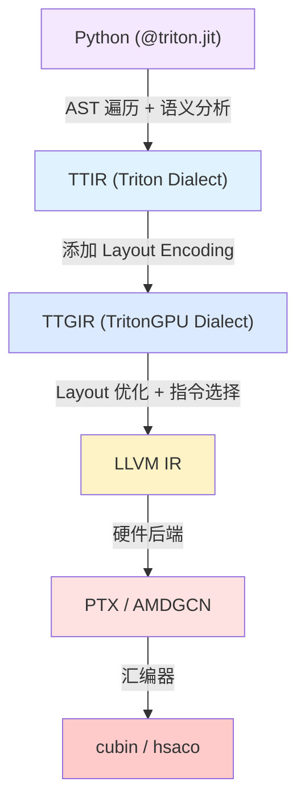

# Triton 编译器架构

??? note "背景知识"
    - **MLIR**：LLVM 子项目，为异构硬件提供多层 IR 框架，Triton 的核心编译基础设施 → [mlir.llvm.org](https://mlir.llvm.org/)
    - **LLVM IR**：LLVM 的低层中间表示，Triton 最终将 GPU 代码降级到此层再交由硬件后端生成机器码
    - **PTX**：NVIDIA 的虚拟指令集，介于 LLVM IR 和 GPU 二进制（cubin）之间
    - **PyTorch 算子分发**：从 Python 到 GPU kernel 的路由机制 → [详见](./operator-dispatch.md)
    - **PyTorch 算子扩展**：在不修改 PyTorch 源码的前提下接入新硬件和自定义算子 → [详见](./operator-extension.md)

---

## 核心问题

CUDA 编程暴露了过多的硬件细节（线程索引、shared memory bank conflict、内存合并访问），导致写出高性能 GPU kernel 的门槛极高。Triton 的核心设计决策是**把编程抽象从线程级提升到 tile 级**——用户只描述 block 级别的张量操作，编译器自动处理线程映射、内存布局、指令选择等底层细节。

这要求编译器能从高层的 Python tile 操作一路降级到特定 GPU 的机器码，同时在每一层做好优化。Triton 采用经典的**前端—中端—后端**三段式架构，基于 MLIR 实现逐层降级。

---

## 编译全链路



### 阶段一：前端——Python AST → TTIR

`@triton.jit` 装饰器将 Python 函数包装为 `JITFunction` 对象。首次调用时触发编译：

1. **AST 解析**：用 Python 标准库 `ast` 模块解析函数源码
2. **CodeGenerator 遍历**：继承 `ast.NodeVisitor` 的 visitor pattern，逐节点转换
3. **语义层（TritonSemantic）**：负责类型检查、隐式转换、IR 生成

关键映射关系——Python DSL 操作如何变成 MLIR op：

| Python DSL | 语义层方法 | TTIR 操作 |
|---|---|---|
| `tl.load(ptr, mask)` | `semantic.load()` | `tt.load` |
| `tl.store(ptr, val)` | `semantic.store()` | `tt.store` |
| `tl.dot(a, b)` | `semantic.dot()` | `tt.dot` |
| `x + y` | `semantic.add()` | `arith.addf` / `arith.addi` |
| `tl.arange(0, N)` | — | `tt.make_range` |
| `tl.program_id(0)` | — | `tt.get_program_id` |

TTIR 是**硬件无关**的：张量只有 shape 和 element type，没有 layout 信息。它复用 MLIR 内置的 `arith`、`math`、`scf` dialect 处理算术运算和控制流，Triton 自定义的 `tt.*` op 只覆盖 tile 级内存操作和张量操作。

### 阶段二：中端——TTIR → TTGIR

`make_ttir()` 先对 TTIR 做硬件无关的优化（内联、CSE、循环展开、DCE），然后 `convert_to_ttgpuir` pass 给每个张量类型**附加 Layout Encoding**，进入 TritonGPU dialect。

**Layout Encoding 是 Triton 最核心的抽象**，它描述张量元素如何分布在 GPU 的四级层次上：

| 层级 | 含义 |
|---|---|
| `register` | 一个线程内的寄存器 |
| `lane` | warp 内的线程（通常 32 个） |
| `warp` | CTA/block 内的 warp |
| `block` | cluster 内的 CTA |

主要 encoding 类型：

- **BlockedEncoding**：规则的多维分块，适用于 elementwise 和 reduction
- **NvidiaMmaEncoding / AMDMfmaEncoding**：匹配硬件 Tensor Core / Matrix Core 的数据排布
- **SharedEncoding**：shared memory 布局，含 swizzle pattern 以避免 bank conflict
- **DotOperandEncoding**：矩阵乘操作数的专用布局

TTGIR 阶段的核心优化 pass 流水线（按执行顺序）：

1. **MemoryCoalescing**：分析访存模式，选择 coalesced 的初始 layout
2. **RemoveLayoutConversions**：传播 layout，消除冗余的 `ttg.convert_layout`（数据搬运代价高，通常需要经过 shared memory 或 warp shuffle）
3. **AccelerateMatmul**：将 `tt.dot` 转换为使用硬件 MMA 指令的版本
4. **OptimizeDotOperands**：为矩阵乘操作数准备 shared memory layout
5. **Pipelining**：软件流水线，将 global memory load 与计算重叠以隐藏访存延迟
6. **Prefetch**：异步 prefetch 指令插入

### 阶段三：后端——TTGIR → LLVM IR → 机器码

后端由 `BaseBackend` 子类实现（NVIDIA 用 `CUDABackend`，AMD 用 `HIPBackend`），分为三步：

**LLVM IR 生成**（`make_llir`）：将 TTGIR 的 tile 级操作"展开"为线程级 LLVM IR。核心机制是 `emitIndices` + `applyLinearLayout`——根据 layout encoding 计算每个线程应该操作哪些元素的索引，然后生成对应的 load/store/compute 指令。这一步还会插入硬件特定的 intrinsic（NVIDIA 的 NVVM dialect、AMD 的 ROCDL dialect）。

**汇编生成**（`make_ptx` / `make_amdgcn`）：调用 LLVM 后端将 LLVM IR 翻译为目标汇编。NVIDIA 路径生成 PTX（虚拟 ISA），AMD 路径生成 AMDGCN。

**二进制生成**（`make_cubin` / `make_hsaco`）：调用硬件汇编器（`ptxas` / `ld.lld`）将汇编编译为可执行二进制。

---

## 扩展机制

Triton 在编译链路的多个层级提供了扩展点，从轻量级的 pass 注入到完整的硬件后端接入。

### 扩展点一：Backend Plugin——接入新硬件

最重量级的扩展。继承 `BaseBackend` 抽象类，实现完整的编译流水线：

```
BaseBackend (python/triton/backends/compiler.py)
├── supports_target(target)     # 声明支持的硬件
├── load_dialects(context)      # 加载自定义 MLIR dialect
├── add_stages(stages, options) # 注册编译阶段
├── parse_options(options)      # 解析编译选项
└── get_module_map()            # 接口模块映射
```

`add_stages()` 是核心方法——它往 `stages` 字典中按顺序注册一系列 `(ir_name, transform_fn)` 条目，每个阶段接收上一阶段的 IR 字符串并返回变换后的结果，最后一个阶段返回可执行的 `bytes`。

已有实现：

| Backend | 目标 | 编译路径 |
|---|---|---|
| `CUDABackend` | NVIDIA GPU | TTIR → TTGIR → LLVM IR → PTX → cubin |
| `HIPBackend` | AMD GPU | TTIR → TTGIR → LLVM IR → AMDGCN → hsaco |
| `CPUBackend`[^triton-shared] | CPU | TTIR → TritonToLinalg → LLVM IR → object |

第三方后端通过 `TRITON_PLUGIN_DIRS` 环境变量在 CMake 构建时注册，需要提供标准目录结构（`backend/compiler.py` + `backend/name.conf` + MLIR dialect/pass 定义 + pybind11 绑定）。

### 扩展点二：Pass Plugin——注入自定义优化

不需要重新编译 Triton，通过共享库（`.so`）动态加载自定义 MLIR pass。两种注入方式：

**环境变量加载**：设置 `TRITON_PLUGIN_PATHS`（冒号分隔），Triton 启动时自动加载并注册 pass 和 dialect。插件通过 C ABI 暴露 `tritonGetPluginInfo` 函数，返回 `PluginInfo` 结构体。

**Inspection Hook**：在 Python 层通过 `knobs.runtime.add_stages_inspection_hook` 设置回调函数，可以在编译流水线的**任意位置**插入、替换或删除 pass。这种方式完全不需要 C++ 编译，适合快速实验：

```
# 在 make_ttir 阶段末尾插入自定义 pass
knobs.runtime.add_stages_inspection_hook = my_hook

# hook 可以查看完整 pass pipeline 并按位置插入
def my_hook(backend, stages, options, language, capability):
    original = stages["ttgir"]
    def new_ttgir(src, metadata):
        result = original(src, metadata)
        # 对 result 做额外变换
        return result
    stages["ttgir"] = new_ttgir
```

典型用例：插桩分析（profiling）、特定 kernel 的 warp specialization、模型级别的定制优化。

### 扩展点三：Dialect Plugin——自定义 IR 操作

当内置的 `tt.*` 和 `ttg.*` op 不够用时，可以定义新的 MLIR dialect。通过同一个 `TRITON_PLUGIN_PATHS` 机制加载。插件需要：

1. 用 TableGen 定义 dialect 和 op（`.td` 文件）
2. 实现 op 的 C++ lowering pattern（从新 dialect → LLVM IR）
3. 通过 `PluginInfo` 注册 dialect 和对应的 lowering pass

已有实例：`triton-ext` 仓库的 **uTLX** 插件，提供了 local memory 操作（`local_alloc`、`local_load`、`local_store`）、barrier 管理和 PingPong pass 等扩展[^triton-ext]。

### 扩展点四：Language Extension——前端 DSL 扩展

Triton 的前端（`triton.language`）本身也可以扩展。`triton-ext` 提供了 `language/` 目录用于添加新的 DSL 原语，这些原语最终映射到自定义 dialect 的 op 上。此外，Triton 还在实验 **Gluon** 前端——一个更底层的编程接口，暴露 warp 级和 shared memory 级的控制能力，适合需要精细控制 GPU 层次结构的场景。

---

## 设计权衡

| 决策 | 收益 | 代价 |
|---|---|---|
| Tile 级抽象（非线程级） | 用户无需管理线程索引和 shared memory | 编译器需要承担 layout 推断和优化的复杂度 |
| 基于 MLIR 的多层 IR | 每层可独立优化，复用 LLVM 生态 | 编译时间较长（JIT 首次编译开销明显） |
| Layout Encoding 系统 | 统一描述硬件数据分布，支持自动 layout 优化 | Layout conversion 可能引入 shared memory 搬运开销 |
| Backend Plugin 架构 | 第三方可接入新硬件而不改 Triton 核心 | 插件需要理解完整的 MLIR 编译栈 |
| Python 前端 + JIT | 用户体验接近 NumPy，零学习曲线 | Python AST 解析引入限制（不支持所有 Python 语法） |

---

## 参考资料

[^triton-shared]: microsoft/triton-shared: CPU backend for Triton. https://github.com/microsoft/triton-shared
[^triton-ext]: triton-lang/triton-ext: Out-of-tree extensions for the Triton compiler. https://github.com/triton-lang/triton-ext
