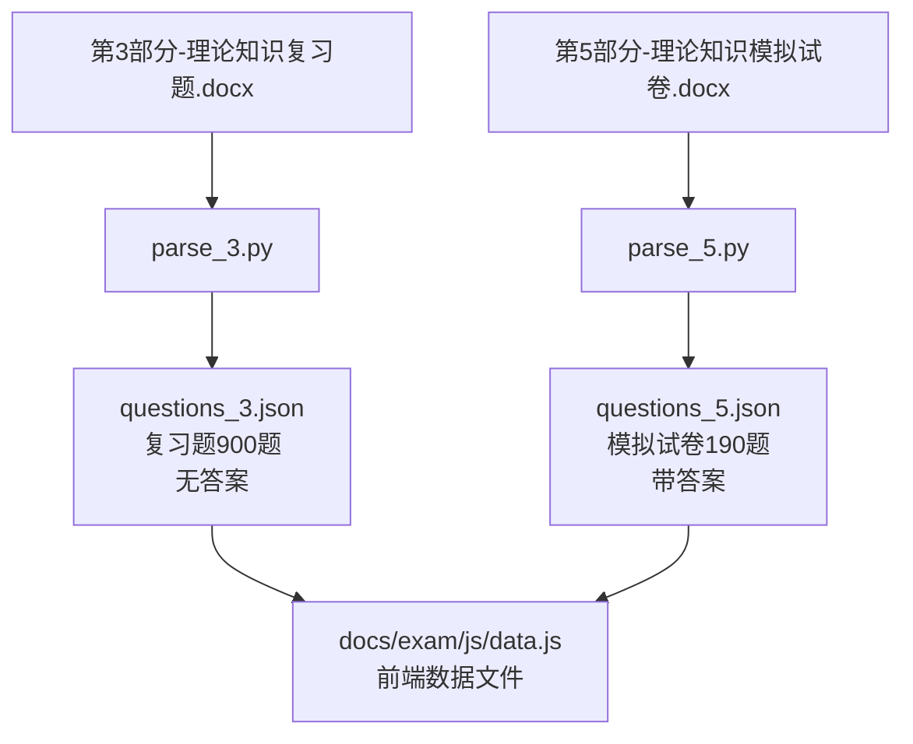

# 人工智能训练师考试资料

## 目录结构

```
exam/
├── source/           # 原始文档
│   ├── 第3部分-人工智能训练师_3级_理论知识复习题.docx
│   ├── 第5部分_人工智能训练师_3级_理论知识模拟试卷.docx
│   ├── 第4部分_人工智能训练师_3级_操作技能复习题.doc
│   ├── 第6部分_人工智能训练师_3级_操作技能模拟试卷.doc
│   └── ...
├── scripts/          # 数据解析脚本
│   ├── parse_3.py          # 解析第3部分（复习题）
│   └── parse_5.py          # 解析第5部分（模拟试卷+答案）
└── data/            # 解析后的数据
    ├── questions_3.json    # 复习题数据（无答案）
    └── questions_5.json    # 模拟试卷数据（带答案）
```

## 数据文件关系



## 数据文件说明

### 数据文件
- **questions_3.json**
  - 来源文档：`exam/source/第3部分-人工智能训练师_3级_理论知识复习题.docx`
  - 生成脚本：`parse_3.py`
  - 内容：900题（判断题300 + 单选题300 + 多选题300）
  - 答案：无答案
  - 用途：练习题库

- **questions_5.json**
  - 来源文档：`exam/source/第5部分_人工智能训练师_3级_理论知识模拟试卷.docx`
  - 生成脚本：`parse_5.py`
  - 内容：190题（判断题40 + 单选题140 + 多选题10）
  - 答案：包含答案（判断题40 + 单选题140 + 多选题10）
  - 用途：模拟试卷题库

## 使用说明

### 1. 解析复习题（第3部分）
```bash
cd exam/scripts
uv run parse_3.py
```
生成文件：
- `../data/questions_3.json`（复习题900题，无答案）

### 2. 解析模拟试卷（第5部分）
```bash
cd exam/scripts
uv run parse_5.py
```
生成文件：
- `../data/questions_5.json`（模拟试卷190题，带答案）

## 数据统计

### 理论知识复习题（第3部分）
- 判断题：300题
- 单选题：300题
- 多选题：300题
- 总计：900题

### 理论知识模拟试卷（第5部分）
- 判断题：40题
- 单选题：140题
- 多选题：10题
- 总计：190题

### 答案情况
- 判断题：40个答案
- 单选题：140个答案
- 多选题：6个答案

## 考试分值（来自竞赛方案）

### 理论知识考试（90分钟，占总成绩30%）
- 单选题：140题，每题0.5分，共70分
- 多选题：10题，每题1分，共10分
- 判断题：40题，每题0.5分，共20分
- **总分：100分**

### 操作技能考核（120分钟，占总成绩70%）
- 考核方式：计算机机考
- 具体项目：待解析

### 总成绩计算
- 理论知识成绩 × 30% + 操作技能成绩 × 70% = 总成绩
- **合格标准：60分及以上**

## 注意事项

- 复习题目前没有答案
- 操作技能题目尚未解析
