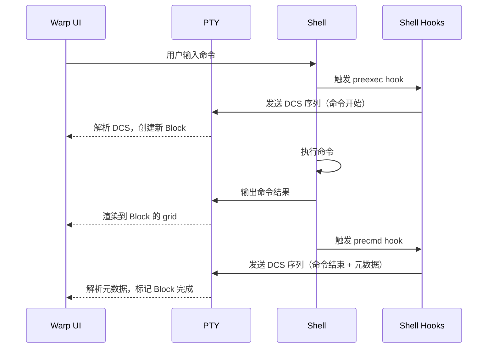
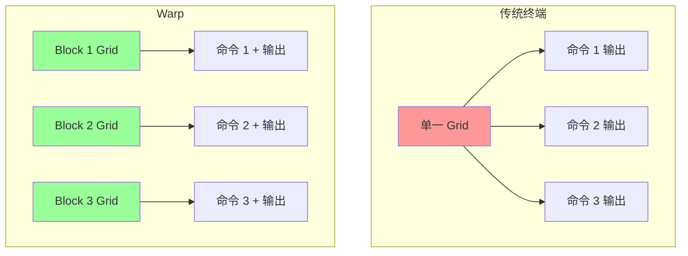

# AI 与 Shell 交互

> AI Agent 的工具箱中，终端是最直接的系统接口。但让 AI"用终端"不是简单地把命令字符串发给 shell——它需要理解命令执行状态、解析输出、处理错误。VSCode Terminal 的设计揭示了这一问题的标准解法。

---

## 1. 核心问题：如何让 AI 理解命令执行结果

AI Agent 执行 shell 命令时面临三个基本问题：

1. **命令是否成功？**——需要知道退出码（exit code）
2. **输出了什么？**——需要捕获 stdout/stderr
3. **当前状态是什么？**——需要知道工作目录、环境变量等

直接用 `subprocess.run()` 或 `os.system()` 只能拿到部分信息，且无法维持会话状态（如 `cd` 后的目录变化）。真正的终端交互需要**伪终端（PTY）**。

---

## 2. PTY 架构：伪终端的本质

PTY（Pseudo-Terminal）是 Unix 系统提供的虚拟终端机制[^pty-man]，由一对设备组成：


- **主端（master）**：由 Agent/VSCode 持有，负责读写数据
- **从端（slave）**：由 shell 进程打开，认为自己连接的是真实终端

PTY 的价值：

| 特性 | 直接 subprocess | PTY |
|------|-----------------|-----|
| 会话状态维持 | ❌（每次调用新进程） | ✅（同一 shell 会话） |
| 终端特性支持 | ❌（无 TTY） | ✅（支持颜色、进度条、交互式程序） |
| 退出码获取 | ✅（返回值） | ✅（通过进程监控） |
| 输出捕获 | ✅（stdout/stderr 管道） | ✅（主端读取） |
| 信号传递 | ❌ | ✅（Ctrl+C、Ctrl+Z） |

---

## 3. 命令成功/失败的检测机制

Shell 在执行每个命令后，会将退出状态码存储在特殊变量 `$?` 中：

```bash
$ ls /nonexistent  # 失败
ls: cannot access '/nonexistent': No such file or directory
$ echo $?          # 输出 1
1

$ ls /tmp          # 成功
$ echo $?          # 输出 0
0
```

退出码约定：
- `0` = 成功
- `非 0` = 失败（不同数值代表不同错误类型）

### 3.1 PTY 环境下的退出码获取

在 PTY 架构下，有两种方式获取退出码：

**方式一：进程监控**
- Agent 监控 shell 子进程的 `waitpid()` 系统调用
- 进程退出时内核返回退出码
- 适用于每次执行一个命令的场景

**方式二：Shell Integration 脚本**
- 在 shell 启动时注入脚本，通过 `PROMPT_COMMAND` 钩子捕获 `$?`
- 将退出码通过特殊序列发送给 Agent
- 适用于交互式会话（多命令连续执行）

---

## 4. Shell Integration：主动报告机制

VSCode 1.70+ 引入的 Shell Integration[^vscode-si] 是当前最成熟的方案。它在 shell 启动时自动注入一段脚本：

```bash
# VSCode 注入的脚本（简化示意）
__vscode_run_command() {
    local exit_code=$?
    # 将退出码通过 OSC 633 序列发送给 VSCode
    printf '\x1b]633;E;%d\x07' "$exit_code"
}
PROMPT_COMMAND="__vscode_run_command;$PROMPT_COMMAND"
```

### 工作流程

```mermaid
sequenceDiagram
    participant A as AI Agent
    participant S as Shell
    participant P as PTY

    A->>S: 执行命令 "ls /tmp"
    S->>S: 运行命令，设置 $? = 0
    S->>P: 输出命令结果
    P-->>A: 返回 stdout

    Note over S: 命令结束，触发 PROMPT_COMMAND

    S->>S: __vscode_run_command 捕获 $?
    S->>P: 发送 OSC 633;E;0 序列
    P-->>A: 返回退出码序列
    A->>A: 解析序列，标记命令成功 ✓
```

### 为什么需要主动报告？

PTY 主端只能看到输出流，无法直接知道"命令何时结束"和"退出码是多少"。Shell Integration 通过以下方式解决：

1. **时机同步**：`PROMPT_COMMAND` 在每次命令执行完毕、显示新提示符前触发，精确标记命令边界
2. **状态传递**：通过 OSC 序列将 `$?` 传递给 Agent
3. **扩展信息**：除了退出码，还能传递命令执行时长、当前工作目录等

---

## 5. OSC 序列：终端通信协议

OSC（Operating System Command）是 ANSI 转义序列的一种[^osc-escape]，用于终端和应用程序之间传递元数据。VSCode 使用自定义的 OSC 633 序列族：

| 序列格式 | 含义 | 示例 |
|----------|------|------|
| `ESC ] 633 ; E ; <exit_code> BEL` | 命令结束，报告退出码 | `\x1b]633;E;0\x07` |
| `ESC ] 633 ; D ; <duration> BEL` | 命令执行时长（毫秒） | `\x1b]633;D;1234\x07` |
| `ESC ] 633 ; C ; <cwd> BEL` | 当前工作目录 | `\x1b]633;C;/home/user\x07` |
| `ESC ] 633 ; A BEL` | 命令开始 | `\x1b]633;A\x07` |

这些序列对用户不可见（终端不会显示它们），但 Agent 可以解析。

### 序列解析示例

```python
import re

# 解析 OSC 633;E;exit_code 序列
def parse_exit_code(output):
    match = re.search(r'\x1b\]633;E;(\d+)\x07', output)
    if match:
        return int(match.group(1))
    return None

# 示例
output = "file1.txt\nfile2.txt\n\x1b]633;E;0\x07user@host:~$ "
exit_code = parse_exit_code(output)  # 返回 0
```

---

## 6. AI Agent 的终端交互模式

基于上述机制，AI Agent 与终端的交互可以分为三种模式：

### 6.1 单次执行模式

每次执行一个独立命令，适合简单任务：

```python
import pty
import os

def run_command(cmd):
    master_fd, slave_fd = pty.openpty()
    pid = os.fork()

    if pid == 0:  # 子进程
        os.close(master_fd)
        os.dup2(slave_fd, 0)  # stdin
        os.dup2(slave_fd, 1)  # stdout
        os.dup2(slave_fd, 2)  # stderr
        os.execlp('bash', 'bash', '-c', cmd)
    else:  # 父进程
        os.close(slave_fd)
        output = os.read(master_fd, 4096).decode()
        _, exit_code = os.waitpid(pid, 0)
        return output, exit_code
```

**权衡**：
- ✅ 简单直接
- ❌ 无法维持会话状态（`cd` 无效）
- ❌ 无法运行交互式程序（如 `vim`）

### 6.2 会话模式

维持一个长期 shell 会话，适合多步骤任务：

```python
import pty
import os
import select

class ShellSession:
    def __init__(self):
        self.master_fd, self.slave_fd = pty.openpty()
        self.pid = os.fork()

        if self.pid == 0:
            os.close(self.master_fd)
            os.dup2(self.slave_fd, 0)
            os.dup2(self.slave_fd, 1)
            os.dup2(self.slave_fd, 2)
            os.execlp('bash', 'bash')
        else:
            os.close(self.slave_fd)

    def execute(self, cmd):
        # 发送命令
        os.write(self.master_fd, f"{cmd}\n".encode())

        # 读取输出（直到提示符出现）
        output = b""
        while True:
            r, _, _ = select.select([self.master_fd], [], [], 0.1)
            if self.master_fd in r:
                chunk = os.read(self.master_fd, 4096)
                output += chunk
                # 检测提示符（简化）
                if b"$ " in chunk or b"# " in chunk:
                    break
            else:
                break

        return output.decode()
```

**权衡**：
- ✅ 维持会话状态
- ✅ 支持交互式程序
- ❌ 需要处理提示符检测（可能不稳定）
- ❌ 需要超时机制

### 6.3 Shell Integration 模式

在会话模式基础上注入 Shell Integration 脚本，获得精确的状态报告：

```python
class SmartShellSession(ShellSession):
    def __init__(self):
        super().__init__()
        # 注入 Shell Integration 脚本
        integration_script = """
__agent_run_command() {
    local exit_code=$?
    printf '\\x1b]633;E;%d\\x07' "$exit_code"
}
PROMPT_COMMAND="__agent_run_command;$PROMPT_COMMAND"
"""
        self.execute(integration_script)

    def execute(self, cmd):
        # 发送命令开始标记
        os.write(self.master_fd, f"\x1b]633;A\x07{cmd}\n".encode())

        output = super().execute(cmd)

        # 解析退出码
        exit_code = self._parse_exit_code(output)
        return output, exit_code

    def _parse_exit_code(self, output):
        match = re.search(r'\x1b\]633;E;(\d+)\x07', output)
        return int(match.group(1)) if match else None
```

**权衡**：
- ✅ 精确的命令边界和退出码
- ✅ 扩展信息（时长、目录等）
- ❌ 依赖 shell 支持（bash/zsh）
- ❌ 需要处理 OSC 序列解析

---

## 7. 工程实践要点

### 7.1 超时处理

终端命令可能挂起（如网络请求、死锁），必须设置超时：

```python
import signal

def run_with_timeout(cmd, timeout=30):
    def handler(signum, frame):
        raise TimeoutError(f"Command timed out: {cmd}")

    signal.signal(signal.SIGALRM, handler)
    signal.alarm(timeout)

    try:
        output, exit_code = run_command(cmd)
        return output, exit_code
    finally:
        signal.alarm(0)
```

### 7.2 输出截断

长输出会消耗大量 token，需要截断或分页：

```python
def truncate_output(output, max_lines=100):
    lines = output.split('\n')
    if len(lines) > max_lines:
        return '\n'.join(lines[:max_lines]) + f"\n... ({len(lines) - max_lines} more lines)"
    return output
```

### 7.3 安全性

防止命令注入：

```python
import shlex

def safe_execute(cmd):
    # 使用 shlex.quote 转义参数
    safe_cmd = shlex.quote(cmd)
    return run_command(f"echo {safe_cmd}")  # 而非直接 f"echo {cmd}"
```

或者使用参数化执行：

```python
import subprocess

def safe_execute_with_args(program, *args):
    return subprocess.run([program] + list(args), capture_output=True)
```

### 7.4 跨平台兼容性

Windows 下 PTY 支持有限，需要替代方案：

| 平台 | PTY 支持 | 替代方案 |
|------|----------|----------|
| Linux/macOS | ✅ 原生 | - |
| Windows | ❌ 有限 | ConPTY（Windows 10+）、`subprocess` + 伪终端模拟 |

---

## 8. 更广的技术全景

### 8.1 其他终端集成方案

| 方案 | 实现方式 | 特点 |
|------|----------|------|
| **VSCode Shell Integration** | OSC 633 序列 | 最成熟，VSCode 生态 |
| **iTerm2 Shell Integration** | OSC 133 序列 | 类似 VSCode，协议不同 |
| **Windows Terminal** | ConPTY + 自定义序列 | Windows 原生支持 |
| **tmux/screen** | 内置状态行 | 终端复用器自带 |

### 8.2 Agent 终端工具对比

| 工具 | PTY 支持 | Shell Integration | 会话维持 | 适用场景 |
|------|----------|-------------------|----------|----------|
| **Claude Code** | ✅ | ✅（自定义实现） | ✅ | 长期编码会话、多步骤任务 |
| **OpenCode** | ❌（subprocess） | ❌ | ❌ | 批量命令执行、简单任务 |
| **Devin** | ✅ | ✅ | ✅ | 长期编码会话 |
| **Cursor** | ✅ | 部分 | ✅ | 代码补全 + 命令执行 |
| **Aider** | ❌（subprocess） | ❌ | ❌ | 单次 git 命令 |
| **Continue** | ✅ | ❌ | 部分 | 简单命令执行 |
| **Warp** | ✅ | ✅（DCS 序列） | ✅ | 高性能终端、Block UI |

### 8.3 Claude Code 的 Bash 工具实现

Claude Code 作为终端 Agent 的代表，其 Bash 工具实现具有以下特点[^claude-code-tools][^claude-code-permissions]：

**权限模型**：
- Bash 工具默认需要用户批准（`PermissionRequired: Yes`）
- 支持细粒度权限规则：可按命令模式、工作目录、工具类型配置
- 提供 `acceptEdits` 模式自动批准常见文件系统命令
- 提供 `auto` 模式（研究预览）在后台验证操作与请求对齐

**Shell 选择策略**：
- **macOS/Linux**：优先使用 Bash（通过 Git Bash 或系统 bash）
- **Windows**：优先使用 Git Bash（如果安装），否则退回到 PowerShell
- **WSL**：直接使用 WSL 内的 bash，无需 Git for Windows
- 通过 PowerShell 工具作为 Windows 原生环境的后备方案

**命令执行特性**：
- 支持复合命令（如 `cd /tmp && ls`）
- 支持进程包装器（如 `npx`、`docker run`）
- 支持只读命令标记（如 `git status`、`ls` 可配置为无需批准）
- 自动检测命令退出码，失败时在 UI 中标记

**会话管理**：
- 维持长期 shell 会话，支持 `cd`、环境变量等状态
- 支持会话恢复（`--resume`、`--continue`）
- 可通过权限规则限制特定命令的执行范围

**安全机制**：
- 禁止对根目录和家目录的破坏性操作（如 `rm -rf /`、`rm -rf ~`）作为熔断器
- 支持沙箱模式隔离执行环境
- 管理员可禁用 `bypassPermissions` 和 `auto` 模式

Claude Code 的实现体现了终端 Agent 的核心权衡：在**自主性**（自动执行命令）和**安全性**（防止误操作）之间通过细粒度权限系统找到平衡点。

### 8.4 OpenCode 的 Process API 实现

OpenCode 选择了不同的技术路线——使用 subprocess 模式而非 PTY。根据其迁移计划文档，OpenCode 正从 Bun Shell 迁移到统一的 Process API[^opencode-migration]。

**核心实现**（`src/util/process.ts`）：

```typescript
import launch from "cross-spawn"

export function spawn(cmd: string[], opts: Options = {}): Child {
  const proc = launch(cmd[0], cmd.slice(1), {
    cwd: opts.cwd,
    shell: opts.shell,
    env: opts.env === null ? {} : opts.env ? { ...process.env, ...opts.env } : undefined,
    stdio: [opts.stdin, opts.stdout, opts.stderr],
    windowsHide: process.platform === "win32",
  })
  // 支持 AbortSignal、timeout、kill
}
```

**Process API 设计**：

| 方法 | 用途 |
|------|------|
| `Process.run(cmd, opts)` | 执行命令，返回退出码和输出 |
| `Process.text(cmd, opts)` | 执行命令，返回文本输出 |
| `Process.lines(cmd, opts)` | 执行命令，返回行数组 |
| `Process.status(cmd, opts)` | 仅检查退出码 |
| `Process.shell(command, opts)` | 显式 shell 执行 |

**环境变量支持**：

```typescript
// 三种模式
await Process.run(["cmd"], { env: null })           // 空环境
await Process.run(["cmd"], { env: { KEY: "val" } }) // 与 process.env 合并
await Process.run(["cmd"])                          // 使用默认 process.env
```

**技术权衡**：

| 维度 | OpenCode (subprocess) | Claude Code (PTY) |
|------|----------------------|-------------------|
| **会话维持** | ❌ 每次独立进程 | ✅ 长期 shell 会话 |
| **环境变量持久化** | ❌ 每次显式传递 | ✅ `export` 后续可用 |
| **交互式命令** | ❌ 不支持 | ✅ 支持 |
| **实现复杂度** | 低（cross-spawn） | 高（PTY + Shell Integration） |
| **适用场景** | 批量命令、简单任务 | 长期会话、复杂交互 |

**设计哲学**：

OpenCode 的选择体现了"简单可控"的设计哲学：
- 更适合批量执行独立命令（git、构建工具）
- 与 Effect 框架集成良好
- 避免 PTY 的复杂性和潜在问题
- 适合不需要 shell 会话状态的场景

**局限性**：

- 无法在 shell 中 `cd` 后影响后续命令
- 无法通过 `export` 持久化环境变量
- 无法运行交互式程序（如 `vim`、`top`）
- 缺少 Shell Integration 的精细状态报告

### 8.5 Warp 的 Block 架构

Warp 是一个基于 Rust 的高性能终端，其核心创新是**Block**（块）概念——将命令和输出视觉化为一个原子单元[^warp-blog]。

**Block ID 结构**：

Warp 使用两种 Block ID 生成策略[^warp-block-id]：

```rust
// PTY 输出的 Block：{SESSION_ID}-{NUM_ID}
// NUM_ID 是会话内的单调递增计数器
// 例如：1234567890-0, 1234567890-1, 1234567890-2

// 手动创建的 Block：UUID
// 例如：manual-550e8400-e29b-41d4-a716-446655440000
```

**命令边界检测机制**：

Warp 通过 shell hooks（precmd/preexec）检测命令边界，与 VSCode Shell Integration 类似但使用不同的通信协议：



**DCS 序列通信**：

Warp 使用自定义的 DCS（Device Control String）序列而非 VSCode 的 OSC 633：

```bash
# Shell hook 发送 DCS 序列（示意）
__warp_preexec() {
    # 发送命令开始标记 + 元数据（JSON 编码）
    printf '\x1bP@warp|{"block_id":"%s","command":"%s"}\x1b\\' \
        "$WARP_BLOCK_ID" "$1"
}

__warp_precmd() {
    local exit_code=$?
    # 发送命令结束标记 + 退出码
    printf '\x1bP@warp|{"exit_code":%d}\x1b\\' "$exit_code"
}
```

**数据模型：Grid 隔离**：

Warp 的关键设计决策是**为每个命令创建独立的 grid**[^warp-blog]：



**为什么需要 Grid 隔离？**

VT100 规范无法保证：
1. 命令输出在新行开始（如 `printf "hello"` 无换行）
2. 输出不会覆盖之前的内容（光标移动序列）

```bash
# 问题示例：无换行导致提示符在同一行
$ printf "hello"
hellobash-5.1$  # 提示符紧接在输出后

# 问题示例：光标上移覆盖
$ printf "\033[1Aoverwrite"  # 向上移动一行并覆盖
```

Grid 隔离确保：
- 每个命令的输出独立存储
- 输出不会互相覆盖
- 可以单独搜索/复制每个 Block

**性能优化**：

Warp 通过以下技术实现高性能[^warp-blog]：

| 优化点 | 技术 | 效果 |
|--------|------|------|
| 渲染 | GPU 加速（Metal） | >144 FPS @ 4K |
| 文本渲染 | Texture Atlas（字形纹理集） | 减少绘制调用 |
| UI 框架 | 自研 Rust UI 框架 | 平台无关（Metal/OpenGL/WebGL） |
| 编辑器 | SumTree（Rope 数据结构） | 高效文本操作和 CRDT 支持 |

**技术权衡**：

| 维度 | Warp (PTY + Grid 隔离) | VSCode Terminal (PTY + OSC) |
|------|------------------------|------------------------------|
| **命令边界检测** | DCS 序列 + shell hooks | OSC 633 + PROMPT_COMMAND |
| **数据模型** | 每个 Block 独立 grid | 单一 grid + 逻辑分组 |
| **输出隔离** | ✅ 物理隔离 | ❌ 逻辑隔离 |
| **性能** | GPU 渲染 + Rust | CPU 渲染 + TypeScript |
| **跨平台** | Metal（macOS）/计划 OpenGL/WebGL | Electron（跨平台） |
| **实现复杂度** | 高（自研 UI 框架） | 中（复用 VSCode 架构） |

**设计哲学**：

Warp 的选择体现了"性能优先 + UI 创新"的设计哲学：
- Grid 隔离为 Block 功能（搜索、复制、分享）提供基础
- GPU 渲染确保在大输出量下仍保持流畅
- 自研 UI 框架为未来 Web 渲染和实时协作铺路
- 适合需要高性能终端和丰富 UI 交互的场景

**局限性**：

- 仅支持 macOS（Metal API 限制），Linux/Windows 支持在开发中
- 依赖 shell hooks（bash/zsh/fish），Windows PowerShell 支持有限
- 自研 UI 框架生态不如 Electron 成熟

---

## 参考资料

[^vscode-si]: Microsoft. *Shell Integration — Visual Studio Code*. https://code.visualstudio.com/docs/terminal/shell-integration
[^pty-man]: Linux man pages. *pty — Pseudo-terminal utilities*. https://man7.org/linux/man-pages/man7/pty.7.html
[^osc-escape]: ECMA-48. *Control Functions for Coded Character Sets*. https://www.ecma-international.com/publications-and-standards/standards/ecma-48/
[^claude-code-tools]: Anthropic. *Tools reference — Claude Code*. https://docs.anthropic.com/en/docs/claude-code/tools
[^claude-code-permissions]: Anthropic. *Configure permissions — Claude Code*. https://docs.anthropic.com/en/docs/claude-code/permissions
[^opencode-migration]: anomalyco. *Bun Shell Migration Plan — OpenCode*. https://github.com/anomalyco/opencode/blob/dev/packages/opencode/BUN_SHELL_MIGRATION_PLAN.md
[^warp-blog]: Aloke Desai. *How Warp Works*. Warp Blog. 2021. https://blog.warp.dev/how-warp-works
[^warp-block-id]: warpdotdev. *block_id.rs — Warp Terminal*. GitHub. https://github.com/warpdotdev/warp/blob/master/crates/warp_terminal/src/model/block_id.rs
