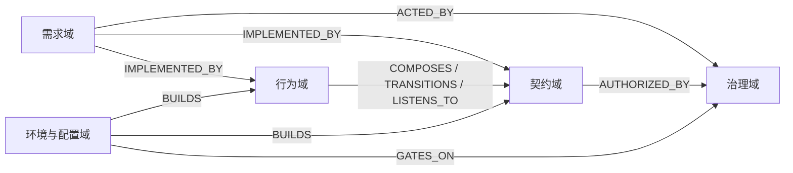
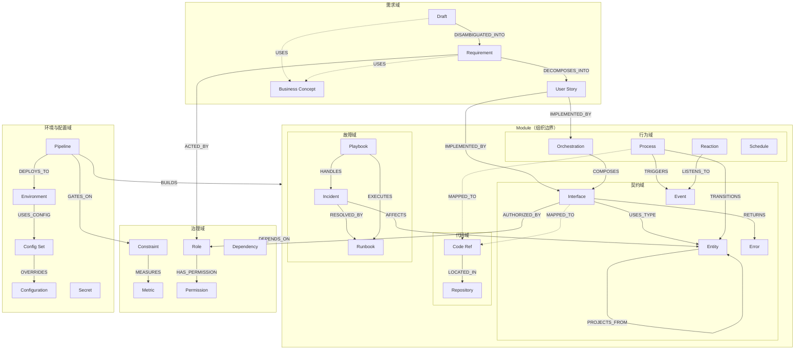

# Structured Artifacts — 制品体系概览

## 设计原则

1. **两个描述性字段**：每个制品最多包含 `name`（短标题）和 `description`（一句话说明）两个自由文本字段。
2. **其余字段皆结构化**：所有非描述性字段必须是可枚举（enum）、可验证（typed reference / pattern）、或可计算的（number / boolean / datetime）。
3. **ID 即引用**：制品之间通过 typed ID 互相引用，形成可追溯的知识图谱。
4. **单向熵减**：信息从非结构化（Draft）逐层转化为严格结构化制品，不允许反向退化。

---

## 域模型

制品按关注点划分为若干域，Module 作为跨域的组织容器将它们分组管理：

| 域 | 关注点 | 核心问题 |
|----|--------|---------|
| **需求域** | 意图与交付 | 用户要什么？怎么拆成可交付的单元？ |
| **契约域** | 结构与通信 | 数据长什么样？模块间怎么通信？ *(Module 内部域)* |
| **行为域** | 状态与编排 | 状态怎么变？多个接口怎么协调？ *(Module 内部域)* |
| **代码域** | 实现映射 | 代码在哪个仓库？逻辑制品怎么映射到物理代码？ *(Module 内部域)* |
| **故障域** | 故障与恢复 | 出了什么事？怎么恢复？ *(Module 内部域)* |
| **治理域** | 约束与依赖 | 谁能做什么？性能底线是什么？用了哪些第三方依赖？ |

> **Module** 不是一个域，而是组织单元——类似文件夹，将契约域、行为域、代码域和故障域的制品按服务边界分组。由于模块会随项目演进经历拆分与合并，Module 与 Repository 之间存在 M:N 映射——同一 Module 的代码可能散布在多个 Repository 中，同一 Repository 也可能包含多个 Module 的代码。所有非需求、非治理制品通过 `module_id` 字段声明归属。

---

## 制品总览

### 需求域

| 制品类型 | ID 模式 | 文件 | 用途 |
|---------|---------|------|------|
| [Draft](requirement/draft.md) | `DRAFT-\d+` | `requirement/draft.md` | 唯一的非结构化入口——人类原始意图 |
| [Requirement](requirement/requirement.md) | `REQ-\d+` | `requirement/requirement.md` | 消歧后的结构化需求 |
| [User Story](requirement/user-story.md) | `US-\d+` | `requirement/user-story.md` | 面向实现的需求分解单元 |
| [Business Concept](requirement/business-concept.md) | `BC-\d+` | `requirement/business-concept.md` | 业务概念——语义位置到技术制品的对齐 |

### 契约域

| 制品类型 | ID 模式 | 文件 | 用途 |
|---------|---------|------|------|
| [Entity](contract/entity.md) | `ENT-\d+` | `contract/entity.md` | 数据结构契约——实体与字段定义 |
| [Interface](contract/interface.md) | `API-\d+` | `contract/interface.md` | 同步 API 契约——请求、响应、错误码 |
| [Event](contract/event.md) | `EVT-\d+` | `contract/event.md` | 异步通信契约——领域事件 |
| [Error](contract/error.md) | `ERR-\d+` | `contract/error.md` | 错误目录——统一错误码、状态码、重试策略 |

### 行为域

| 制品类型 | ID 模式 | 文件 | 用途 |
|---------|---------|------|------|
| [Process](behavior/process.md) | `PROC-\d+` | `behavior/process.md` | 单实体状态机——状态集合、转换规则、守卫条件 |
| [Orchestration](behavior/orchestration.md) | `ORCH-\d+` | `behavior/orchestration.md` | 跨模块 Interface 编排——分布式事务、多步协调 |
| [Reaction](behavior/reaction.md) | `SUB-\d+` | `behavior/reaction.md` | 事件反应器——模块响应领域事件自动执行 |
| [Schedule](behavior/schedule.md) | `SCH-\d+` | `behavior/schedule.md` | 定时任务——按 cron 或固定间隔周期执行 |

### 代码域

| 制品类型 | ID 模式 | 文件 | 用途 |
|---------|---------|------|------|
| [Repository](code/repository.md) | `REPO-\d+` | `code/repository.md` | 代码仓库——URL、默认分支、语言栈 |
| [Code Ref](code/code-ref.md) | `CREF-\d+` | `code/code-ref.md` | 代码映射——制品到源码位置（仓库、文件路径、符号）的追溯引用 |

### 故障域

| 制品类型 | ID 模式 | 文件 | 用途 |
|---------|---------|------|------|
| [Incident](incident/incident.md) | `INC-\d+` | `incident/incident.md` | 故障定义——故障类型、影响范围、处理流程 |
| [Runbook](incident/runbook.md) | `RB-\d+` | `incident/runbook.md` | 运维手册——标准化操作步骤 |
| [Playbook](incident/playbook.md) | `PB-\d+` | `incident/playbook.md` | 应急响应预案——故障场景、处置步骤 |
### 治理域

| 制品类型 | ID 模式 | 文件 | 用途 |
|---------|---------|------|------|
| [Constraint](governance/constraint.md) | `CON-\d+` | `governance/constraint.md` | 性能、安全、合规等可验证约束 |
| [Metric](governance/metric.md) | `MET-\d+` | `governance/metric.md` | 度量指标——单位、聚合方式、优化方向 |
| [RBAC 子系统](governance/rbac/concepts.md) | `ROLE-\d+` / `PERM-\d+` | `governance/rbac/` | 角色 + 权限——独立访问控制体系 |
| [Dependency](governance/dependency.md) | `DEP-\d+` | `governance/dependency.md` | 第三方依赖——包名、版本范围、许可证 |

### 组织单元

| 制品类型 | ID 模式 | 文件 | 用途 |
|---------|---------|------|------|
| [Module](module.md) | `MOD-\d+` | `module.md` | 组织容器——按服务边界将制品分组、声明依赖、映射源码 |

### 环境与配置域

| 制品类型 | ID 模式 | 文件 | 用途 |
|---------|---------|------|------|
| [Environment](delivery/environment.md) | `ENV-\d+` | `delivery/environment.md` | 部署目标——类型（dev / staging / prod）、地域、URL、配置基线 |
| [Pipeline](delivery/pipeline.md) | `PIPE-\d+` | `delivery/pipeline.md` | 交付流程——从提交到上线的阶段序列、质量关卡、触发条件 |
| [Configuration](delivery/configuration.md) | `CONF-\d+` | `delivery/configuration.md` | 配置项——键名、类型、默认值、验证规则 |
| [Config Set](delivery/config-set.md) | `CSET-\d+` | `delivery/config-set.md` | 配置集合——按环境/模块分组的配置项及覆盖值 |
| [Secret](delivery/secret.md) | `SEC-\d+` | `delivery/secret.md` | 敏感信息——密码、密钥、证书、API Token |

> 环境与配置域是全局的，不受单个 Module 管辖。Pipeline 通过 `BUILDS` 引用 Module，通过 `DEPLOYS_TO` 引用 Environment，通过 `GATES_ON` 引用治理域的 Constraint 作为质量关卡。Environment 通过 `USES_CONFIG` 引用 Config Set，Config Set 通过 `OVERRIDES` 引用 Configuration。

### 验证（测试制品）

| 配对域 | 制品类型 | ID 模式 | 文件 | 验证对象 |
|--------|---------|---------|------|---------|
| 需求 | [Acceptance Test](test/acceptance-test.md) | `AT-\d+` | `test/acceptance-test.md` | Requirement |
| 需求 | [Scenario Test](test/scenario-test.md) | `ST-\d+` | `test/scenario-test.md` | User Story |
| 组织 | [Integration Test](test/integration-test.md) | `IT-\d+` | `test/integration-test.md` | Module 间交互 |
| 契约 | [Contract Test](test/contract-test.md) | `CT-\d+` | `test/contract-test.md` | Interface 契约 |
| 行为 | [Transition Test](test/transition-test.md) | `TT-\d+` | `test/transition-test.md` | Process 状态转换 |
| 治理 | [Benchmark](test/benchmark.md) | `BM-\d+` | `test/benchmark.md` | Constraint 指标达标 |

---

## 制品关系图

### 跨域总览

### 完整制品关系

### 测试配对

| 被测制品 | 测试制品 | 验证目标 |
|---------|---------|---------|
| Requirement | Acceptance Test | 需求验收 |
| User Story | Scenario Test | 场景覆盖 |
| Module | Integration Test | 模块间交互 |
| Interface | Contract Test | 接口契约 |
| Process | Transition Test | 状态转换 |
| Constraint | Benchmark | 指标达标 |

---

## ID 规范

- **格式**：`{TYPE_PREFIX}-{NUMBER}`，序号为不限位数的正整数（如 `REQ-1`、`MOD-42`、`ENT-10086`）
- **不可复用**：ID 一旦分配永不回收，即使制品被废弃
- **引用表示**：在其他制品中通过完整 ID 字符串（如 `"MOD-10"`）引用

---

## TODO — 待扩展域

- [ ] **可观测域** — 生产系统的可观测性支撑（告警、监控面板、日志、链路追踪等），复杂度高，暂不定义具体制品
- [ ] **变更域** — 企业级系统的变更管理（变更请求、版本发布、回滚策略等），涉及风险管控和审批流程，复杂度高，暂不定义具体制品
